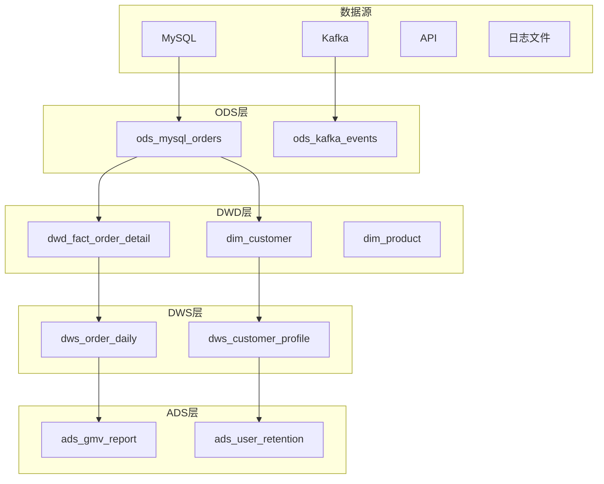
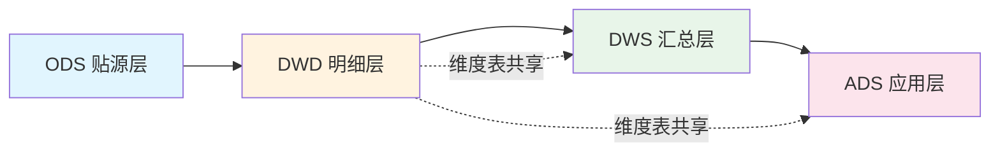
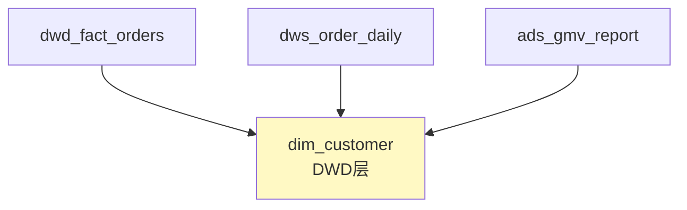
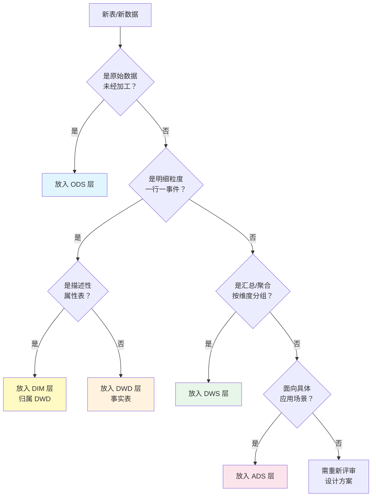
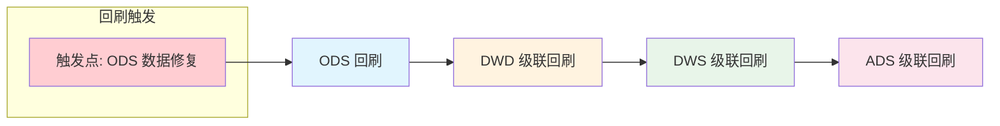

# 数仓分层体系规范

> 本文档定义 HiveMind 数仓系统的 ODS/DWD/DWS/ADS 四层架构，包括各层职责、跨层规则、落层决策指南和回刷约束。

## 1. 四层定义总览

### 1.1 分层架构概览



### 1.2 各层定义详表

| 层级 | 英文全称 | 中文名称 | 职责定义 | 数据特征 |
|------|----------|----------|----------|----------|
| **ODS** | Operational Data Store | 操作数据层/贴源层 | 原始数据落地，保持源系统结构和数据不变，仅做基础格式转换 | 原始格式、冗余多、数据质量未保证 |
| **DWD** | Data Warehouse Detail | 明细数据层 | 数据清洗、标准化、去重，建立事实表和维度表，统一数据口径 | 标准化字段、统一编码、明细粒度 |
| **DWS** | Data Warehouse Summary | 汇总数据层 | 按主题轻度汇总，构建宽表，预计算常用指标 | 轻度聚合、主题化、可直接分析 |
| **ADS** | Application Data Service | 应用数据层 | 面向应用的指标结果表，直接服务报表、API、数据产品 | 高度聚合、场景化、即用即取 |

### 1.3 各层详细规范

#### ODS 层（贴源层）[Analyst: 了解数据源头] [Engineer: 设计同步任务]

| 维度 | 规范要求 |
|------|----------|
| **职责** | 存放从源系统抽取的原始数据，保持源系统结构不变 |
| **数据特征** | 原始格式、可能有重复、空值、脏数据 |
| **命名规范** | `ods_{source}_{table}` 例如 `ods_mysql_orders` |
| **更新策略** | 全量快照（T+1 覆盖）或增量追加（CDC 模式） |
| **保留周期** | 7-30 天（可配置），超期归档或删除 |
| **典型表** | `ods_mysql_orders`, `ods_kafka_user_events`, `ods_api_products` |
| **允许操作** | 格式转换、时区转换、字段映射 |
| **禁止操作** | 业务逻辑加工、数据清洗、字段衍生 |

#### DWD 层（明细层）[Analyst: 理解明细口径] [Engineer: 建模与清洗]

| 维度 | 规范要求 |
|------|----------|
| **职责** | 数据清洗、标准化、关联维度，建立事实表和维度表 |
| **数据特征** | 明细粒度、字段标准化、编码统一、主键唯一 |
| **命名规范** | `dwd_fact_{domain}_{entity}` 或 `dim_{entity}` |
| **更新策略** | 分区增量更新（T+1），维度表可全量覆盖 |
| **保留周期** | 永久保留或按业务需求（1-3 年） |
| **典型表** | `dwd_fact_order_detail`, `dwd_fact_payment`, `dim_customer`, `dim_product` |
| **允许操作** | 去重、空值填充、字段标准化、维度关联、SCD 处理 |
| **禁止操作** | 聚合汇总、业务规则硬编码 |

#### DWS 层（汇总层）[Analyst: 分析汇总指标] [Engineer: 构建宽表]

| 维度 | 规范要求 |
|------|----------|
| **职责** | 按业务主题轻度汇总，构建分析宽表，预计算常用指标 |
| **数据特征** | 轻度聚合、主题化组织、冗余字段便于分析 |
| **命名规范** | `dws_{domain}_{granularity}` 例如 `dws_order_daily` |
| **更新策略** | 分区增量更新，可能需要回刷历史 |
| **保留周期** | 1-3 年或永久 |
| **典型表** | `dws_order_daily`, `dws_customer_profile`, `dws_product_sales_weekly` |
| **允许操作** | 按时间粒度聚合、多表宽表化、指标预计算 |
| **禁止操作** | 业务规则硬编码、跳过 DWD 直接引用 ODS |

#### ADS 层（应用层）[Analyst: 使用报表指标] [Engineer: 对接下游系统]

| 维度 | 规范要求 |
|------|----------|
| **职责** | 面向具体应用场景的指标结果表，直接服务报表、API、数据产品 |
| **数据特征** | 高度聚合、场景化设计、即用即取 |
| **命名规范** | `ads_{application}_{report}` 例如 `ads_gmv_report` |
| **更新策略** | T+1 全量或增量，取决于应用需求 |
| **保留周期** | 根据业务需求（通常 90 天 - 1 年） |
| **典型表** | `ads_gmv_report`, `ads_user_retention`, `ads_regional_sales` |
| **允许操作** | 高度定制化聚合、口径裁剪、格式转换 |
| **禁止操作** | 跳过 DWS 直接引用 DWD（特殊情况除外） |

---

## 2. 维度表落层说明 [Analyst: 理解维度表位置] [Engineer: 设计维度模型]

### 2.1 维度表归属原则

**维度表落在 DWD 层**，与事实表并列存储。

| 要点 | 说明 |
|------|------|
| **落层位置** | DWD 层（使用 `dim_` 前缀） |
| **与事实表关系** | 并列存储，通过外键关联 |
| **共享范围** | 一致性维度可跨多个事实表共享（参考 [一致性维度](../glossary/terms.md#modeling_conformed_dimension)） |
| **命名规范** | `dim_{entity}`，如 `dim_customer`, `dim_product`, `dim_date` |

### 2.2 SCD 策略与维度表管理

维度表的历史变更通过 [SCD 策略](./methodology/scd-strategies.md) 管理：

| SCD 类型 | 适用场景 | 实现方式 |
|----------|----------|----------|
| **Type 1** | 可纠错属性（手机号修正） | 直接覆盖，不保留历史 |
| **Type 2** | 需历史追溯（客户地址变更） | 保留历史版本，使用 `dw_valid_from/dw_valid_to/is_current` |
| **Type 3** | 只需前值对比（价格调整） | 增加 `previous_` 字段 |

**dbt-hive 实现要点**（无原生 Snapshots）：
- 使用 `INSERT OVERWRITE` 分区回刷实现 Type 2
- 维护 `dw_valid_from`, `dw_valid_to`, `is_current` 字段
- 详细实现参见 [SCD 策略文档](./methodology/scd-strategies.md)

### 2.3 维度表示例

```sql
-- 客户维度表 (SCD Type 2)
CREATE TABLE dim_customer (
    customer_sk         BIGINT      COMMENT '客户代理键',
    customer_id         BIGINT      COMMENT '客户自然键',
    customer_name       STRING      COMMENT '客户姓名',
    customer_level      STRING      COMMENT '客户等级',
    region_code         STRING      COMMENT '地区编码',
    city_name           STRING      COMMENT '城市名称',
    register_date       DATE        COMMENT '注册日期',
    -- SCD Type 2 字段
    dw_valid_from       DATE        COMMENT 'SCD 有效起始',
    dw_valid_to         DATE        COMMENT 'SCD 有效截止',
    is_current          TINYINT     COMMENT '当前版本标志',
    -- 元数据字段
    dw_create_time      TIMESTAMP   COMMENT '数据入仓时间',
    dw_modify_time      TIMESTAMP   COMMENT '数据修改时间'
)
COMMENT '客户维度表';
```

---

## 3. 跨层引用规则 [Analyst: 理解数据流向] [Engineer: 遵循依赖规范]

### 3.1 标准数据流向



### 3.2 允许的引用关系

| 目标层 | 可引用的源层 | 说明 |
|--------|-------------|------|
| **DWD** | ODS | 正常清洗流程 |
| **DWS** | DWD, DIM | 事实表 + 维度表关联 |
| **ADS** | DWS, DIM | 汇总数据 + 维度表关联 |
| **ADS** | DWD（特例）| 仅当 DWS 无法满足需求时 |

### 3.3 禁止的跨层引用

| 禁止模式 | 原因 | 正确做法 |
|----------|------|----------|
| **DWD → DWD** | 避免复杂依赖链 | 拆分为独立事实表或使用 ODS |
| **DWS → ODS** | 跳过清洗层，数据质量无保障 | 必须经过 DWD 清洗 |
| **ADS → ODS** | 跳过两层，严重违反规范 | 必须经过 DWD → DWS |
| **ODS → DWS/ADS** | 上游不应依赖下游 | 层级单向依赖 |

### 3.4 例外情况：维度表特殊处理

**维度表可被多层引用**，不受跨层限制：



| 维度表引用规则 | 说明 |
|---------------|------|
| **DWD 事实表引用维度表** | 标准做法，维度关联 |
| **DWS 引用维度表** | 允许，用于维度扩展 |
| **ADS 引用维度表** | 允许，用于维度筛选 |

**为什么维度表例外？**
- 维度表是描述性数据，不是流程性数据
- 一致性维度设计要求跨业务域共享
- 维度表更新频率低，不会造成调度复杂性

---

## 4. 落层决策指南 [Analyst: 判断表的位置] [Engineer: 设计合理分层]

### 4.1 落层决策树



### 4.2 落层判断清单

#### [Analyst] 业务视角判断

| 问题 | 选择 ODS | 选择 DWD | 选择 DWS | 选择 ADS |
|------|----------|----------|----------|----------|
| 数据是否已清洗？ | 未清洗 | 已清洗 | 已清洗 | 已清洗 |
| 粒度是什么？ | 原始 | 明细 | 汇总 | 高度汇总 |
| 谁使用这张表？ | ETL 工程师 | 分析师 + 工程师 | 分析师 | 业务用户 |
| 用于什么目的？ | 数据溯源 | 明细分析 | 多维分析 | 报表/API |

#### [Engineer] 技术视角判断

| 特征 | ODS | DWD | DWS | ADS |
|------|-----|-----|-----|-----|
| 数据结构 | 与源系统一致 | 星型/雪花模型 | 宽表 | 定制化 |
| 主键定义 | 可能无主键 | 必须有主键 | 必须有主键 | 必须有主键 |
| 字段标准化 | 否 | 是 | 是 | 是 |
| 分区策略 | 按同步日期 | 按业务日期 | 按业务日期 | 按业务需求 |
| 更新频率 | T+1 或实时 | T+1 | T+1 | T+1 或按需 |

### 4.3 常见场景落层示例

| 数据场景 | 推荐层级 | 表名示例 | 理由 |
|----------|----------|----------|------|
| MySQL 订单表同步 | ODS | `ods_mysql_orders` | 原始数据落地 |
| 清洗后订单明细 | DWD | `dwd_fact_order_detail` | 明细事实表 |
| 客户属性表 | DIM | `dim_customer` | 描述性维度 |
| 订单日汇总 | DWS | `dws_order_daily` | 按天聚合 |
| GMV 日报 | ADS | `ads_gmv_report` | 面向报表 |
| 用户行为日志 | ODS → DWD | `ods_` → `dwd_fact_` | 先落地后清洗 |
| 客户生命周期价值 | DWS | `dws_customer_ltv` | 跨周期汇总 |

---

## 5. 回刷/重算约束 [Analyst: 理解数据更新影响] [Engineer: 设计回刷策略]

### 5.1 跨层回刷传播规则



**回刷传播原则**：
1. **级联传播**：上游回刷必须触发下游回刷
2. **最小范围**：仅回刷受影响的分区
3. **顺序执行**：按层级依次执行，不可并行

### 5.2 回刷窗口约束

| 层级 | 默认回刷窗口 | 最大回刷窗口 | 约束说明 |
|------|-------------|-------------|----------|
| **ODS** | 当日 | 7 天 | 超过 7 天需审批，可能已归档 |
| **DWD** | 当日 | 30 天 | 超过 30 天需评估下游影响 |
| **DWS** | 当日 | 30 天 | 需同步回刷依赖的 DWD |
| **ADS** | 当日 | 90 天 | 面向应用，需通知下游系统 |

### 5.3 调度依赖原则 [Engineer: 配置调度任务]

| 原则 | 说明 | 示例 |
|------|------|------|
| **层级顺序** | 严格按 ODS → DWD → DWS → ADS 顺序执行 | DWS 任务依赖 DWD 任务完成 |
| **分区对齐** | 上下游分区字段必须一致 | 都使用 `dt` 作为日期分区 |
| **时间窗口** | 留足上游完成时间 | DWD 任务设置 2 小时等待窗口 |
| **失败重试** | 支持单分区重试 | 使用 `INSERT OVERWRITE PARTITION` |
| **依赖检查** | 执行前检查上游分区是否就绪 | 检查 `_SUCCESS` 标记文件 |

### 5.4 回刷操作示例

```sql
-- 回刷 DWD 层特定日期分区
INSERT OVERWRITE TABLE dwd_fact_order_detail
PARTITION (dt = '2026-01-30')
SELECT
    order_id,
    customer_id,
    product_id,
    order_amt,
    -- ... 其他字段
    current_timestamp() as dw_modify_time
FROM ods_mysql_orders
WHERE dt = '2026-01-30';

-- 级联回刷 DWS 层
INSERT OVERWRITE TABLE dws_order_daily
PARTITION (dt = '2026-01-30')
SELECT
    order_date,
    SUM(order_amt) as total_amt,
    COUNT(DISTINCT order_id) as order_cnt,
    -- ... 其他聚合
    current_timestamp() as dw_modify_time
FROM dwd_fact_order_detail
WHERE dt = '2026-01-30'
GROUP BY order_date;
```

---

## 6. 误区与反模式 [Analyst: 识别常见错误] [Engineer: 避免设计陷阱]

| 误区 | 错误描述 | 正确做法 | 影响 |
|------|----------|----------|------|
| **ODS 做业务加工** | 在 ODS 层进行数据清洗、字段衍生 | ODS 仅做格式转换，业务逻辑放 DWD | 数据溯源困难，难以定位问题 |
| **DWD 直接汇总** | 在 DWD 层创建汇总表（如日汇总） | 汇总表放 DWS，DWD 保持明细粒度 | 混淆层级职责，维护混乱 |
| **跳过 DWD 层** | DWS 直接引用 ODS 数据 | 必须经过 DWD 清洗 | 数据质量无保障，口径不一致 |
| **维度表放 DWS** | 将维度表放在 DWS 或 ADS 层 | 维度表归属 DWD 层，使用 `dim_` 前缀 | 维度不一致，无法复用 |
| **ADS 过度冗余** | 为每个报表创建独立 ADS 表 | 抽象通用指标到 DWS，ADS 按场景定制 | 表爆炸，维护成本高 |
| **忽略分区设计** | 事实表不设置分区 | 按日期分区，支持分区裁剪 | 查询性能差，回刷困难 |
| **跨层循环依赖** | A 表依赖 B 表，B 表又依赖 A 表 | 重新设计表结构，打破循环 | 调度死锁，无法正常执行 |
| **随意跨层引用** | ADS 直接引用 DWD 或 ODS | 遵循层级依赖规则，特殊情况需审批 | 依赖混乱，难以追踪 |

---

## 7. 分层检查清单

### 7.1 [Analyst] 业务检查

- [ ] 是否理解各层数据的业务含义？
- [ ] 是否知道分析需求应该从哪一层取数？
- [ ] 是否了解指标口径在哪一层定义？
- [ ] 是否清楚维度表的位置和使用方式？
- [ ] 是否理解数据回刷对报表的影响？

### 7.2 [Engineer] 设计检查

- [ ] 新表是否选择了正确的层级？
- [ ] 表命名是否遵循分层前缀规范？
- [ ] 是否遵循层级依赖规则（无跨层引用）？
- [ ] 维度表是否放在 DWD 层并使用 `dim_` 前缀？
- [ ] 是否设置了合理的分区策略？
- [ ] 是否配置了正确的调度依赖？
- [ ] 回刷策略是否符合窗口约束？

### 7.3 [Analyst/Engineer] 评审检查

- [ ] 数据流向是否符合 ODS → DWD → DWS → ADS？
- [ ] 是否存在跳层引用？如有，是否有合理理由？
- [ ] 维度表是否实现了一致性维度设计？
- [ ] SCD 策略是否与业务需求匹配？
- [ ] 回刷传播链路是否完整？
- [ ] 调度依赖是否形成 DAG（无环）？
- [ ] 是否有足够的文档说明特殊设计决策？

---

## 8. 参考链接

- [中英术语对照表](../glossary/terms.md) — 术语定义与引用
- [Kimball 维度建模](./methodology/dimensional-modeling.md) — 维度建模方法论
- [事实表类型](./methodology/fact-table-types.md) — 事实表设计指南
- [SCD 策略](./methodology/scd-strategies.md) — 缓慢变化维度处理
- [命名规范](../docs/naming.md) — 表名、字段名规范

---

*Version: 1.0.0 | Updated: 2026-01-31 | Owner: data-platform*
