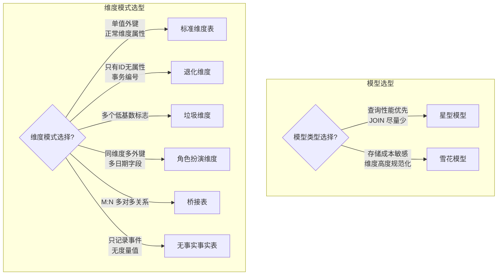

# Kimball 维度建模核心概念

## 适用范围 & 前置假设

- T+1 离线数仓场景（数据次日可用）
- Hive 4.x 非 ACID 模式
- dbt-hive 1.10.0（不支持 snapshots/ephemeral）
- 增量策略以分区回刷（INSERT OVERWRITE）为主

---

## 读者导航（双轨）

- **[Analyst]** 你会得到：粒度合同解读、维度表使用方式、一致性维度对报表口径的意义
- **[Engineer]** 你会得到：星型/雪花模型选型依据、特殊维度模式选择、Bus Matrix 实践方法

---

## TL;DR

Kimball 四步法是维度建模的核心流程：选业务过程 → 声明粒度 → 确定维度 → 确定事实。**星型模型**是 Hive 场景的首选（减少 JOIN）。**一致性维度**是企业级建模的基石，确保跨主题域数据可钻取。

---

## 核心概念

### Kimball 四步维度建模法

Kimball 维度建模法是设计[事实表](../glossary/terms.md#modeling_fact_table)和[维度表](../glossary/terms.md#modeling_dimension_table)的标准流程，包含四个步骤：

**Step 1: 选择业务过程**

识别要建模的业务活动——通常是企业中产生度量值的事件。

| 业务过程示例 | 产生的度量 |
|-------------|-----------|
| 下单 | 订单金额、订单件数 |
| 支付 | 支付金额、支付笔数 |
| 发货 | 发货数量、物流成本 |
| 退款 | 退款金额、退款件数 |

> **[Engineer]** 一个业务过程通常对应一张事实表。

**Step 2: 声明粒度**

定义事实表单行所代表的业务含义——这是维度设计的"合同"。

```
"一行代表一个订单明细（order_detail），包含单个商品的交易信息"
```

> **[Analyst]** 粒度决定了你能做什么分析。明细粒度支持下钻，汇总粒度只能上卷。

> **[Engineer]** 粒度声明后不可轻易变更，变更会导致历史数据一致性问题。

**Step 3: 确定维度**

识别分析视角——用于筛选、分组和描述事实的上下文。

常见维度包括：
- **时间维度**：日期、周、月、季、年
- **客户维度**：客户属性、等级、地域
- **产品维度**：商品属性、类目、品牌
- **地点维度**：省、市、区、门店

**Step 4: 确定事实**

选择要存储的[度量](../glossary/terms.md#modeling_measure)——通常是数值型字段，可进行聚合计算。

| 度量 | 可加性 | 聚合方式 |
|------|-------|---------|
| 订单金额 | 可加 | SUM |
| 订单件数 | 可加 | SUM |
| 单价 | 不可加 | AVG / 加权平均 |
| 折扣率 | 不可加 | 加权平均 |

---

### 星型模型 vs 雪花模型

[星型模型](../glossary/terms.md#modeling_star_schema)和[雪花模型](../glossary/terms.md#modeling_snowflake_schema)是两种基本的维度模型结构：

| 对比项 | 星型模型 | 雪花模型 |
|-------|---------|---------|
| 结构 | 事实表居中，维度表直连 | 维度表规范化分解 |
| JOIN 数量 | 少（维度直连） | 多（需连接多个规范化表） |
| 存储效率 | 维度冗余，存储大 | 规范化，存储小 |
| 查询性能 | 高（适合 OLAP） | 低（JOIN 多） |
| 维护复杂度 | 低 | 高 |

**案例对比：**

```sql
-- 星型模型：产品维度直接包含类目属性
dim_product (product_sk, product_name, category_name, brand_name)

-- 雪花模型：产品维度拆分为多个规范化表
dim_product (product_sk, product_name, category_sk, brand_sk)
dim_category (category_sk, category_name, parent_category_sk)
dim_brand (brand_sk, brand_name)
```

> **[Engineer]** Hive 场景优先选择星型模型。分布式环境下 JOIN 成本高，星型模型减少表连接可显著提升查询性能。

---

### 一致性维度 (Conformed Dimension)

[一致性维度](../glossary/terms.md#modeling_conformed_dimension)是跨多个事实表共享且定义一致的维度，是实现"可组合数据集市"的基石。

**作用：**
- 确保不同主题域使用相同的维度定义
- 支持跨事实表的数据钻取和对比分析
- 避免同名不同义导致的口径混乱

**案例：公共时间维度 dim_date**

```sql
-- 公共时间维度，被订单、履约、会员三个事实表共享
dim_date (
    date_key        INT,        -- 日期代理键 (20260131)
    full_date       DATE,       -- 完整日期
    day_of_week     STRING,     -- 周几
    month_name      STRING,     -- 月份名称
    quarter         INT,        -- 季度
    year            INT         -- 年份
)
```

> **[Analyst]** 一致性维度意义：你在订单报表看到的"2026年Q1"和履约报表看到的"2026年Q1"是完全一致的时间范围，可以放心对比。

> **[Engineer]** 新增事实表前，先检查是否可复用现有一致性维度，避免维度定义碎片化。

---

### Bus Matrix 总线矩阵

[Bus Matrix](../glossary/terms.md#modeling_bus_matrix)（总线矩阵）是规划企业维度建模蓝图的工具，展示业务过程（事实表）与维度之间的关系矩阵。

**案例：电商订单/履约/会员 Bus Matrix**

| 业务过程 / 维度 | 时间 | 客户 | 产品 | 地点 | 员工 | 促销 |
|----------------|------|------|------|------|------|------|
| 订单明细 | X | X | X | X | - | X |
| 履约记录 | X | X | X | X | X | - |
| 会员行为 | X | X | - | X | - | X |

> X = 该事实表关联该维度

**Bus Matrix 的价值：**
1. 可视化展示维度复用情况
2. 识别一致性维度（多个 X 的维度列）
3. 发现维度缺口（某事实表缺少必要维度）

> **[Engineer]** 实践方法：新增事实表时，先在 Bus Matrix 中确定其维度关联，优先复用已有一致性维度。

---

### 特殊维度模式

除了标准维度表，Kimball 定义了多种特殊维度模式，用于处理复杂建模场景。

#### 1. 退化维度 (Degenerate Dimension)

**定义：** 存储在事实表中而非独立维度表的维度属性，通常是事务编号。

**何时使用：** 事务 ID 只有唯一标识作用，无其他属性可描述，建独立维度表无意义。

```sql
-- 订单号作为退化维度，直接存在事实表中
dwd_fact_order_detail (
    ...
    order_no        STRING,     -- 退化维度：订单号
    ...
)
```

> **[Analyst]** 你可以用订单号筛选或分组，但它不会关联到独立的"订单维度表"。

#### 2. 垃圾维度 (Junk Dimension)

**定义：** 将多个低基数标志位（如 is_xxx 字段）合并到一个维度表中。

**何时使用：** 事实表中有多个 Boolean 或低基数枚举字段。

```sql
-- 垃圾维度：合并订单状态标志
dim_order_flags (
    flag_sk         INT,
    is_gift         INT,        -- 是否礼品订单
    is_first_order  INT,        -- 是否首单
    is_promotion    INT,        -- 是否促销订单
    channel_type    STRING      -- 渠道类型 (APP/WEB/MINI)
)
-- 事实表只存一个外键
dwd_fact_order (flag_sk INT, ...)
```

#### 3. 角色扮演维度 (Role-playing Dimension)

**定义：** 同一个物理维度表以不同角色多次关联同一事实表。

**何时使用：** 同类型维度需要多次引用（如多个日期字段）。

```sql
-- 时间维度角色扮演
SELECT
    f.order_amount,
    d1.full_date AS order_date,     -- 下单日期
    d2.full_date AS ship_date,      -- 发货日期
    d3.full_date AS receive_date    -- 签收日期
FROM dwd_fact_order_lifecycle f
JOIN dim_date d1 ON f.order_date_key = d1.date_key
JOIN dim_date d2 ON f.ship_date_key = d2.date_key
JOIN dim_date d3 ON f.receive_date_key = d3.date_key
```

> **[Engineer]** 创建视图或 CTE 为角色扮演维度起别名，提升查询可读性。

#### 4. 无事实事实表 (Factless Fact Table)

**定义：** 只记录事件发生但不包含度量的事实表，只有维度外键。

**何时使用：** 需要记录"发生"而非"量化"的业务事件。

```sql
-- 学生选课：只记录谁选了什么课，无度量
fact_student_enrollment (
    date_key        INT,
    student_key     INT,
    course_key      INT
    -- 无度量字段
)
-- 分析：统计选课人数用 COUNT(*)
```

#### 5. 桥接表 (Bridge Table)

**定义：** 处理多对多（M:N）关系的中间表，连接事实表和维度表。

**何时使用：** 一个事实关联多个同类维度实体（如一个订单用多张优惠券）。

```sql
-- 订单-促销桥接表
bridge_order_promotion (
    order_sk        INT,        -- 订单外键
    promotion_sk    INT,        -- 促销外键
    allocation_pct  DECIMAL     -- 分摊权重（用于金额分摊）
)
```

> **[Analyst]** 使用桥接表时注意聚合：直接 SUM 可能重复计数，需用 DISTINCT 或分摊权重。

---

## 选型决策树



---

## 误区与反模式

| 错误做法 | 正确做法 | 原因 |
|---------|---------|------|
| 不声明粒度就设计事实表 | 先声明粒度，用一句话描述"一行是什么" | 粒度是维度设计的"合同"，不明确会导致可加性问题 |
| 维度属性冗余到事实表 | 事实表只存外键，属性放维度表 | 违反星型原则，更新维护困难 |
| 每个事实表用独立维度定义 | 使用一致性维度，跨事实表共享 | 独立维度导致口径不一致，无法跨域分析 |
| 雪花模型追求极致规范化 | Hive 场景优先星型模型 | 分布式环境 JOIN 成本高，性能损失大 |
| 低基数标志散落在事实表 | 合并为垃圾维度，事实表存外键 | 减少事实表列数，提升可维护性 |

---

## 检查清单

### [Analyst] 分析侧检查项
- [ ] 粒度定义是否清晰？（能用一句话描述"一行代表什么"）
- [ ] 维度表是否有明确的业务含义？（每列都能解释给业务方）
- [ ] 是否理解哪些度量可加、半可加、不可加？
- [ ] 跨报表数据是否使用相同的一致性维度？

### [Engineer] 工程侧检查项
- [ ] 是否优先选择星型模型？（Hive 场景减少 JOIN）
- [ ] 一致性维度是否被多事实表共享？（检查 Bus Matrix）
- [ ] 特殊维度模式选择是否有依据？（退化/垃圾/角色扮演等）
- [ ] 事实表是否只存储外键和度量？（无冗余维度属性）
- [ ] 粒度声明是否写入模型文档或 dbt schema.yml？

---

## 参考文献

- **《数据仓库工具箱》第三版** — Ralph Kimball, Margy Ross
- **[Kimball Dimensional Modeling Techniques](https://www.kimballgroup.com/data-warehouse-business-intelligence-resources/kimball-techniques/dimensional-modeling-techniques/)** — Kimball Group 官方资源
- **[Star Schema vs Snowflake Schema](https://www.thoughtspot.com/data-trends/data-modeling/star-schema-vs-snowflake-schema)** — 模式选型参考

---

*Version: 1.0.0 | Updated: 2026-01-31 | Owner: data-platform*
