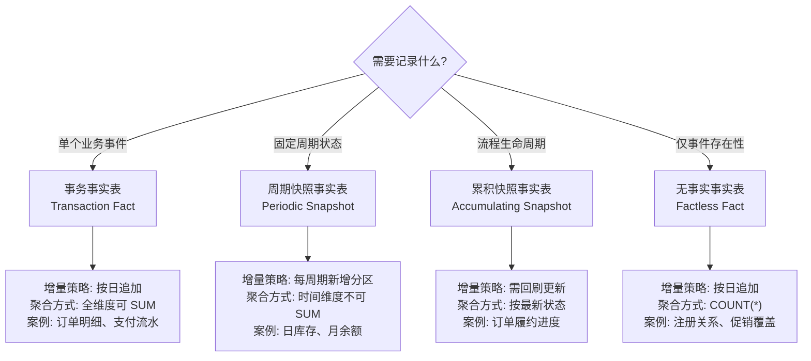

# 事实表类型指南

> 本文档定义事实表 (Fact Table) 的四种类型、可加性分类、以及迟到事实处理策略。用于指导维度建模中事实表的选型和设计决策。

## 适用范围 & 前置假设

- T+1 离线数仓场景
- Hive 分区表（按日期分区）
- dbt-hive incremental 模式（`insert_overwrite`）
- 事实表 [粒度](../glossary/terms.md#modeling_grain) 必须先于设计确定

## 读者导航（双轨）

- **[Analyst]** 你会得到：三类事实表的口径差异、如何正确查询、聚合注意事项（避免错误 SUM）
- **[Engineer]** 你会得到：表结构设计模式、增量策略选择、迟到事实处理骨架

## TL;DR

> 事实表分**事务/周期快照/累积快照**三类，选型基于"记录什么"——单事件用事务型、固定周期状态用周期快照、流程生命周期用累积快照。度量必须标注**可加性**，错误聚合（如对余额跨时间 SUM）是数据分析最常见的 bug。

---

## 核心概念

### 事务事实表 (Transaction Fact Table)

[事务事实表](../glossary/terms.md#modeling_transaction_fact) 记录单个业务事件，一行对应一次事务。

| 特征 | 说明 |
|------|------|
| **粒度** | 事件发生时刻（一个订单行、一笔支付、一次点击） |
| **更新方式** | 只插入不更新（Append-only） |
| **典型场景** | 订单明细、支付流水、行为日志 |

**[Analyst]** 查询模式：

- 直接 `SUM/COUNT`，跨时间维度可加
- 按日期范围过滤后聚合

**[Engineer]** 增量策略：

- 按分区日期追加，`INSERT INTO` 新分区
- 无需回刷历史（除迟到事实场景）

**案例：**

```sql
-- dwd_fact_order_detail（订单明细事实表）
-- 粒度：一个订单行
SELECT
    dt,
    product_key,
    SUM(line_amount) AS total_amount,  -- 可加，直接 SUM
    COUNT(*) AS order_line_count
FROM dwd_fact_order_detail
WHERE dt BETWEEN '2026-01-01' AND '2026-01-31'
GROUP BY dt, product_key;
```

---

### 周期快照事实表 (Periodic Snapshot Fact Table)

[周期快照事实表](../glossary/terms.md#modeling_periodic_snapshot) 记录固定时间周期的状态快照。

| 特征 | 说明 |
|------|------|
| **粒度** | 时间周期 + 实体（日库存、月账户余额） |
| **更新方式** | 每周期新增一行，不修改历史 |
| **典型场景** | 日库存快照、月账户余额、周销售汇总 |

**[Analyst]** 查询模式：

- 取某周期值或对比不同周期
- **时间维度不可加**——不能对多天库存直接 SUM

**[Engineer]** 增量策略：

- 每周期 `INSERT` 新分区
- 历史分区不修改

**案例：**

```sql
-- dws_inventory_daily（日库存快照）
-- 粒度：一个仓库 + 一天

-- ❌ 错误：对库存跨时间 SUM（时间维度不可加）
SELECT SUM(inventory_qty) FROM dws_inventory_daily
WHERE dt BETWEEN '2026-01-01' AND '2026-01-07';

-- ✓ 正确：取某日库存
SELECT warehouse_key, inventory_qty
FROM dws_inventory_daily WHERE dt = '2026-01-07';

-- ✓ 正确：计算周平均库存
SELECT warehouse_key, AVG(inventory_qty) AS avg_inventory
FROM dws_inventory_daily
WHERE dt BETWEEN '2026-01-01' AND '2026-01-07'
GROUP BY warehouse_key;
```

---

### 累积快照事实表 (Accumulating Snapshot Fact Table)

[累积快照事实表](../glossary/terms.md#modeling_accumulating_snapshot) 记录流程实例的生命周期，包含多个时间戳。

| 特征 | 说明 |
|------|------|
| **粒度** | 流程实例（一个订单的全生命周期） |
| **更新方式** | 可更新——流程推进时更新时间戳 |
| **典型场景** | 订单履约进度、工单处理流程、贷款审批进度 |

**[Analyst]** 查询模式：

- 计算阶段耗时：`履约时长 = 发货日期 - 下单日期`
- 流程漏斗分析：各阶段完成率

**[Engineer]** 增量策略：

- 需回刷更新（订单状态变更时更新对应行）
- 或使用版本化（每变更新增行，类似 SCD Type 2）

**案例：**

```sql
-- dwd_fact_order_lifecycle（订单履约进度事实表）
-- 粒度：一个订单
CREATE TABLE dwd_fact_order_lifecycle (
    order_sk            BIGINT,               -- 代理键
    order_key           STRING,               -- 订单业务键
    customer_key        INT,                  -- 客户维度外键

    -- 多时间戳：记录流程各阶段
    order_date          DATE,                 -- 下单日期
    payment_date        DATE,                 -- 支付日期
    ship_date           DATE,                 -- 发货日期
    delivery_date       DATE,                 -- 送达日期

    -- 阶段耗时（可选，也可查询时计算）
    order_to_payment    INT,                  -- 下单到支付天数
    payment_to_ship     INT,                  -- 支付到发货天数
    ship_to_delivery    INT,                  -- 发货到送达天数

    -- 当前状态
    current_status      STRING,               -- 已下单/已支付/已发货/已送达

    dt                  STRING                -- 分区日期（最后更新日）
)
PARTITIONED BY (dt);
```

**[Analyst]** 典型分析：

```sql
-- 计算平均履约时长
SELECT
    AVG(DATEDIFF(delivery_date, order_date)) AS avg_fulfillment_days
FROM dwd_fact_order_lifecycle
WHERE delivery_date IS NOT NULL
  AND dt = '2026-01-30';
```

---

### 无事实事实表 (Factless Fact Table)

[无事实事实表](../glossary/terms.md#modeling_factless_fact) 只记录事件发生，无度量字段。

| 特征 | 说明 |
|------|------|
| **粒度** | 事件存在性（学生注册课程、促销覆盖商品） |
| **度量** | 无显式度量，`COUNT(*)` 即度量 |
| **典型场景** | 多对多关系记录、覆盖范围、事件存在性 |

**案例：**

```sql
-- dwd_fact_student_enrollment（学生-课程注册事实表）
-- 粒度：一个学生注册一门课程
CREATE TABLE dwd_fact_student_enrollment (
    date_key        INT,                      -- 注册日期
    student_key     INT,                      -- 学生维度外键
    course_key      INT,                      -- 课程维度外键
    dt              STRING                    -- 分区日期
)
PARTITIONED BY (dt);

-- 查询：某课程注册人数
SELECT course_key, COUNT(*) AS enrollment_count
FROM dwd_fact_student_enrollment
WHERE dt = '2026-01-30'
GROUP BY course_key;
```

---

## 可加性 (Additivity)

**[Analyst] 必读：这是数据分析最常见的 bug 来源。**

[可加性](../glossary/terms.md#modeling_additive_fact) 决定度量能否在特定维度上 SUM。

| 度量类型 | 时间可加 | 其他维度可加 | 正确聚合方式 | 示例 |
|---------|:-------:|:-----------:|-------------|------|
| **可加** (Additive) | ✓ | ✓ | `SUM` | 销售金额、订单数量、件数 |
| **半可加** (Semi-additive) | ✗ | ✓ | 取最新 / `AVG` | 账户余额、库存数量、人数 |
| **不可加** (Non-additive) | ✗ | ✗ | 加权平均 / 比率公式 | 单价、折扣率、转化率 |

### [Analyst] 警告

- **半可加度量**：对时间维度 SUM 会得到无意义的结果
  - ❌ `SUM(balance)` across days = 错误
  - ✓ `balance WHERE dt = 最新日期` = 正确

- **不可加度量**：任何维度 SUM 都错误
  - ❌ `SUM(unit_price)` = 错误
  - ✓ `SUM(line_amount) / SUM(quantity)` = 正确的平均单价

### [Engineer] 实践

在 `schema.yml` 中用 `meta` 标注可加性：

```yaml
version: 2

models:
  - name: dwd_fact_order_detail
    columns:
      - name: line_amount
        description: 订单行金额
        meta:
          additivity: additive     # 可加
      - name: unit_price
        description: 单价
        meta:
          additivity: non_additive # 不可加
      - name: quantity
        description: 数量
        meta:
          additivity: additive     # 可加

  - name: dws_inventory_daily
    columns:
      - name: inventory_qty
        description: 库存数量
        meta:
          additivity: semi_additive  # 半可加：时间不可加
```

---

## 迟到事实 (Late-arriving Facts)

**[Engineer] 必读：T+1 场景的常见问题。**

### 场景

事务数据延迟到达：如 T+2 才收到 T 日的订单。

### 影响

历史分区需要补数，否则数据不完整。

### 处理策略

1. **定义回刷窗口**：如最近 7 天分区可回刷

2. **dbt 增量模型**：使用 `insert_overwrite` 覆盖分区

```sql
-- models/dwd/dwd_fact_order_detail.sql
{{
  config(
    materialized='incremental',
    incremental_strategy='insert_overwrite',
    partition_by=['dt'],
    partitions=['{{ var("ds") }}']  -- 当日分区
  )
}}

SELECT
    order_detail_sk,
    date_key,
    customer_key,
    product_key,
    order_no,
    quantity,
    unit_price,
    line_amount,
    dt
FROM {{ source('ods', 'order_details') }}
WHERE dt = '{{ var("ds") }}'


-- 回刷窗口：最近 7 天可能有迟到数据
UNION ALL
SELECT * FROM {{ source('ods', 'order_details') }}
WHERE dt >= DATE_SUB('{{ var("ds") }}', 7)
  AND dt < '{{ var("ds") }}'
  AND updated_at > (SELECT MAX(etl_time) FROM {{ this }} WHERE dt = source.dt)

```

3. **超期处理**：超出回刷窗口的迟到数据记录日志，人工处理

```sql
-- 记录超期迟到事实
INSERT INTO dwd_late_arriving_log
SELECT
    'order_detail' AS table_name,
    order_no AS business_key,
    dt AS data_date,
    CURRENT_DATE AS detected_date,
    DATEDIFF(CURRENT_DATE, dt) AS days_late
FROM {{ source('ods', 'order_details') }}
WHERE dt < DATE_SUB(CURRENT_DATE, 7)  -- 超出 7 天回刷窗口
  AND NOT EXISTS (SELECT 1 FROM {{ this }} t WHERE t.order_no = source.order_no);
```

---

## 选型决策树



---

## 实操指南

### 场景 1：订单明细事实表（事务型）

**[Engineer]** 骨架示例：

```sql
-- dwd_fact_order_detail（订单明细事实表）
CREATE TABLE dwd_fact_order_detail (
    -- 代理键
    order_detail_sk     BIGINT              COMMENT '代理键',

    -- 维度外键
    date_key            INT                 COMMENT '日期维度外键',
    customer_key        INT                 COMMENT '客户维度外键',
    product_key         INT                 COMMENT '产品维度外键',
    store_key           INT                 COMMENT '门店维度外键',

    -- 退化维度
    order_no            STRING              COMMENT '订单号（退化维度）',

    -- 事实/度量
    quantity            INT                 COMMENT '数量（可加）',
    unit_price          DECIMAL(10,2)       COMMENT '单价（不可加）',
    line_amount         DECIMAL(10,2)       COMMENT '行金额（可加）',
    discount_amount     DECIMAL(10,2)       COMMENT '折扣金额（可加）',

    -- 分区键
    dt                  STRING              COMMENT '分区日期'
)
COMMENT '订单明细事实表 - 粒度：一个订单行'
PARTITIONED BY (dt);
```

**[Analyst]** 典型查询：

```sql
-- 按日期和产品汇总销售额
SELECT
    dt,
    p.product_category,
    SUM(f.line_amount) AS total_amount,     -- 可加，直接 SUM
    SUM(f.quantity) AS total_quantity,       -- 可加
    SUM(f.line_amount) / SUM(f.quantity) AS avg_price  -- 不可加，需公式
FROM dwd_fact_order_detail f
JOIN dim_product p ON f.product_key = p.product_key
WHERE f.dt BETWEEN '2026-01-01' AND '2026-01-31'
GROUP BY dt, p.product_category;
```

### 场景 2：日库存快照（周期快照型）

**[Engineer]** 骨架示例：

```sql
-- dws_inventory_daily（日库存快照事实表）
CREATE TABLE dws_inventory_daily (
    -- 维度外键
    date_key            INT                 COMMENT '日期维度外键',
    warehouse_key       INT                 COMMENT '仓库维度外键',
    product_key         INT                 COMMENT '产品维度外键',

    -- 事实/度量（半可加）
    inventory_qty       INT                 COMMENT '库存数量（半可加：时间不可加）',
    inventory_value     DECIMAL(12,2)       COMMENT '库存金额（半可加）',

    -- 分区键
    dt                  STRING              COMMENT '快照日期'
)
COMMENT '日库存快照事实表 - 粒度：一个仓库+产品+日期'
PARTITIONED BY (dt);
```

**[Analyst]** 正确查询模式：

```sql
-- ✓ 取最新库存（当前状态）
SELECT warehouse_key, product_key, inventory_qty
FROM dws_inventory_daily
WHERE dt = '2026-01-30';

-- ✓ 计算期间平均库存
SELECT
    warehouse_key,
    AVG(inventory_qty) AS avg_inventory
FROM dws_inventory_daily
WHERE dt BETWEEN '2026-01-01' AND '2026-01-30'
GROUP BY warehouse_key;

-- ✓ 库存变化趋势
SELECT dt, SUM(inventory_qty) AS total_inventory  -- 仓库维度可加
FROM dws_inventory_daily
WHERE dt BETWEEN '2026-01-01' AND '2026-01-30'
GROUP BY dt
ORDER BY dt;
```

---

## 误区与反模式

| 错误做法 | 正确做法 | 原因 |
|---------|---------|------|
| ❌ 对余额/库存按时间 SUM | ✓ 取最新值或 AVG | 半可加度量时间维度不可加，SUM 无业务意义 |
| ❌ 累积快照不设计回刷机制 | ✓ 定义回刷窗口和更新策略 | 流程状态会更新，不回刷导致数据过时 |
| ❌ 混用事务和快照粒度 | ✓ 拆分为两张事实表 | 粒度不一致导致聚合错误和数据冗余 |
| ❌ 迟到事实直接丢弃 | ✓ 定义回刷窗口，超期记录日志 | 数据完整性优先，不能静默丢失数据 |
| ❌ 不标注度量可加性 | ✓ 在 schema.yml 用 meta 标注 | 下游分析人员无法判断正确聚合方式 |
| ❌ 无事实表加冗余度量 | ✓ 只保留维度外键 | 无事实表的"度量"就是 COUNT(*)，加其他度量破坏语义 |

---

## 检查清单

### [Analyst] 分析侧

- [ ] 是否确认每个度量的可加性类型
- [ ] 查询半可加度量时是否避免跨时间 SUM
- [ ] 不可加度量是否使用正确公式计算
- [ ] 是否理解事实表粒度（一行代表什么）

### [Engineer] 工程侧

- [ ] 事务事实表是否为只追加模式（Append-only）
- [ ] 周期快照是否定义了周期粒度（日/周/月）
- [ ] 累积快照是否设计了回刷机制
- [ ] 迟到事实是否有处理策略（回刷窗口 + 超期日志）
- [ ] schema.yml 是否用 `meta.additivity` 标注可加性
- [ ] 无事实表是否只包含维度外键
- [ ] 分区键是否与增量策略匹配

---

**参考文献:**
- Kimball, R., Ross, M. (2013). *The Data Warehouse Toolkit, 3rd Edition*. Wiley.
- [Kimball Dimensional Modeling Techniques](https://www.kimballgroup.com/data-warehouse-business-intelligence-resources/kimball-techniques/dimensional-modeling-techniques/)

**版本:** 1.0.0 | **更新日期:** 2026-01-31
