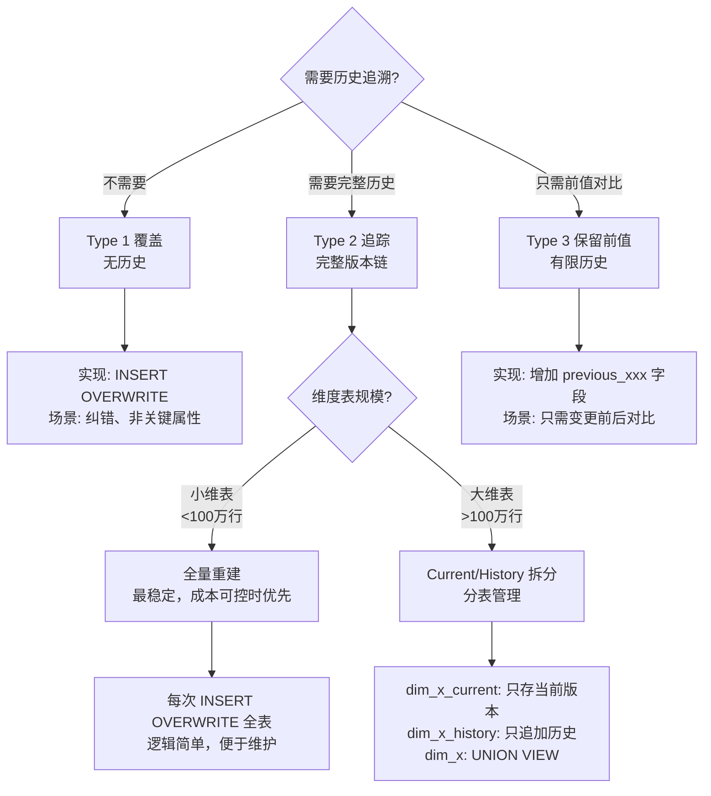

# SCD 策略指南

> 本文档定义缓慢变化维度 (Slowly Changing Dimension, SCD) 的三种主要策略、字段合同规范、以及 dbt-hive 无 Snapshots 环境下的实现方案。用于指导维度表设计和历史追溯需求的技术选型。

## 适用范围 & 前置假设

- T+1 离线数仓场景
- Hive 非 ACID 模式（不支持原生 UPDATE/DELETE）
- **dbt-hive 不支持 Snapshots 功能**，需自定义实现
- 增量以 `insert_overwrite` 分区回刷为主
- 维度表详见 [维度建模指南](./dimensional-modeling.md)

## 读者导航（双轨）

- **[Analyst]** 你会得到：历史追溯查询方式、as-of 查询模式、变更审计查询
- **[Engineer]** 你会得到：SCD 选型决策、dbt-hive 实现骨架、质量门禁（dbt tests）、字段合同规范

## TL;DR

> [SCD](../glossary/terms.md#scd_slowly_changing)（缓慢变化维度）有 Type 1/2/3 三种主要策略。Type 1 直接覆盖、Type 2 追踪完整历史、Type 3 只保留前值。**dbt-hive 无 Snapshots 支持**，需用 `insert_overwrite` + 有效期字段手动实现 Type 2。字段合同：采用右开区间 `[effective_start, effective_end)`，每个自然键最多一条 `is_current=1`。

---

## 核心概念

### SCD Type 1 — 覆盖（无历史）

[SCD Type 1](../glossary/terms.md#scd_type1) 直接覆盖旧值，不保留历史。

| 特征 | 说明 |
|------|------|
| **行为** | 新值覆盖旧值，历史记录消失 |
| **历史** | 不保留 |
| **适用场景** | 数据纠错、不需要历史追溯的属性 |

**[Analyst]** 影响：

- 历史报表会使用新值重算
- 无法回答"当时的值是什么"

**[Engineer]** 实现：

```sql
-- 直接 INSERT OVERWRITE 全表或分区
INSERT OVERWRITE TABLE dim_customer
SELECT
    customer_sk,
    customer_id,
    customer_name,
    customer_email,  -- 纠错后的新邮箱
    CURRENT_DATE AS dw_update_time
FROM source_customers;
```

**案例：** 客户邮箱纠错、商品名称拼写修正

---

### SCD Type 2 — 追踪历史（完整版本链）

[SCD Type 2](../glossary/terms.md#scd_type2) 每次变更新增一行，保留所有历史版本。

| 特征 | 说明 |
|------|------|
| **行为** | 每次变更创建新版本行，旧版本标记为历史 |
| **历史** | 完整保留（可追溯任意时间点） |
| **适用场景** | 需要历史追溯（客户地址变更、商品价格调整） |

**[Analyst]** 查询模式：

```sql
-- 当前视图：查询当前有效记录
SELECT * FROM dim_customer
WHERE is_current = 1;

-- as-of 回溯：查询 2025-06-15 时点的客户地址
SELECT * FROM dim_customer
WHERE effective_start <= '2025-06-15'
  AND effective_end > '2025-06-15';

-- 变更审计：查看客户所有历史版本
SELECT * FROM dim_customer
WHERE customer_id = 'C001'
ORDER BY effective_start;
```

**[Engineer]** 标准字段组合：

```sql
-- SCD Type 2 维度表结构
CREATE TABLE dim_customer (
    -- 代理键
    customer_sk         BIGINT              COMMENT '代理键（每版本唯一）',

    -- 自然键/业务键
    customer_id         STRING              COMMENT '业务键（客户编号）',

    -- 维度属性
    customer_name       STRING              COMMENT '客户名称',
    customer_address    STRING              COMMENT '客户地址（可能变更）',
    customer_level      STRING              COMMENT '客户等级（可能变更）',

    -- SCD Type 2 标准字段
    effective_start     DATE                COMMENT '生效开始日期',
    effective_end       DATE                COMMENT '生效结束日期（当前: 9999-12-31）',
    is_current          INT                 COMMENT '当前标识（1=当前, 0=历史）',

    -- ETL 审计字段
    dw_insert_time      TIMESTAMP           COMMENT '首次加载时间',
    dw_update_time      TIMESTAMP           COMMENT '最后更新时间'
)
COMMENT 'SCD Type 2 客户维度表 - 粒度：一个客户一个版本';
```

**案例：** 客户地址变更追踪、商品价格历史、会员等级变化

---

### SCD Type 3 — 保留前值（有限历史）

[SCD Type 3](../glossary/terms.md#scd_type3) 只保留当前值和前一个值。

| 特征 | 说明 |
|------|------|
| **行为** | 增加"前值"字段，只保留最近一次变更 |
| **历史** | 有限保留（只有当前值 + 前值） |
| **适用场景** | 只关心"变更前后"对比 |

**[Analyst]** 查询模式：

```sql
-- 对比当前区域和前区域
SELECT
    sales_rep_id,
    current_region,
    previous_region,
    region_change_date
FROM dim_sales_rep
WHERE previous_region IS NOT NULL;  -- 有过变更的销售
```

**[Engineer]** 实现：

```sql
CREATE TABLE dim_sales_rep (
    sales_rep_sk        BIGINT,
    sales_rep_id        STRING,
    sales_rep_name      STRING,

    -- SCD Type 3：当前值 + 前值
    current_region      STRING              COMMENT '当前销售区域',
    previous_region     STRING              COMMENT '前销售区域',
    region_change_date  DATE                COMMENT '区域变更日期'
);
```

**案例：** 销售区域调整（只需对比变更前后）、组织架构调整

---

## SCD2 字段合同

**[Engineer] 必读：这是 SCD Type 2 实现的"数据合同"。**

按项目约定，SCD Type 2 必须满足以下 5 个约束：

### 1. 区间语义：右开区间 `[effective_start, effective_end)`

```
生效区间包含 effective_start，不包含 effective_end
当前记录：effective_end = '9999-12-31'
```

**示例：**

| customer_id | effective_start | effective_end | is_current | 含义 |
|-------------|-----------------|---------------|------------|------|
| C001 | 2024-01-01 | 2024-06-15 | 0 | 2024-01-01 至 2024-06-14 有效 |
| C001 | 2024-06-15 | 9999-12-31 | 1 | 2024-06-15 至今有效 |

### 2. Current 唯一约束

```
每个自然键最多一条 is_current = 1
```

### 3. 区间不重叠

```
任意日期 as-of 查询只能命中同一自然键的一行
同一自然键的不同版本区间不交叉
```

### 4. Tie-breaker 规则

```
同一自然键同一时刻多次变更的处理：
- 使用 updated_at、loaded_at 或属性 hash 裁决
- 保留最后变更为当前版本
```

### 5. 可验证实现合同（dbt tests）

```yaml
# schema.yml
version: 2

models:
  - name: dim_customer
    description: "SCD Type 2 客户维度表"
    tests:
      # 测试 1: is_current=1 唯一性（每个自然键最多一条当前记录）
      - dbt_utils.unique_combination_of_columns:
          combination_of_columns:
            - customer_id
          where: "is_current = 1"

      # 测试 2: 区间有效性（start < end）
      - dbt_utils.expression_is_true:
          expression: "effective_start < effective_end"

      # 测试 3: 自然键 + effective_start 唯一性（无重复版本）
      - dbt_utils.unique_combination_of_columns:
          combination_of_columns:
            - customer_id
            - effective_start

    columns:
      - name: customer_sk
        tests:
          - unique
          - not_null

      - name: customer_id
        tests:
          - not_null

      - name: is_current
        tests:
          - accepted_values:
              values: [0, 1]
```

---

## 迟到维度 (Late-arriving Dimensions)

**[Engineer] 必读：事实数据先到，维度记录后到的处理策略。**

### 场景

- 订单事实先于客户维度到达
- 事实表外键指向不存在的维度记录

### 处理策略

1. **创建 Unknown 成员**：占位维度记录

```sql
-- Unknown 成员：customer_sk = -1
INSERT INTO dim_customer VALUES (
    -1,                     -- customer_sk（Unknown 占位）
    'UNKNOWN',              -- customer_id
    '未知客户',              -- customer_name
    '未知',                  -- customer_address
    '未知',                  -- customer_level
    '1900-01-01',           -- effective_start
    '9999-12-31',           -- effective_end
    1,                      -- is_current
    CURRENT_TIMESTAMP,
    CURRENT_TIMESTAMP
);
```

2. **事实加载时**：缺失维度指向 Unknown

```sql
-- 事实表加载时处理缺失维度
SELECT
    f.order_detail_sk,
    f.date_key,
    COALESCE(c.customer_sk, -1) AS customer_key,  -- 缺失时指向 Unknown
    f.product_key,
    f.line_amount
FROM staging_order_detail f
LEFT JOIN dim_customer c
    ON f.customer_id = c.customer_id AND c.is_current = 1;
```

3. **维度到达后**：更新 Unknown 为真实值

```sql
-- 选项 A: Type 1 覆盖（更新 Unknown 成员）
-- 选项 B: Type 2 新增版本（保留 Unknown 历史）
```

4. **事实回刷决策**：是否更新已关联 Unknown 的事实记录

| 策略 | 做法 | 适用场景 |
|------|------|---------|
| 不回刷 | 事实表保持 Unknown 关联 | 历史精确性要求不高 |
| 回刷 | 定期重算事实表维度外键 | 历史分析精确性要求高 |

---

## 选型决策树



---

## 实操指南 — dbt-hive SCD2 实现

### 实现路径 1: 全量重建（推荐小维表）

**[Engineer]** 适用条件：维度表行数 < 100 万，每日可全量刷新

```sql
-- models/dim/dim_customer.sql
{{
  config(
    materialized='table',
    file_format='parquet'
  )
}}

WITH source AS (
    SELECT
        customer_id,
        customer_name,
        customer_address,
        customer_level,
        updated_at
    FROM {{ source('ods', 'customers') }}
),

-- Step 1: 获取当前维表的所有记录
existing AS (
    SELECT * FROM {{ this }}
    WHERE 1=0  -- 首次运行时为空
    
    UNION ALL
    SELECT * FROM {{ this }}
    
),

-- Step 2: 识别变更（与当前维表对比）
changes AS (
    SELECT
        s.customer_id,
        s.customer_name,
        s.customer_address,
        s.customer_level,
        s.updated_at,
        CASE
            WHEN e.customer_sk IS NULL THEN 'INSERT'
            WHEN s.customer_address != e.customer_address
              OR s.customer_level != e.customer_level THEN 'UPDATE'
            ELSE 'NO_CHANGE'
        END AS change_type,
        e.customer_sk AS existing_sk
    FROM source s
    LEFT JOIN existing e
        ON s.customer_id = e.customer_id AND e.is_current = 1
),

-- Step 3: 关闭旧版本（UPDATE -> 设置 effective_end 和 is_current=0）
closed_versions AS (
    SELECT
        e.customer_sk,
        e.customer_id,
        e.customer_name,
        e.customer_address,
        e.customer_level,
        e.effective_start,
        CAST('{{ var("ds") }}' AS DATE) AS effective_end,  -- 关闭日期
        0 AS is_current,
        e.dw_insert_time,
        CURRENT_TIMESTAMP AS dw_update_time
    FROM existing e
    INNER JOIN changes c
        ON e.customer_id = c.customer_id
        AND e.is_current = 1
        AND c.change_type = 'UPDATE'
),

-- Step 4: 新增版本（INSERT 和 UPDATE 都产生新行）
new_versions AS (
    SELECT
        ROW_NUMBER() OVER (ORDER BY customer_id)
            + COALESCE((SELECT MAX(customer_sk) FROM existing), 0) AS customer_sk,
        customer_id,
        customer_name,
        customer_address,
        customer_level,
        CAST('{{ var("ds") }}' AS DATE) AS effective_start,
        CAST('9999-12-31' AS DATE) AS effective_end,
        1 AS is_current,
        CURRENT_TIMESTAMP AS dw_insert_time,
        CURRENT_TIMESTAMP AS dw_update_time
    FROM changes
    WHERE change_type IN ('INSERT', 'UPDATE')
),

-- Step 5: 保留未变更的记录
unchanged AS (
    SELECT
        e.customer_sk,
        e.customer_id,
        e.customer_name,
        e.customer_address,
        e.customer_level,
        e.effective_start,
        e.effective_end,
        e.is_current,
        e.dw_insert_time,
        e.dw_update_time
    FROM existing e
    LEFT JOIN changes c
        ON e.customer_id = c.customer_id AND e.is_current = 1
    WHERE c.change_type IS NULL OR c.change_type = 'NO_CHANGE'
),

-- Step 6: 合并所有记录
final AS (
    SELECT * FROM unchanged
    UNION ALL
    SELECT * FROM closed_versions
    UNION ALL
    SELECT * FROM new_versions
)

SELECT * FROM final
```

### 实现路径 2: Current/History 拆分（大维表）

**[Engineer]** 适用条件：维度表行数 > 100 万，需要优化性能

```
dim_customer_current   -- 只存当前版本，每天 INSERT OVERWRITE
dim_customer_history   -- 只追加历史版本，每天 INSERT INTO
dim_customer           -- UNION VIEW（对外暴露）
```

**dim_customer_current.sql:**

```sql
{{
  config(
    materialized='table',
    file_format='parquet'
  )
}}

-- 每天全量刷新当前版本
SELECT
    customer_sk,
    customer_id,
    customer_name,
    customer_address,
    customer_level,
    effective_start,
    CAST('9999-12-31' AS DATE) AS effective_end,
    1 AS is_current,
    dw_insert_time,
    CURRENT_TIMESTAMP AS dw_update_time
FROM {{ ref('stg_dim_customer_merged') }}
WHERE is_current = 1
```

**dim_customer_history.sql:**

```sql
{{
  config(
    materialized='incremental',
    incremental_strategy='append'
  )
}}

-- 只追加新产生的历史版本
SELECT
    customer_sk,
    customer_id,
    customer_name,
    customer_address,
    customer_level,
    effective_start,
    effective_end,
    0 AS is_current,
    dw_insert_time,
    dw_update_time
FROM {{ ref('stg_dim_customer_closed') }}
WHERE effective_end = CAST('{{ var("ds") }}' AS DATE)  -- 今天关闭的版本


AND customer_sk NOT IN (SELECT customer_sk FROM {{ this }})

```

**dim_customer.sql (VIEW):**

```sql
{{
  config(
    materialized='view'
  )
}}

SELECT * FROM {{ ref('dim_customer_current') }}
UNION ALL
SELECT * FROM {{ ref('dim_customer_history') }}
```

---

## 标准查询模式

**[Analyst]** 三种常用查询：

### 1. 当前视图

```sql
-- 查询所有当前有效的客户
SELECT
    customer_id,
    customer_name,
    customer_address,
    customer_level
FROM dim_customer
WHERE is_current = 1;
```

### 2. as-of 回溯查询

```sql
-- 查询 2025-06-15 时点的客户状态
SELECT
    customer_id,
    customer_name,
    customer_address,
    customer_level
FROM dim_customer
WHERE effective_start <= '2025-06-15'
  AND effective_end > '2025-06-15';
```

### 3. 变更审计查询

```sql
-- 查看客户 C001 的所有历史版本
SELECT
    customer_id,
    customer_address,
    effective_start,
    effective_end,
    is_current,
    CASE
        WHEN is_current = 1 THEN '当前版本'
        ELSE CONCAT('历史版本 (', effective_start, ' - ', effective_end, ')')
    END AS version_label
FROM dim_customer
WHERE customer_id = 'C001'
ORDER BY effective_start;
```

---

## 误区与反模式

| 错误做法 | 正确做法 | 原因 |
|---------|---------|------|
| ❌ 用闭区间 `[start, end]` | ✓ 用右开区间 `[start, end)` | 避免边界日期重复命中两个版本 |
| ❌ 不设 is_current 标志 | ✓ 加 is_current=1 当前标识 | 简化当前视图查询，避免每次计算 MAX(effective_start) |
| ❌ 无 tie-breaker 规则 | ✓ 用 updated_at 裁决同时刻变更 | 避免同一自然键出现多条 is_current=1 |
| ❌ 迟到维直接跳过 | ✓ 使用 Unknown 成员占位 | 保证事实表外键完整性，不产生 NULL 外键 |
| ❌ SCD2 无 dbt tests | ✓ 加区间、唯一性测试 | 保证数据合同可验证，防止脏数据入仓 |
| ❌ 大维表全量重建 | ✓ 拆分 Current/History 表 | 避免性能问题，减少每日计算量 |
| ❌ effective_end 用 NULL | ✓ effective_end 用 9999-12-31 | NULL 比较语义复杂，9999-12-31 更易处理 |

---

## 检查清单

### [Analyst] 分析侧

- [ ] 是否清楚 SCD 类型对历史查询的影响
- [ ] as-of 查询是否使用正确的区间条件（`start <= date AND end > date`）
- [ ] 当前视图查询是否使用 `is_current = 1`
- [ ] 是否理解 Type 1 变更会影响历史报表结果

### [Engineer] 工程侧

- [ ] SCD Type 2 是否使用标准字段（effective_start/end + is_current）
- [ ] 区间是否采用右开语义 `[start, end)`
- [ ] 当前记录 effective_end 是否统一为 `9999-12-31`
- [ ] 是否有 is_current 唯一性 dbt test
- [ ] 是否有区间有效性 dbt test（start < end）
- [ ] 是否有自然键 + effective_start 唯一性 test
- [ ] 是否定义了迟到维 Unknown 成员
- [ ] 是否选择了合适的实现路径（全量重建 vs 拆分）
- [ ] 同时刻多变更是否有 tie-breaker 规则

---

**参考文献:**
- Kimball, R., Ross, M. (2013). *The Data Warehouse Toolkit, 3rd Edition*. Wiley.
- [Kimball Dimensional Modeling Techniques](https://www.kimballgroup.com/data-warehouse-business-intelligence-resources/kimball-techniques/dimensional-modeling-techniques/)
- [dbt Community: SCD Type 2 without Snapshots](https://discourse.getdbt.com/t/how-to-implement-scd-type-2-without-using-snapshot/4346)

**版本:** 1.0.0 | **更新日期:** 2026-01-31
