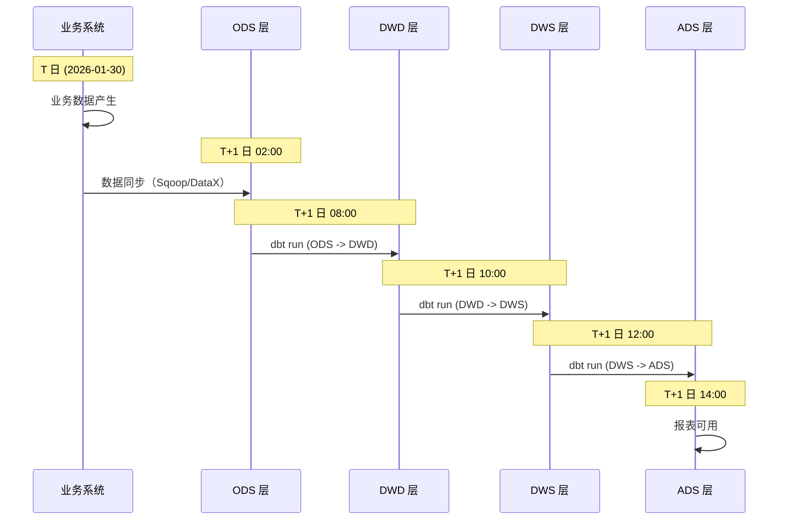

# 增量策略

> 本文档定义 T+1 离线数仓的增量策略，重点说明 insert_overwrite 分区回刷机制和 lookback 窗口配置。非 ACID 模式下，分区回刷是唯一可靠的增量更新方式。

## TL;DR

- **离线数仓使用 T+1 增量模式** — 昨日数据今日可用
- **核心策略:** insert_overwrite 分区回刷，覆盖指定分区，其他分区不变
- **默认 lookback 7 天** — 覆盖迟到数据（Late-arriving Data）
- **分区内去重** — row_number 取最新版本
- **核心观点:** 分区幂等 + 窗口回刷 = 数据最终一致

---

## T+1 离线数仓模式原理

### 什么是 T+1

T+1 指"昨日数据今日可用"：
- **T** = 业务发生日（如 2026-01-30）
- **T+1** = 数据可用日（如 2026-01-31）
- 数据延迟一天进入数仓，适合离线分析场景

### 数据流转时间线



### 调度时间点说明

| 时间 | 事件 | 说明 |
|------|------|------|
| 02:00 | ODS 同步开始 | 从业务系统抽取 T 日数据 |
| 06:00 | ODS 同步完成 | 数据落地 ODS 分区 |
| 08:00 | DWD 计算开始 | ODS -> DWD 明细层 |
| 10:00 | DWS 计算开始 | DWD -> DWS 汇总层 |
| 12:00 | ADS 计算开始 | DWS -> ADS 应用层 |
| 14:00 | 报表可用 | T 日数据分析就绪 |

---

## 增量策略对比矩阵

| 策略 | 适用场景 | 优点 | 缺点 | 推荐度 |
|------|---------|------|------|--------|
| insert_overwrite | 分区回刷 | 幂等、可重跑、简单 | 全分区重算 | 5/5 |
| append | 纯追加日志 | 性能高、无计算 | 不支持更新/去重 | 2/5 |
| merge (ACID) | 行级更新 | 精确、支持 upsert | 需要 ACID 表、有性能开销 | 3/5 |

**结论:** 非 ACID 环境首选 insert_overwrite，牺牲少量性能换取幂等性和简单性。

---

## insert_overwrite 分区回刷机制

### 原理说明

INSERT OVERWRITE PARTITION 覆盖指定分区数据，其他分区保持不变：

```sql
-- 只覆盖 dt='2026-01-31' 分区
INSERT OVERWRITE TABLE dwd_fact_orders PARTITION (dt)
SELECT order_id, customer_id, order_amount, dt
FROM ods_orders
WHERE dt = '2026-01-31';

-- 效果：
-- dt='2026-01-30' 分区: 不变
-- dt='2026-01-31' 分区: 全部替换为新数据
-- dt='2026-02-01' 分区: 不变
```

### 幂等性保证

分区回刷天然幂等：
- **重跑 = 覆盖** — 多次执行结果一致
- **无重复数据** — 覆盖而非追加
- **故障恢复简单** — 直接重跑即可

### 分区键选择原则

| 原则 | 说明 | 示例 |
|------|------|------|
| 低基数 | 分区数不宜过多（<10000） | 日期、地区、类型 |
| 业务相关 | 与查询模式匹配 | 按日期分区支持日期范围查询 |
| 均匀分布 | 避免数据倾斜 | 避免按用户 ID 分区 |

**推荐:** 大多数场景使用 `dt`（日期）作为分区键。

---

## lookback 回刷模式（核心章节）

### 为什么需要 lookback

**迟到数据 (Late-arriving Data):**
- 业务系统延迟同步（网络故障、队列积压）
- 数据修正（业务系统补录、更正）
- 跨系统依赖延迟

**示例:**
- T 日 订单在 T+3 日才完成状态更新
- 数据源系统在 T+2 日补录历史数据

### lookback 配置

**重要:** 此配置决定数据一致性窗口。详细配置原理参考 [SCD 策略文档](../methodology/scd-strategies.md)。

| 层级 | 默认 lookback | 原因 |
|------|--------------|------|
| ODS | 7 天 | 源系统同步延迟，覆盖一周迟到数据 |
| DWD-DWS | 30 天 | 业务修正窗口，覆盖月度结算周期 |
| ADS | 90 天 | 报表重算需求，覆盖季度报表 |

> **注意:** lookback 天数需根据业务实际迟到分布调整。可通过分析历史数据到达时间确定合理值。

### dbt 模型示例

**标准 T+1 + lookback 7 天增量模型:**

```sql
-- models/dwd/dwd_fact_orders.sql
{{
  config(
    materialized='incremental',
    incremental_strategy='insert_overwrite',
    partition_by=['dt'],
    file_format='orc'
  )
}}

SELECT
    order_id,
    user_id,
    order_amount,
    order_status,
    updated_at,
    -- P0：分区列必须在最后
    dt
FROM {{ source('ods', 'orders') }}
WHERE dt >= date_sub('{{ var("ds") }}', {{ var("lookback_days", 7) }})
  AND dt <= '{{ var("ds") }}'
  -- P0：分区列非空检查
  AND dt IS NOT NULL
  -- P0：分区列格式校验
  AND dt RLIKE '^[0-9]{4}-[0-9]{2}-[0-9]{2}$'
```

### 运行命令示例

```bash
# 日常调度（默认 lookback 7 天）
dbt run --select dwd_fact_orders --vars '{"ds":"2026-01-31"}'

# 显式指定 lookback 天数
dbt run --select dwd_fact_orders --vars '{"ds":"2026-01-31","lookback_days":7}'

# 扩大 lookback 窗口（数据修正场景）
dbt run --select dwd_fact_orders --vars '{"ds":"2026-01-31","lookback_days":30}'

# 全量重跑（初始化或 schema 变更）
dbt run --select dwd_fact_orders --full-refresh
```

---

## 分区内去重模式

### 为什么需要去重

同一业务键可能有多个版本：
- 源系统重复推送
- 业务修正产生多版本
- 迟到数据覆盖

### row_number 去重示例

```sql
-- 分区内去重，取最新版本
{{
  config(
    materialized='incremental',
    incremental_strategy='insert_overwrite',
    partition_by=['dt'],
    file_format='orc'
  )
}}

WITH source_with_rownum AS (
    SELECT
        order_id,
        user_id,
        order_amount,
        order_status,
        updated_at,
        dt,
        ROW_NUMBER() OVER (
            PARTITION BY order_id, dt
            ORDER BY updated_at DESC
        ) AS rn
    FROM {{ source('ods', 'orders') }}
    WHERE dt >= date_sub('{{ var("ds") }}', {{ var("lookback_days", 7) }})
      AND dt <= '{{ var("ds") }}'
      AND dt IS NOT NULL
      AND dt RLIKE '^[0-9]{4}-[0-9]{2}-[0-9]{2}$'
)

SELECT
    order_id,
    user_id,
    order_amount,
    order_status,
    updated_at,
    dt
FROM source_with_rownum
WHERE rn = 1  -- 只保留最新版本
```

**去重策略选择:** 参考 [SCD 策略文档](../methodology/scd-strategies.md) 中的 Type 1 覆盖更新模式。

### dbt test 唯一性检测

```yaml
# schema.yml
version: 2

models:
  - name: dwd_fact_orders
    description: "订单明细事实表"
    tests:
      # 业务键 + 分区键唯一
      - dbt_utils.unique_combination_of_columns:
          combination_of_columns:
            - order_id
            - dt
    columns:
      - name: order_id
        tests:
          - not_null
      - name: dt
        tests:
          - not_null
```

---

## 全量重跑 vs 增量跑决策矩阵

| 场景 | 选择 | 原因 | 命令 |
|------|------|------|------|
| 日常调度 | 增量（lookback N天） | 效率高，覆盖迟到数据 | `dbt run --select model` |
| Schema 变更 | 全量重跑 | 结构一致性，列变更需重建 | `dbt run --full-refresh` |
| 历史数据修正 | 扩大 lookback | 覆盖修正范围 | `--vars '{"lookback_days":90}'` |
| 初始化 | 全量 | 无历史数据 | `dbt run --full-refresh` |
| 逻辑变更 | 评估影响范围 | 简单逻辑可增量，复杂逻辑全量 | 视情况 |

### 何时必须全量重跑

1. **列变更（新增/删除/改类型）** — ORC 格式对 schema 变更敏感
2. **分区键变更** — 分区结构改变需重建
3. **去重逻辑变更** — 历史数据可能需要重新去重
4. **首次部署** — 初始化加载

---

## 故障重试与数据一致性

### 幂等性保证重试安全

```
失败 -> 重试 -> 成功
         |
         v
   覆盖同一分区，结果一致
```

分区回刷天然幂等，重试不产生重复数据。

### 分区锁防止并发冲突

**P0 约束:** 同一表同一分区只允许单写者。

```yaml
# Airflow DAG 示例：分区级别串行
task_dt_20260130 >> task_dt_20260131  # 不同分区可并行
task_dt_20260131_a >> task_dt_20260131_b  # 同分区必须串行（或加锁）
```

### DQ 检测确认数据完整

```yaml
# schema.yml - 数据质量检测
models:
  - name: dwd_fact_orders
    tests:
      # 记录数阈值检测
      - dbt_utils.expression_is_true:
          expression: "count(*) > 0"

      # 金额合理性检测
      - dbt_utils.expression_is_true:
          expression: "order_amount >= 0"
```

---

## 与 SCD 策略的关系

| 场景 | 使用策略 | 说明 |
|------|---------|------|
| 事实表增量 | 本文档增量策略 | insert_overwrite + lookback |
| 维度表历史追溯 | [SCD 策略文档](../methodology/scd-strategies.md) | SCD Type 2 实现 |
| 维度表无历史 | 本文档 + SCD Type 1 | 直接覆盖 |

**关系说明:**
- **增量策略** — 解决"怎么高效更新数据"
- **SCD 策略** — 解决"怎么追踪历史变更"
- 事实表通常用增量策略，维度表按需选择 SCD 类型

链接: [SCD 策略文档](../methodology/scd-strategies.md)

---

## 配置速查

### dbt config 模板

```sql
{{
  config(
    materialized='incremental',
    incremental_strategy='insert_overwrite',
    partition_by=['dt'],
    file_format='orc',
    on_schema_change='fail'
  )
}}
```

### vars 参数说明

| 参数 | 含义 | 默认值 | 示例 |
|------|------|--------|------|
| ds | 执行日期 | 无（必须指定） | `2026-01-31` |
| lookback_days | 回刷天数 | 7 | `7`, `30`, `90` |

### WHERE 条件模板

```sql
WHERE dt >= date_sub('{{ var("ds") }}', {{ var("lookback_days", 7) }})
  AND dt <= '{{ var("ds") }}'
  AND dt IS NOT NULL
  AND dt RLIKE '^[0-9]{4}-[0-9]{2}-[0-9]{2}$'
```

---

## 检查清单

### 增量模型检查

- [ ] 使用 insert_overwrite 策略
- [ ] 配置 partition_by
- [ ] 分区列在 SELECT 末尾
- [ ] WHERE 包含 lookback 窗口条件
- [ ] 分区列 NOT NULL 检查
- [ ] 分区列格式校验

### 数据质量检查

- [ ] 业务键 + dt 唯一性 dbt test
- [ ] 分区内去重逻辑（如需要）
- [ ] 记录数阈值检测
- [ ] 金额/数量合理性检测

### 运维检查

- [ ] 调度串行配置（同分区单写者）
- [ ] lookback 天数符合业务需求
- [ ] 故障重试策略配置

---

## 参考文献

- [dbt Incremental Models](https://docs.getdbt.com/docs/build/incremental-models)
- [Hive INSERT OVERWRITE](https://cwiki.apache.org/confluence/display/hive/languagemanual+dml#LanguageManualDML-InsertingdataintoHiveTablesfromqueries)
- [SCD 策略文档](../methodology/scd-strategies.md) — 维度表历史追溯实现

---

*Version: 1.0.0 | Updated: 2026-01-31*
