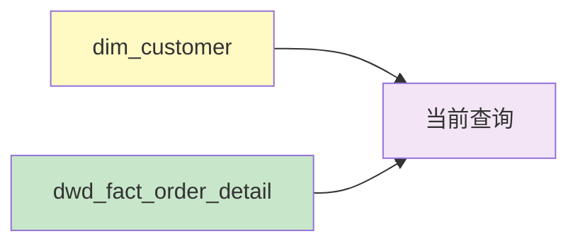
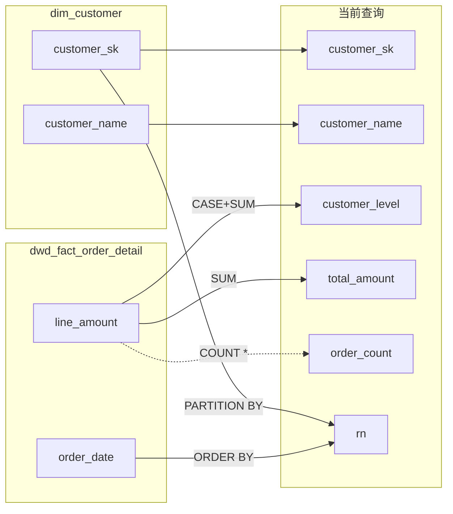

# 案例：含窗口函数的字段级血缘分析

## 用户输入

```sql
-- 分析此 SQL 的字段级血缘
SELECT
    customer_sk,
    customer_name,
    CASE
        WHEN total_amount >= 10000 THEN 'VIP'
        WHEN total_amount >= 1000 THEN 'Regular'
        ELSE 'New'
    END AS customer_level,
    total_amount,
    order_count,
    ROW_NUMBER() OVER (PARTITION BY customer_sk ORDER BY order_date DESC) AS rn
FROM (
    SELECT
        c.customer_sk,
        c.customer_name,
        SUM(o.line_amount) AS total_amount,
        COUNT(*) AS order_count,
        MAX(o.order_date) AS order_date
    FROM dim_customer c
    LEFT JOIN dwd_fact_order_detail o
        ON c.customer_sk = o.customer_key
    GROUP BY c.customer_sk, c.customer_name
) sub
```

---

## Stage 1 输出：表级血缘

### 血缘分析报告

#### 分析模式

- [x] 表级血缘
- [ ] 字段级血缘

#### 解析精度

| 属性 | 值 |
|------|-----|
| **表级血缘** | 100% 准确 |
| **识别方式** | FROM/JOIN 解析 |

#### 依赖图



#### 依赖清单

| 类型 | 依赖对象 | 调用方式 | 位置 |
|------|----------|----------|------|
| table | `dim_customer` | FROM | L16 |
| table | `dwd_fact_order_detail` | LEFT JOIN | L17 |

---

回复"**字段级**"获取字段级血缘映射表。

---

## Stage 2 输出：字段级血缘

### 字段级血缘报告

#### 字段映射表

| 目标字段 | 源表 | 源字段 | 转换 | 置信度 | 方法 | 标记 |
|----------|------|--------|------|--------|------|------|
| `customer_sk` | `dim_customer` | `customer_sk` | 直接映射 | A | STATIC | - |
| `customer_name` | `dim_customer` | `customer_name` | 直接映射 | A | STATIC | - |
| `customer_level` | `dwd_fact_order_detail` | `line_amount` | CASE(SUM) | B | STATIC | CASE |
| `total_amount` | `dwd_fact_order_detail` | `line_amount` | SUM 聚合 | B | STATIC | AGG |
| `order_count` | `dwd_fact_order_detail` | `*` | COUNT 聚合 | B | STATIC | AGG |
| `rn` | `dim_customer`, `dwd_fact_order_detail` | `customer_sk`, `order_date` | ROW_NUMBER | B | STATIC | WINDOW |

#### 置信度统计

| 等级 | 含义 | 数量 |
|------|------|------|
| **A** | 高置信 — 显式映射 | 2 |
| **B** | 中置信 — 表达式/聚合/窗口 | 4 |
| **C** | 低置信 | 0 |
| **D** | 需人工确认 | 0 |

#### 详细 Mermaid 图（字段级）



---

## 案例要点

### 解析特征

1. **子查询识别**：穿透子查询追踪原始源表
2. **聚合函数**：SUM/COUNT 产生 B 级置信度
3. **窗口函数**：ROW_NUMBER 依赖 PARTITION BY 和 ORDER BY 列
4. **CASE 表达式**：依赖底层聚合结果

### 置信度分析

| 字段 | 为何是该等级 |
|------|-------------|
| `customer_sk` | A 级：直接列引用，无转换 |
| `customer_level` | B 级：依赖 CASE 表达式，底层是聚合 |
| `rn` | B 级：窗口函数，依赖列集合确定但有计算 |

### 适用场景

- 字段影响分析（上游字段变更影响哪些下游）
- 数据质量问题定位（某字段异常时追溯源头）
- 指标口径确认（理解指标计算逻辑）
