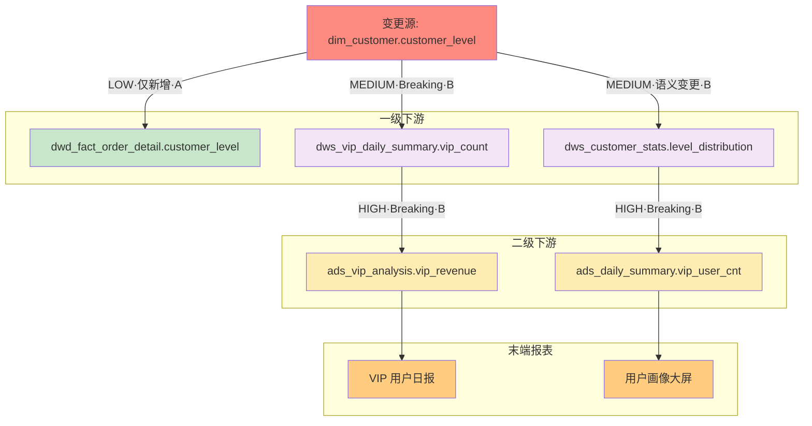

# 案例：字段变更的影响评估分析

## 用户输入

```markdown
我需要评估一个字段变更的影响：

**变更对象：** dim_customer.customer_level
**变更类型：** modify
**变更内容：** 原来的 'VIP' 等级将拆分为 'VIP' 和 'SVIP' 两个等级

请分析这个变更会影响哪些下游表和报表。
```

---

## Stage 3 输出：变更影响评估报告

### 变更影响评估报告

#### 变更描述

- **变更对象：** `dim_customer.customer_level`
- **变更类型：** modify（修改枚举值）
- **影响类型（初判）：** 语义变更
- **变更内容：** 原 'VIP' 等级拆分为 'VIP' 和 'SVIP'

---

### 影响范围

#### Level 1: 一级下游（3 个对象）

| 对象 | 类型 | 影响等级 | 影响类型 | 路径置信度 | 影响原因（路径摘要） | 处理建议 |
|------|------|----------|----------|------------|----------------------|----------|
| `dwd_fact_order_detail.customer_level` | 字段 | 低 | 仅新增 | A | `dim_customer → dwd_fact_order_detail` | 无需修改（直接映射） |
| `dws_customer_stats.level_distribution` | 字段 | 中 | 语义变更 | B | `dim_customer → dws_customer_stats` | 需更新聚合逻辑 |
| `dws_vip_daily_summary.vip_count` | 字段 | 中 | Breaking | B | `dim_customer → dws_vip_daily_summary` | 需修改 VIP 过滤条件 |

#### Level 2: 二级下游（2 个对象）

| 对象 | 类型 | 影响等级 | 影响类型 | 路径置信度 | 影响原因（路径摘要） | 处理建议 |
|------|------|----------|----------|------------|----------------------|----------|
| `ads_vip_analysis.vip_revenue` | 字段 | 高 | Breaking | B | `dim_customer → dws_vip_daily_summary → ads_vip_analysis` | 需修改口径（VIP/SVIP 区分或合并） |
| `ads_daily_summary.vip_user_cnt` | 字段 | 高 | Breaking | B | `dim_customer → dws_customer_stats → ads_daily_summary` | 需修改口径 |

#### 末端影响（2 个报表）

| 报表/应用 | 负责人 | 影响等级 | 影响类型 | 路径置信度 | 影响原因（路径摘要） | 处理建议 |
|-----------|--------|----------|----------|------------|----------------------|----------|
| VIP 用户日报 | 张三 | 高 | Breaking | B | `dim_customer → ... → VIP 用户日报` | 通知业务方 + 确认新口径定义 |
| 用户画像大屏 | 李四 | 高 | Breaking | B | `dim_customer → ... → 用户画像大屏` | 更新展示逻辑（VIP/SVIP 分开或合并） |

---

### 影响图谱



---

### 循环与截断说明

- **循环检测：** not_detected
- **最大深度：** 3（Level 0 → Level 1 → Level 2 → 末端）
- **最大节点数：** 8（未截断）

---

### 处理清单

#### 必须处理（Breaking）

- [ ] 修改 `dws_vip_daily_summary` 的 VIP 过滤条件（决定是否包含 SVIP）
- [ ] 修改 `ads_vip_analysis` 的口径定义（VIP/SVIP 分开统计 or 合并）
- [ ] 修改 `ads_daily_summary` 的 vip_user_cnt 口径
- [ ] 通知 VIP 用户日报负责人（张三）确认新口径
- [ ] 通知用户画像大屏负责人（李四）更新展示

#### 建议处理（语义变更）

- [ ] 更新 `dws_customer_stats` 的 level_distribution 聚合逻辑
- [ ] 在数据字典中更新 customer_level 的枚举值说明

#### 无需处理（仅新增）

- `dwd_fact_order_detail.customer_level`：直接映射，无需修改

---

### 重跑计划

| 表 | 分区范围 | 优先级 | 前置条件 |
|----|----------|--------|----------|
| `dws_vip_daily_summary` | 最近 30 天 | P1 | dim_customer 变更生效后 |
| `dws_customer_stats` | 最近 30 天 | P1 | dim_customer 变更生效后 |
| `ads_vip_analysis` | 最近 90 天 | P2 | dws 层重跑完成后 |
| `ads_daily_summary` | 最近 90 天 | P2 | dws 层重跑完成后 |

---

## 案例要点

### 解析特征

1. **多层级追踪**：从 Level 0 追踪到 Level 2 + 末端报表
2. **影响类型分类**：Breaking / 语义变更 / 仅新增
3. **路径置信度传播**：min(路径上所有边置信度)
4. **分类处理清单**：按影响类型分组的待办事项

### 影响类型判断

| 下游对象 | 影响类型 | 判断依据 |
|----------|----------|----------|
| `dwd_fact_order_detail` | 仅新增 | 直接映射，枚举新增值不影响现有数据 |
| `dws_customer_stats` | 语义变更 | 聚合逻辑可运行，但分布结果变化 |
| `dws_vip_daily_summary` | Breaking | 硬编码 `WHERE customer_level = 'VIP'` 会漏掉 SVIP |
| `ads_*` | Breaking | 继承 DWS 层的 Breaking 影响 |

### 路径置信度

| 路径 | 边置信度 | 路径置信度 | 计算 |
|------|----------|------------|------|
| `dim → dwd_fact_order_detail` | A | A | min(A) = A |
| `dim → dws_customer_stats` | B | B | min(B) = B |
| `dim → dws → ads_vip_analysis` | B, B | B | min(B, B) = B |

### 边级置信度说明

| 边 | 置信度 | 证据/位置 |
|-----|-------|----------|
| `dim_customer → dwd_fact_order_detail` | A | 明确 LEFT JOIN 映射 |
| `dim_customer → dws_customer_stats` | B | 涉及 GROUP BY 聚合 |
| `dim_customer → dws_vip_daily_summary` | B | 涉及 WHERE 过滤 |
| `dws_* → ads_*` | B | 涉及聚合和过滤 |

### 适用场景

- 评估字段变更前的影响范围
- 确定需要通知的下游负责人
- 规划变更后的重跑计划
- 识别 Breaking 变更需要阻断发布

### 影响类型处理矩阵

| 影响类型 | 定义 | 默认建议动作 |
|----------|------|--------------|
| **Breaking** | 下游不可直接运行 | 阻断发布；修改下游；全链路重跑；通知负责人 |
| **语义变更** | 可运行但口径变化 | 标记口径升级；重跑/回刷；关键报表回归 |
| **仅新增** | 不影响既有结果 | 更新文档/血缘；下游按需接入 |

### 节点颜色约定

| 类型 | 颜色 | 说明 |
|------|------|------|
| 变更源 | `#ff8a80` | 红色（警告） |
| DWD 层 | `#c8e6c9` | 淡绿色 |
| DWS 层 | `#f3e5f5` | 淡紫色 |
| ADS 层 | `#ffecb3` | 淡橙色 |
| 末端报表 | `#ffcc80` | 橙色（关注） |
