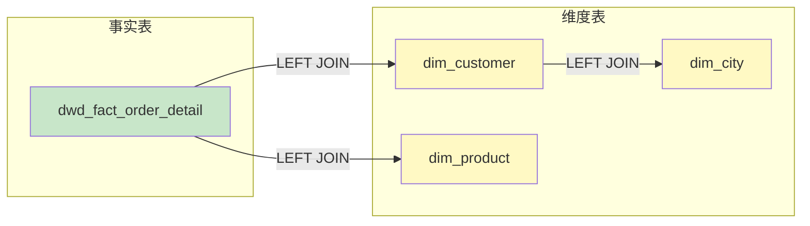
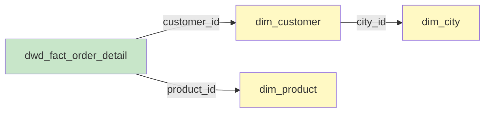

# 案例：复杂多表 JOIN 的关联识别分析

## 用户输入

```sql
-- 订单汇总报表模型
SELECT
    o.order_id,
    o.order_date,
    c.customer_name,
    c.customer_level,
    p.product_name,
    p.category_name,
    city.city_name,
    city.province_name,
    o.order_amt,
    o.quantity
FROM dwd_fact_order_detail o
LEFT JOIN dim_customer c
    ON o.customer_id = c.customer_id
    AND c.is_current = 1
LEFT JOIN dim_product p
    ON o.product_id = p.product_id
LEFT JOIN dim_city city
    ON c.city_id = city.city_id
WHERE o.dt >= '2026-01-01'
  AND o.order_status = 'completed'
```

---

## Stage 1 输出：表级血缘 + JOIN 关联

### 血缘分析报告

#### 分析模式

- [x] 表级血缘
- [x] JOIN 关联分析
- [ ] 字段级血缘

#### 解析精度

| 属性 | 值 |
|------|-----|
| **表级血缘** | 100% 准确 |
| **JOIN 识别** | 100% 准确 |
| **识别方式** | FROM/JOIN 解析 |

#### 依赖图



#### 依赖清单

| 类型 | 依赖对象 | 调用方式 | 位置 |
|------|----------|----------|------|
| table | `dwd_fact_order_detail` | FROM | L14 |
| table | `dim_customer` | LEFT JOIN | L15-17 |
| table | `dim_product` | LEFT JOIN | L18-19 |
| table | `dim_city` | LEFT JOIN | L20-21 |

---

### JOIN 关联分析

#### 关联图



#### 关联清单

| 左表 | 右表 | 关联类型 | 关联条件 | 边置信度 | 证据/位置 | 风险标记 |
|------|------|----------|----------|----------|----------|----------|
| `dwd_fact_order_detail` | `dim_customer` | LEFT JOIN | `o.customer_id = c.customer_id AND c.is_current = 1` | A | `L15-17: ON o.customer_id = c.customer_id AND c.is_current = 1` | `SCD2=is_current` |
| `dwd_fact_order_detail` | `dim_product` | LEFT JOIN | `o.product_id = p.product_id` | A | `L18-19: ON o.product_id = p.product_id` | `KEY_UNIQ?` |
| `dim_customer` | `dim_city` | LEFT JOIN | `c.city_id = city.city_id` | A | `L20-21: ON c.city_id = city.city_id` | - |

#### 关联风险

- [ ] 笛卡尔积风险：无
- [x] SCD2 语义：`dim_customer` 使用 `is_current = 1`（仅取当前版本）
- [x] 唯一性待确认：`dim_product.product_id` 唯一性未知（标记 `KEY_UNIQ?`）
- [ ] 多对多 JOIN：无明显多对多风险

#### 关联链路说明

```
事实表 (dwd_fact_order_detail)
    |
    +--[customer_id]---> 维度表 (dim_customer) ---> SCD2 过滤: is_current = 1
    |                         |
    |                         +--[city_id]---> 维度表 (dim_city) ---> 二次 JOIN
    |
    +--[product_id]---> 维度表 (dim_product) ---> 唯一性待确认
```

**链路分析：**
- `dim_city` 通过 `dim_customer.city_id` 间接关联，非直接依赖事实表
- 事实表 → 维度表形成"星型"结构，但 `dim_city` 延伸为"雪花"

---

### 识别统计

| 类型 | 数量 |
|------|------|
| LEFT JOIN | 3 |
| INNER JOIN | 0 |
| 原生表名 | 4 |
| SCD2 语义 JOIN | 1 |
| 待确认唯一性 | 1 |

---

回复"**字段级**"获取字段级血缘映射表。

---

## 案例要点

### 解析特征

1. **多层 JOIN 识别**：识别 4 个表的 3 次 JOIN 操作
2. **SCD2 语义标记**：`dim_customer` 使用 `is_current = 1` 条件
3. **唯一性风险标记**：`dim_product.product_id` 唯一性未知
4. **星型 vs 雪花**：`dim_city` 通过维度表二次关联（雪花延伸）

### 边级置信度

| 边 | 置信度 | 证据/位置 |
|-----|-------|----------|
| `fact → dim_customer` | A | 明确的等值 JOIN + SCD2 条件 |
| `fact → dim_product` | A | 明确的等值 JOIN |
| `dim_customer → dim_city` | A | 明确的等值 JOIN |

### 风险标记说明

| 标记 | 含义 | 处理建议 |
|------|------|----------|
| `SCD2=is_current` | 维表 JOIN 使用当前版本过滤 | 确认是否需要历史版本关联 |
| `KEY_UNIQ?` | JOIN key 唯一性未知 | 确认 product_id 是否主键/唯一键 |
| `M2M?` | 可能多对多 JOIN | 检查是否产生数据膨胀 |
| `CROSS_JOIN!` | 笛卡尔积风险 | 必须修复 |

### 适用场景

- 评估 JOIN 性能优化空间
- 检查 SCD2 语义是否正确
- 识别潜在的数据膨胀风险
- 验证星型/雪花模型设计合规性
