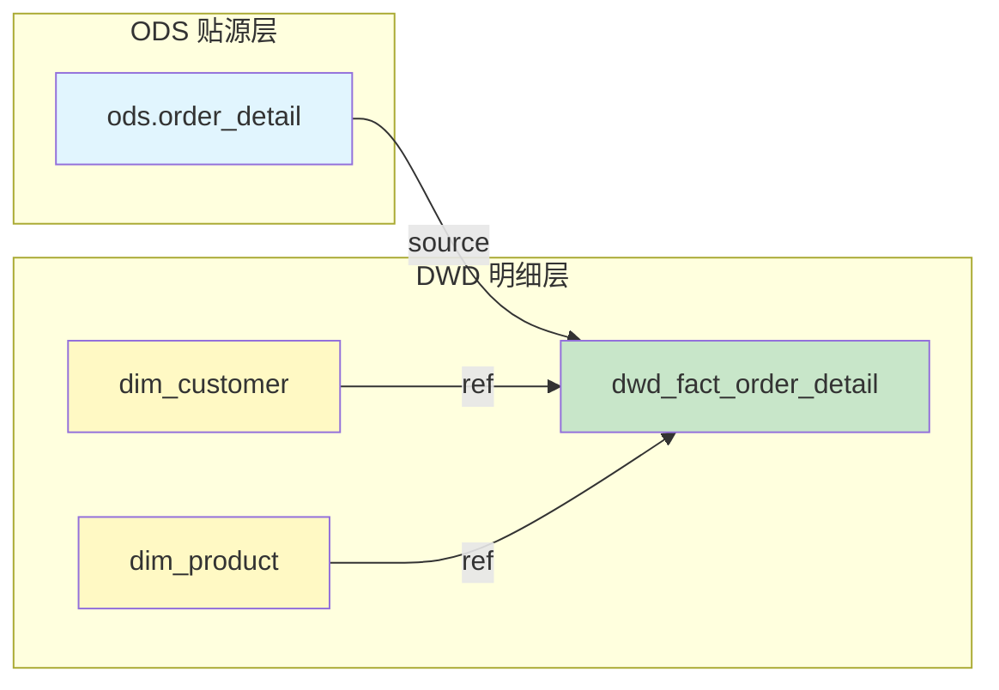

# 案例：多表 JOIN 的表级血缘分析

## 用户输入

```sql
-- dbt 模型: dwd_fact_order_detail.sql
{{
  config(
    materialized='incremental',
    incremental_strategy='insert_overwrite',
    partition_by=['dt'],
    file_format='orc'
  )
}}

SELECT
    CAST(conv(substr(md5(concat_ws('||', o.order_id, o.item_id, '{{ var("ds") }}')), 1, 15), 16, 10) AS BIGINT) AS order_detail_sk,
    c.customer_sk AS customer_key,
    p.product_sk AS product_key,
    o.order_id,
    o.item_id,
    o.order_amount AS line_amount,
    o.order_status,
    '{{ var("ds") }}' AS dt
FROM {{ source('ods', 'order_detail') }} o
LEFT JOIN {{ ref('dim_customer') }} c
    ON o.customer_id = c.customer_id AND c.is_current = 1
LEFT JOIN {{ ref('dim_product') }} p
    ON o.product_id = p.product_id AND p.is_current = 1

WHERE o.dt = '{{ var("ds") }}'

```

---

## Stage 1 输出：表级血缘

### 血缘分析报告

#### 分析模式

- [x] 表级血缘
- [ ] 字段级血缘

#### 解析精度

| 属性 | 值 |
|------|-----|
| **表级血缘** | 100% 准确 |
| **识别方式** | ref()/source() 识别 |

#### 依赖图



#### 依赖清单

| 类型 | 依赖对象 | 调用方式 | 位置 |
|------|----------|----------|------|
| source | `ods.order_detail` | `source('ods', 'order_detail')` | L22 |
| ref | `dim_customer` | `ref('dim_customer')` | L23 |
| ref | `dim_product` | `ref('dim_product')` | L25 |

#### 识别统计

| 类型 | 数量 |
|------|------|
| source() 调用 | 1 |
| ref() 调用 | 2 |
| 原生表名 | 0 |

---

回复"**字段级**"获取字段级血缘映射表。

---

## 案例要点

### 解析特征

1. **dbt 语法识别**：正确解析 `source()` 和 `ref()` 调用
2. **多表 JOIN**：识别 LEFT JOIN 关联的维度表
3. **SCD Type 2 过滤**：识别 `is_current = 1` 条件（不影响表级血缘）

### 关键输出

- **Mermaid 图**：按分层（ODS/DWD）分组展示
- **颜色约定**：ODS 淡蓝、维度表淡黄、事实表淡绿
- **边标签**：标注 source/ref 调用方式

### 适用场景

- 需要快速了解模型依赖关系
- 评估变更影响范围
- 检查跨层依赖是否合规
