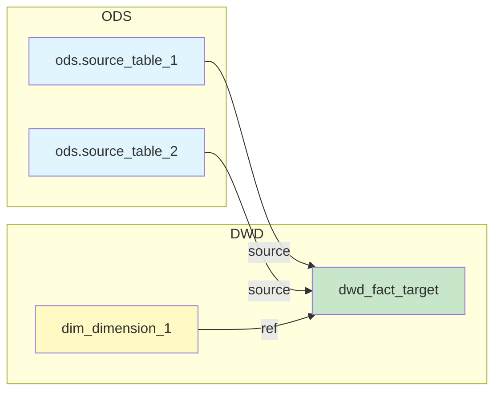

# 血缘分析输出模板

## Stage 1 输出模板：表级血缘概览

```markdown
# 血缘分析报告

## 分析模式

- [x] 表级血缘
- [ ] 字段级血缘

## 解析精度

| 属性 | 值 |
|------|-----|
| **表级血缘** | {准确率}% 准确 |
| **识别方式** | {ref()/source() 识别 / FROM/JOIN 解析} |

## 依赖图



## 依赖清单

| 类型 | 依赖对象 | 调用方式 | 位置 |
|------|----------|----------|------|
| source | `{schema}.{table}` | `source('{schema}', '{table}')` | L{line} |
| ref | `{model_name}` | `ref('{model_name}')` | L{line} |
| table | `{db}.{table}` | FROM/JOIN | L{line} |

## 识别统计

| 类型 | 数量 |
|------|------|
| source() 调用 | {N} |
| ref() 调用 | {M} |
| 原生表名 | {K} |

---

回复"**字段级**"获取字段级血缘映射表。
```

---

## Stage 2 输出模板：字段级血缘报告

```markdown
# 字段级血缘报告

## 字段映射表

| 目标字段 | 源表 | 源字段 | 转换 | 置信度 | 方法 | 标记 |
|----------|------|--------|------|--------|------|------|
| `{target_col}` | `{source_table}` | `{source_col}` | 直接映射 | A | STATIC | - |
| `{target_col}` | - | - | `md5(concat_ws(...))` | A | STATIC | GENERATED |
| `{target_col}` | `{source_table}` | `{expr}` | 表达式计算 | B | STATIC | EXPR |
| `{target_col}` | `{source_table}` | `{col1}, {col2}` | CASE WHEN | B | MIXED | CASE |
| `{target_col}` | `{source_table}` | `*` | CTE 传递 | C | LLM | CTE |
| `{target_col}` | ? | ? | UDF 黑盒 | D | LLM | UDF |

## 置信度说明

| 等级 | 含义 | 数量 |
|------|------|------|
| **A** | 高置信 — 显式映射/别名/CAST | {N} |
| **B** | 中置信 — 表达式/聚合/窗口 | {M} |
| **C** | 低置信 — CTE/子查询/UNION | {K} |
| **D** | 需人工确认 — UDF/动态 SQL | {J} |

## 标记说明

| 标记 | 含义 |
|------|------|
| `GENERATED` | 生成列（如代理键、MD5 哈希） |
| `EXPR` | 表达式计算 |
| `CASE` | CASE WHEN 分支 |
| `CTE` | CTE/子查询传递 |
| `AGG` | 聚合函数 |
| `WINDOW` | 窗口函数 |
| `UDF` | 用户自定义函数 |
| `STAR_EXPANSION` | SELECT * 展开 |

## 无法解析的字段

| 字段 | 原因 | 建议 |
|------|------|------|
| `{col}` | 动态 SQL 生成 | 需人工确认 |
| `{col}` | 递归 CTE | 需人工追踪 |

## 详细 Mermaid 图（字段级）

```mermaid
graph LR
    subgraph Source["源表: {source_table}"]
        S1[{source_col_1}]
        S2[{source_col_2}]
    end

    subgraph Target["目标表: {target_table}"]
        T1[{target_col_1}]
        T2[{target_col_2}]
    end

    S1 --> T1
    S2 -->|CASE| T2
```
```

---

## 样式约定

### Mermaid 节点颜色

| 层级/类型 | 颜色代码 | 说明 |
|----------|----------|------|
| ODS 源表 | `#e1f5fe` | 淡蓝色 |
| DWD 事实表 | `#c8e6c9` | 淡绿色 |
| 维度表 | `#fff9c4` | 淡黄色 |
| DWS 汇总表 | `#f3e5f5` | 淡紫色 |
| ADS 应用表 | `#ffecb3` | 淡橙色 |

### 边标签

| 标签 | 含义 |
|------|------|
| `source` | dbt source() 调用 |
| `ref` | dbt ref() 调用 |
| `FROM` | 原生 SQL FROM 子句 |
| `JOIN` | 原生 SQL JOIN 子句 |
