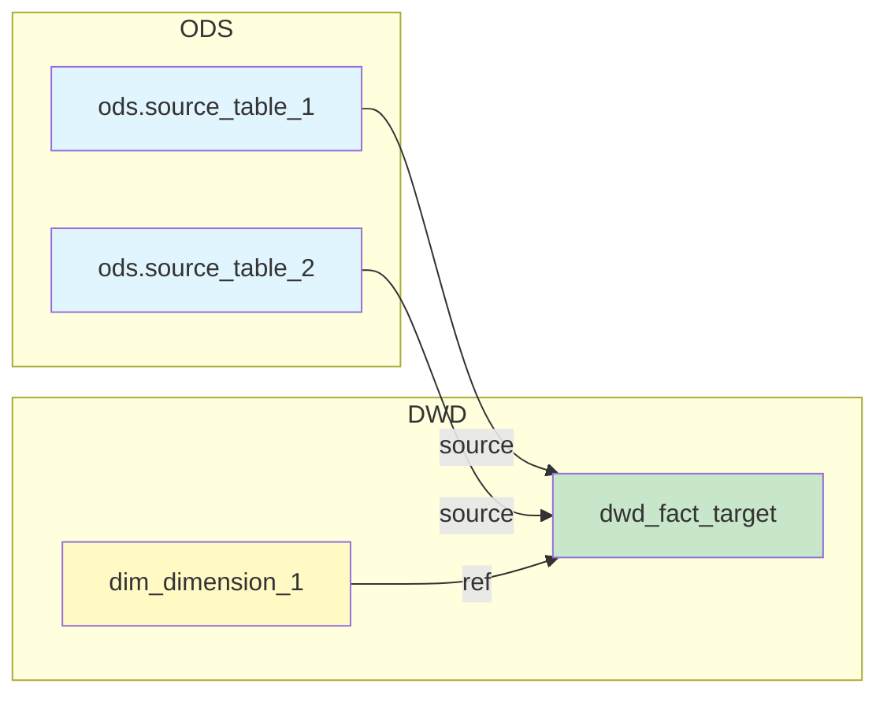
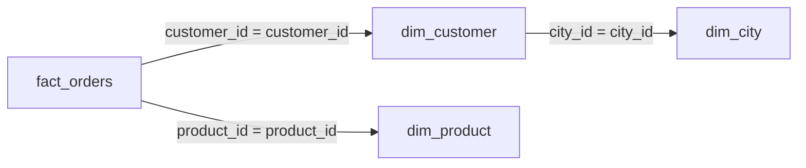
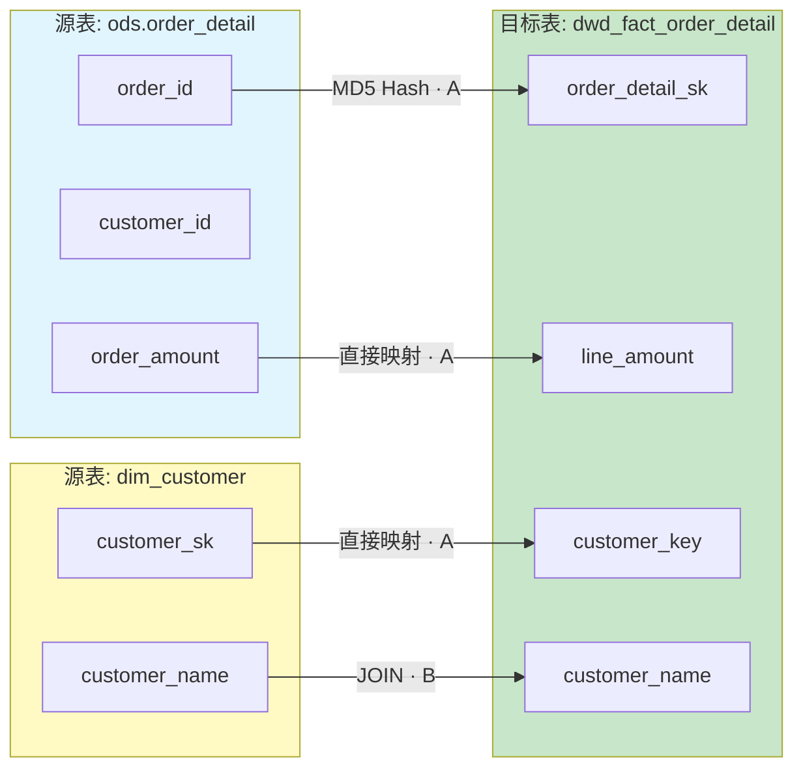

# 血缘分析输出模板

## Stage 1 输出模板：表级血缘概览

```markdown
# 血缘分析报告

## 分析模式

- [x] 表级血缘
- [ ] 字段级血缘
- [ ] 影响评估

## 解析精度

| 属性 | 值 |
|------|-----|
| **表级血缘** | {准确率}% 准确 |
| **识别方式** | {ref()/source() 识别 / FROM/JOIN 解析} |

## 依赖图



## 依赖清单

| 类型 | 依赖对象 | 调用方式 | 位置 |
|------|----------|----------|------|
| source | `{schema}.{table}` | `source('{schema}', '{table}')` | L{line} |
| ref | `{model_name}` | `ref('{model_name}')` | L{line} |
| table | `{db}.{table}` | FROM/JOIN | L{line} |

## JOIN 关联分析

### 关联图



### 关联清单

| 左表 | 右表 | 关联类型 | 关联条件 | 边置信度 | 证据/位置 | 风险标记 |
|------|------|----------|----------|----------|----------|----------|
| `fact_orders` | `dim_customer` | LEFT JOIN | `customer_id = customer_id` | A | `L12: ON o.customer_id = c.customer_id` | `SCD2=is_current` |
| `fact_orders` | `dim_product` | LEFT JOIN | `product_id = product_id` | B | `L15` | `M2M?` |

### 关联风险

- [ ] 笛卡尔积风险
- [x] 多对多 JOIN 风险（`fact_orders` - `dim_product` 可能多对多）
- [ ] SCD2 语义未明确

## 识别统计

| 类型 | 数量 |
|------|------|
| source() 调用 | {N} |
| ref() 调用 | {M} |
| 原生表名 | {K} |
| JOIN 关联 | {J} |

---

回复"**字段级**"获取字段级血缘映射表，或提供变更描述进行"**影响评估**"。
```

---

## Stage 2 输出模板：字段级血缘报告

```markdown
# 字段级血缘报告

## 字段映射表

| 源字段 | 目标字段 | 转换逻辑 | 边置信度 | 证据/位置 | 备注/风险 |
|--------|----------|----------|----------|----------|-----------|
| `ods.order_detail.order_amount` | `dwd_fact_order.line_amount` | `o.order_amount` | A | `L32: o.order_amount AS line_amount` | - |
| `dim_customer.customer_level` | `ads_vip_daily.is_vip` | `CASE WHEN ...` | B | `L58: CASE WHEN ... END` | 语义变更风险 |
| `cte_orders.*` | `fact_orders.order_id` | CTE 传递 | C | `L12` | CTE 遮蔽风险，需验证 |
| `my_udf(col)` | `result_col` | UDF 黑盒 | D | `L45` | 需人工确认 |

## 边置信度统计

| 等级 | 数量 | 占比 |
|------|------|------|
| **A** | {N} | {X}% |
| **B** | {M} | {Y}% |
| **C** | {K} | {Z}% |
| **D** | {J} | {W}% |

## 置信度说明

| 等级 | 含义 | 典型证据/位置 |
|------|------|---------------|
| **A** | 高置信 — 显式映射/别名/CAST，AST 可确定 | 行号 + 明确表达式 |
| **B** | 中置信 — 表达式/聚合/窗口，可追溯 | CASE/窗口函数位置 |
| **C** | 低置信 — CTE/子查询/UNION/`SELECT *`，需验证 | 推断依据说明 |
| **D** | 需人工确认 — UDF/动态 SQL | 标注"需人工确认" |

## 标记说明

| 标记 | 含义 |
|------|------|
| `GENERATED` | 生成列（如代理键、MD5 哈希） |
| `EXPR` | 表达式计算 |
| `CASE` | CASE WHEN 分支 |
| `CTE` | CTE/子查询传递 |
| `AGG` | 聚合函数 |
| `WINDOW` | 窗口函数 |
| `UDF` | 用户自定义函数 |
| `STAR_EXPANSION` | SELECT * 展开 |

## 无法解析的字段

| 字段 | 原因 | 建议 |
|------|------|------|
| `{col}` | 动态 SQL 生成 | 需人工确认 |
| `{col}` | 递归 CTE | 需人工追踪 |

## 详细 Mermaid 图（字段级）


```

---

## 样式约定

### Mermaid 节点颜色

| 层级/类型 | 颜色代码 | 说明 |
|----------|----------|------|
| ODS 源表 | `#e1f5fe` | 淡蓝色 |
| DWD 事实表 | `#c8e6c9` | 淡绿色 |
| 维度表 | `#fff9c4` | 淡黄色 |
| DWS 汇总表 | `#f3e5f5` | 淡紫色 |
| ADS 应用表 | `#ffecb3` | 淡橙色 |

### 边标签

| 标签 | 含义 |
|------|------|
| `source` | dbt source() 调用 |
| `ref` | dbt ref() 调用 |
| `FROM` | 原生 SQL FROM 子句 |
| `JOIN` | 原生 SQL JOIN 子句 |
| `· A/B/C/D` | 边置信度后缀 |

### 边置信度标注格式

字段级 Mermaid 图中，边标签格式为：`"转换类型 · 置信度"`

示例：
- `-->|"直接映射 · A"|`
- `-->|"CASE WHEN · B"|`
- `-->|"SELECT * · C"|`
- `-->|"UDF · D"|`
