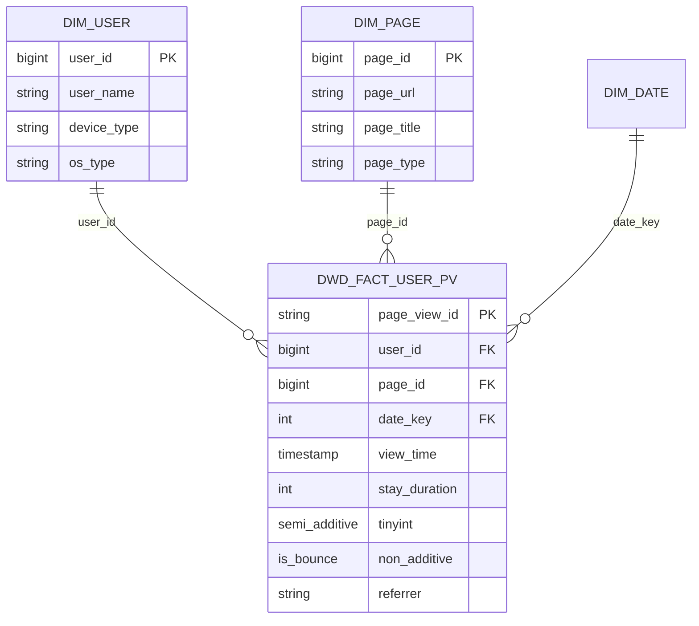

# 案例：用户页面浏览（PV）

## 输入

```yaml
business_event: 用户页面浏览
grain: 一个用户 + 一次浏览 = 一行
measures:
  - name: stay_duration
    desc: 停留时长（秒）
    additivity: semi_additive
  - name: is_bounce
    desc: 是否跳出（0/1）
    additivity: non_additive
dimensions:
  - 用户
  - 页面
  - 日期/时间
source:
  - ods_kafka.page_view_log
特点: 高频事件，无复杂 SCD 需求
```

## Stage 1 输出

### 输入解析

| 字段 | 值 |
|------|-----|
| 业务事件 | 用户页面浏览 |
| 粒度 | 一个用户 + 一次浏览 = 一行 |
| 度量 | stay_duration(半可加), is_bounce(不可加) |
| 维度 | 用户(Type1), 页面(Type1), 日期 |

### 决策摘要

| 决策项 | 选择 | 理由 |
|--------|------|------|
| 事实表类型 | 事务事实表 | 每次浏览是独立事件 |
| SCD 策略 | 全部 Type 1 | 用户/页面维度无需历史追踪 |
| 分层落点 | DWD | 原子粒度事件 |
| 键策略 | FK 使用自然键（user_id/page_id） | Type 1 可直接引用 |

### 假设清单

1. page_view_id 作为唯一事件标识
2. 日期维度复用标准 dim_date
3. 页面维度为扁平结构（无层级）

### 完整度评估

**可生成可运行 SQL** - 已提供完整输入

## Stage 2 输出

### 星型模型图



### 分层落点表

| 表名 | 分层 | 类型 | 理由 |
|------|------|------|------|
| dwd_fact_user_pv | DWD | 事实表 | 原子粒度事件 |
| dim_user | DWD | 维度表 | Type 1 |
| dim_page | DWD | 维度表 | Type 1 |

### File: models/dwd/dwd_fact_user_pv.sql

```sql
{{
  config(
    materialized='incremental',
    incremental_strategy='insert_overwrite',
    partition_by=['dt'],
    file_format='orc'
  )
}}

WITH source AS (
    SELECT
        page_view_id,
        user_id,
        page_id,
        view_time,
        stay_duration,
        is_bounce,
        referrer,
        dt
    FROM {{ source('ods', 'page_view_log') }}
    WHERE dt >= date_sub('{{ var("ds") }}', {{ var("lookback_days", 7) }})
),

deduplicated AS (
    SELECT *, ROW_NUMBER() OVER (
        PARTITION BY page_view_id, dt
        ORDER BY view_time DESC
    ) AS rn
    FROM source
),

final AS (
    SELECT
        page_view_id,
        user_id,
        page_id,
        CAST(date_format(view_time, 'yyyyMMdd') AS INT) AS date_key,
        view_time,
        stay_duration,
        is_bounce,
        referrer,
        0 AS is_deleted,
        'ods_kafka' AS data_source,
        CURRENT_TIMESTAMP AS dw_create_time,
        CURRENT_TIMESTAMP AS dw_modify_time,
        CAST('{{ var("ds") }}' AS DATE) AS etl_date,
        dt
    FROM deduplicated
    WHERE rn = 1
)

SELECT * FROM final
```

### File: models/dwd/dwd_fact_user_pv.yml

```yaml
version: 2

models:
  - name: dwd_fact_user_pv
    description: 用户页面浏览事实表 - 粒度：一次浏览事件
    meta:
      layer: dwd
      fact_type: transaction
      grain: "用户 + 浏览 = 一行"

    columns:
      - name: page_view_id
        tests: [unique, not_null]

      - name: user_id
        tests: [not_null]

      - name: stay_duration
        description: 停留时长（秒）
        meta: { additivity: semi_additive }

      - name: is_bounce
        description: 是否跳出
        meta: { additivity: non_additive }
        tests:
          - accepted_values:
              values: [0, 1]
```

## 案例要点

**与电商订单案例的差异：**
- 全部 Type 1 维度，FK 可直接使用自然键
- 高频事件场景，无需维护维度历史

**高频事件处理建议：**
- 考虑按小时分区（partition_by=['dt', 'hour']）以提升查询性能
- 事件 ID 采用 UUID 确保唯一性
- 半可加度量（如 stay_duration）需注明，避免跨用户/页面 SUM
