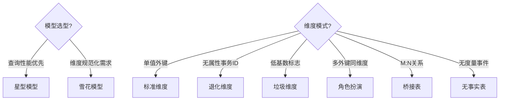

<objective>
创建方法论索引页和 Kimball 维度建模核心概念文档（METHOD-01）

Purpose: 建立方法论库的入口和第一个核心文档，覆盖 Kimball 维度建模的核心概念，为后续事实表、SCD、分层文档奠定基础。

Output:
- `context/methodology/index.md` — 方法论索引页，链接所有 METHOD 文档
- `context/methodology/dimensional-modeling.md` — 1500-2500 字，覆盖四步法、星型/雪花、一致性维度、Bus Matrix、特殊维度模式
</objective>

<execution_context>
@./.claude/agents/gsd-executor.md
@./.claude/get-shit-done/templates/summary.md
</execution_context>

<context>
@.planning/PROJECT.md
@.planning/ROADMAP.md
@.planning/STATE.md
@.planning/phases/02-methodology/02-CONTEXT.md
@.planning/phases/02-methodology/02-RESEARCH.md
@.planning/phases/01-infrastructure/01-01-SUMMARY.md
@.planning/phases/01-infrastructure/01-02-SUMMARY.md
@.claude/data-warehouse/glossary/terms.md
@.claude/data-warehouse/docs/prompting.md
</context>

<tasks>

<task type="auto">
  <name>Task 1: 创建方法论索引页</name>
  <files>.claude/data-warehouse/context/methodology/index.md</files>
  <action>
创建 `context/methodology/index.md` 索引页：

1. **YAML frontmatter**（遵循 prompting.md 规范）：
   ```yaml
   ---
   type: context
   title: 方法论库索引
   status: stable
   version: 1.0.0
   domain: methodology
   updated_at: 2026-01-31
   ---
   ```

2. **文档内容结构**：
   - 一段话简介（方法论库的目的和覆盖范围）
   - 文档列表（表格格式）：

   | 文档 | 覆盖需求 | 聚焦领域 | 一句话描述 |
   |------|---------|---------|-----------|
   | [dimensional-modeling.md](./dimensional-modeling.md) | METHOD-01 | 模式与一致性 | Kimball 四步法、星型/雪花、一致性维度、Bus Matrix、特殊维度模式 |
   | [fact-table-types.md](./fact-table-types.md) | METHOD-02 | 事实与口径 | 事务/周期快照/累积快照、可加性、查询模式 |
   | [scd-strategies.md](./scd-strategies.md) | METHOD-03 | 历史与回溯 | SCD Type 1/2/3 选型、dbt-hive 实现（无 Snapshots） |
   | [layering-system.md](../layers/layering-system.md) | METHOD-04 | 落层与治理边界 | ODS/DWD/DWS/ADS 定义、跨层规则 |

   - 阅读顺序建议（按依赖关系推荐顺序）
   - 参考文献（《数据仓库工具箱》第三版、Kimball Group）

3. **保持简洁**：索引页不超过 100 行，聚焦导航功能
  </action>
  <verify>
    - 文件存在且 YAML frontmatter 有效
    - 包含 4 个 METHOD 文档的链接
    - Markdown 格式正确（表格可渲染）
  </verify>
  <done>索引页包含所有 METHOD 文档链接和一句话描述，阅读顺序清晰</done>
</task>

<task type="auto">
  <name>Task 2: 编写 Kimball 维度建模概念文档 (METHOD-01)</name>
  <files>.claude/data-warehouse/context/methodology/dimensional-modeling.md</files>
  <action>
创建 `context/methodology/dimensional-modeling.md`，遵循 RESEARCH.md 定义的七段式结构：

**1. YAML frontmatter**：
```yaml
---
type: methodology
method_id: METHOD-01
title: Kimball 维度建模核心概念
status: stable
version: 1.0.0
domain: methodology
updated_at: 2026-01-31
---
```

**2. 适用范围 & 前置假设**：
- T+1 离线数仓场景
- Hive 非 ACID 模式
- dbt-hive 不支持 snapshots/ephemeral
- 增量以分区回刷为主

**3. 读者导航（双轨）**：
- **[Analyst]** 你会得到：粒度合同解读、维度表使用方式、一致性维度意义
- **[Engineer]** 你会得到：星型/雪花选型、维度模式选择、Bus Matrix 实践

**4. TL;DR**（一段话，不超过 3 句）：
总结 Kimball 四步法、星型模型优先、一致性维度是企业级建模基石

**5. 核心概念（按 RESEARCH 补充的内容分配）**：

### Kimball 四步维度建模法
1. 选择业务过程（下单、支付、发货）
2. 声明粒度（一行代表什么 — Grain 合同）
3. 确定维度（分析视角：时间、客户、产品）
4. 确定事实（度量：金额、数量）
- 案例：电商订单建模（订单/履约/会员贯穿示例）

### 星型模型 vs 雪花模型
- 星型：事实表居中，维度表直连（查询性能优）
- 雪花：维度表规范化分解（存储效率优，但 JOIN 多）
- 决策树（Mermaid flowchart）：是否需要规范化 → 选择模型
- **[Engineer]** 推荐：Hive 场景优先星型（减少 JOIN）

### 一致性维度 (Conformed Dimension)
- 定义：跨事实表共享的标准维度（如时间维度、客户维度）
- 作用：实现"可组合数据集市"，确保不同主题域可钻取
- **[Analyst]** 意义：不同报表使用相同维度定义，口径一致
- 案例：`dim_date`、`dim_customer` 跨订单/履约/会员共享

### Bus Matrix 总线矩阵
- 用途：规划企业维度建模蓝图（事实表 × 维度表 矩阵）
- 案例：用订单/履约/会员三个事实表展示 Bus Matrix
- **[Engineer]** 实践：新增事实表前先检查 Bus Matrix，确定共享维度

### 特殊维度模式
逐个介绍以下模式（定义 + 何时使用 + 案例）：
1. **退化维度 (Degenerate Dimension)**：订单号留在事实表，不单独建维度表
2. **垃圾维度 (Junk Dimension)**：低基数标志位合并成一个维度表
3. **角色扮演维度 (Role-playing Dimension)**：同一维度表多次引用（如订单日期、发货日期都引用 dim_date）
4. **无事实事实表 (Factless Fact)**：只记录事件发生，无度量（如学生注册课程）
5. **桥接表 (Bridge Table)**：处理 M:N 关系（如订单对应多促销）

**6. 选型决策树（Mermaid flowchart）**：


**7. 误区与反模式**（表格格式，3-5 条）：
| 错误做法 | 正确做法 | 原因 |
|---------|---------|------|
| ❌ 不声明粒度就设计 | ✓ 先定粒度再选维度事实 | 粒度是维度设计的"合同" |
| ❌ 维度属性冗余到事实表 | ✓ 事实表只存外键 | 违反星型原则，更新困难 |
| ❌ 每个事实表用独立维度 | ✓ 使用一致性维度 | 无法跨主题域钻取 |

**8. 检查清单**（Markdown 复选框，分 Analyst/Engineer）：
- [ ] **[Analyst]** 粒度定义是否清晰（一句话描述"一行是什么"）
- [ ] **[Engineer]** 是否优先选择星型模型
- [ ] **[Analyst]** 维度表是否有明确的业务含义
- [ ] **[Engineer]** 一致性维度是否被多事实表共享
- [ ] **[Engineer]** 特殊维度模式选择是否有依据

**9. 文档底部**：
- 参考文献：《数据仓库工具箱》第三版, Kimball Group
- 版本号 + 更新日期

**字数控制**：1500-2500 字（中等长度）
**术语引用**：首次出现的核心术语链接到 glossary/terms.md（如 `[事实表](../glossary/terms.md#modeling_fact_table)`）
  </action>
  <verify>
    - 文件存在且 YAML frontmatter 有效
    - 包含七段式结构所有章节
    - Mermaid 决策树语法正确
    - 包含 3+ 误区条目
    - 包含 5+ 检查清单项
    - 字数在 1500-2500 范围
    - 术语链接到 glossary/terms.md
  </verify>
  <done>
    METHOD-01 文档完成，覆盖四步法、星型/雪花、一致性维度、Bus Matrix、5 种特殊维度模式，
    包含 Mermaid 决策树、误区表格、检查清单，术语链接正确
  </done>
</task>

</tasks>

<verification>
1. 目录结构确认：
   ```bash
   ls -la .claude/data-warehouse/context/methodology/
   # 应包含 index.md 和 dimensional-modeling.md
   ```

2. YAML frontmatter 有效性：
   ```bash
   head -20 .claude/data-warehouse/context/methodology/index.md
   head -20 .claude/data-warehouse/context/methodology/dimensional-modeling.md
   ```

3. 术语链接检查：
   ```bash
   grep -c "glossary/terms.md" .claude/data-warehouse/context/methodology/dimensional-modeling.md
   # 应有 3+ 术语链接
   ```

4. Mermaid 图表存在：
   ```bash
   grep -c "mermaid" .claude/data-warehouse/context/methodology/dimensional-modeling.md
   # 应有 1+ Mermaid 代码块
   ```
</verification>

<success_criteria>
1. index.md 索引页包含 4 个 METHOD 文档链接，格式正确
2. dimensional-modeling.md 遵循七段式结构，1500-2500 字
3. 覆盖所有 RESEARCH 要求的 METHOD-01 内容：四步法、星型/雪花、一致性维度、Bus Matrix、特殊维度模式
4. 包含至少 1 个 Mermaid 决策树
5. 包含误区表格（3+ 条）和检查清单（5+ 项）
6. 术语正确链接到 glossary/terms.md
7. 双受众标识（[Analyst]/[Engineer]）穿插呈现
</success_criteria>

<output>
After completion, create `.planning/phases/02-methodology/02-01-SUMMARY.md`
</output>
