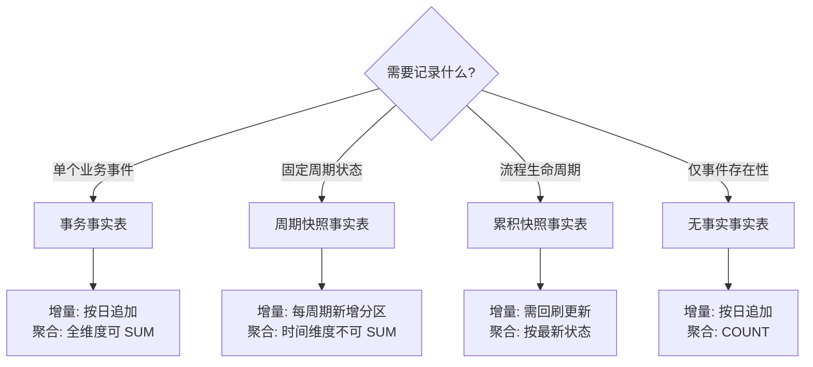
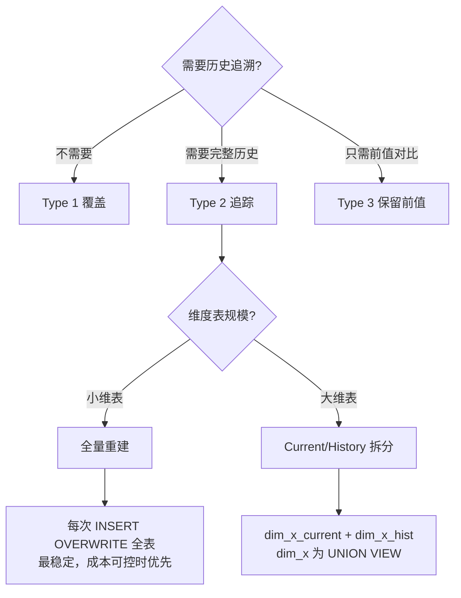

<objective>
创建事实表类型指南（METHOD-02）和 SCD 策略指南（METHOD-03）

Purpose: 建立事实表类型选型和 SCD 策略选型的权威参考文档，特别是提供 dbt-hive 无 Snapshots 环境下的 SCD Type 2 实现方案。

Output:
- `context/methodology/fact-table-types.md` — 1500-2500 字，覆盖事务/周期快照/累积快照、可加性、迟到事实
- `context/methodology/scd-strategies.md` — 1500-2500 字，覆盖 SCD Type 1/2/3、dbt-hive 实现、迟到维度
</objective>

<execution_context>
@./.claude/agents/gsd-executor.md
@./.claude/get-shit-done/templates/summary.md
</execution_context>

<context>
@.planning/PROJECT.md
@.planning/ROADMAP.md
@.planning/STATE.md
@.planning/phases/02-methodology/02-CONTEXT.md
@.planning/phases/02-methodology/02-RESEARCH.md
@.planning/phases/01-infrastructure/01-01-SUMMARY.md
@.planning/phases/01-infrastructure/01-02-SUMMARY.md
@.claude/data-warehouse/glossary/terms.md
@.claude/data-warehouse/docs/prompting.md
@.claude/data-warehouse/docs/naming.md
</context>

<tasks>

<task type="auto">
  <name>Task 1: 编写事实表类型指南 (METHOD-02)</name>
  <files>.claude/data-warehouse/context/methodology/fact-table-types.md</files>
  <action>
创建 `context/methodology/fact-table-types.md`，遵循七段式结构：

**1. YAML frontmatter**：
```yaml
---
type: methodology
method_id: METHOD-02
title: 事实表类型指南
status: stable
version: 1.0.0
domain: methodology
updated_at: 2026-01-31
---
```

**2. 适用范围 & 前置假设**：
- T+1 离线数仓场景
- Hive 分区表（按日期分区）
- dbt-hive incremental 模式（insert_overwrite）

**3. 读者导航（双轨）**：
- **[Analyst]** 你会得到：三类事实表的口径差异、如何查询、聚合注意事项
- **[Engineer]** 你会得到：表结构设计、增量策略、迟到事实处理

**4. TL;DR**：
事实表分事务/周期快照/累积快照三类，选型基于"记录什么"——单事件、固定周期状态、流程生命周期。度量需标注可加性，错误聚合是数据分析最常见的 bug。

**5. 核心概念**：

### 事务事实表 (Transaction Fact)
- **定义**：记录单个业务事件，一行一事务
- **粒度**：事件发生时刻（订单行、支付、点击）
- **更新**：只插入不更新
- **[Analyst]** 查询模式：直接 SUM/COUNT，跨时间可加
- **[Engineer]** 增量策略：按分区日期追加
- **案例**：`dwd_fact_order_detail`（订单明细）、`dwd_fact_payment`（支付流水）

### 周期快照事实表 (Periodic Snapshot)
- **定义**：记录固定时间周期的状态快照
- **粒度**：时间周期 + 实体（日库存、月账户余额）
- **更新**：每周期新增一行，不修改历史
- **[Analyst]** 查询模式：取某周期值或对比不同周期，时间维度**不可加**
- **[Engineer]** 增量策略：每周期 INSERT 新分区
- **案例**：`dws_inventory_daily`（日库存快照）、`dws_account_monthly`（月账户余额）

### 累积快照事实表 (Accumulating Snapshot)
- **定义**：记录流程实例的生命周期，包含多个时间戳
- **粒度**：流程实例（一个订单的全生命周期）
- **更新**：可更新（流程推进时更新时间戳）
- **[Analyst]** 查询模式：计算阶段耗时（履约时长 = 发货日期 - 下单日期）
- **[Engineer]** 增量策略：需回刷更新，或使用版本化（每变更新增行）
- **案例**：`dwd_fact_order_lifecycle`（订单履约进度）

### 无事实事实表 (Factless Fact)
- **定义**：只记录事件发生，无度量字段
- **用途**：记录多维度关联、覆盖范围、事件存在性
- **案例**：`dwd_fact_student_enrollment`（学生-课程注册）、促销覆盖

### 可加性 (Additivity) — **[Analyst] 必读**

| 度量类型 | 时间可加 | 其他维度可加 | 正确聚合方式 | 示例 |
|---------|---------|-------------|-------------|------|
| 可加 (Additive) | ✓ | ✓ | SUM | 销售金额、数量 |
| 半可加 (Semi-additive) | ✗ | ✓ | 取最新/AVG | 账户余额、库存数量 |
| 不可加 (Non-additive) | ✗ | ✗ | 加权平均/比率公式 | 单价、折扣率 |

- **[Analyst]** 警告：对半可加/不可加度量直接 SUM 会得到错误结果
- **[Engineer]** 实践：在 schema.yml 中用 `meta` 标注可加性

### 迟到事实 (Late-arriving Facts) — **[Engineer] 必读**
- **场景**：事务数据延迟到达（如 T+2 才收到 T 的订单）
- **影响**：历史分区需要补数
- **处理策略**：
  1. 定义回刷窗口（如最近 7 天分区可回刷）
  2. dbt 增量模型使用 `insert_overwrite` 覆盖分区
  3. 超出回刷窗口的迟到数据记录日志，人工处理

**6. 选型决策树（Mermaid flowchart）**：


**7. 实操指南**：

#### 场景 1: 订单明细事实表（事务型）
**[Engineer]** 骨架示例：
```sql
-- dwd_fact_order_detail (订单明细事实表)
CREATE TABLE dwd_fact_order_detail (
    order_detail_sk   BIGINT,             -- 代理键
    date_key          INT,                -- 日期维度外键
    customer_key      INT,                -- 客户维度外键
    product_key       INT,                -- 产品维度外键
    order_no          STRING,             -- 退化维度
    quantity          INT,                -- 可加事实
    unit_price        DECIMAL(10,2),      -- 不可加事实
    line_amount       DECIMAL(10,2),      -- 可加事实
    dt                STRING              -- 分区日期
)
PARTITIONED BY (dt);
```

**[Analyst]** 查询示例：
```sql
-- 按日期和产品汇总销售额
SELECT
    dt,
    product_key,
    SUM(line_amount) AS total_amount  -- 可加，直接 SUM
FROM dwd_fact_order_detail
WHERE dt BETWEEN '2026-01-01' AND '2026-01-31'
GROUP BY dt, product_key;
```

#### 场景 2: 日库存快照（周期快照型）
**[Analyst]** 错误 vs 正确查询：
```sql
-- ❌ 错误：直接 SUM 库存（时间维度不可加）
SELECT SUM(inventory_qty) FROM dws_inventory_daily WHERE dt BETWEEN '2026-01-01' AND '2026-01-07';

-- ✓ 正确：取某日库存
SELECT inventory_qty FROM dws_inventory_daily WHERE dt = '2026-01-07';

-- ✓ 正确：计算周平均库存
SELECT AVG(inventory_qty) FROM dws_inventory_daily WHERE dt BETWEEN '2026-01-01' AND '2026-01-07';
```

**8. 误区与反模式**：

| 错误做法 | 正确做法 | 原因 |
|---------|---------|------|
| ❌ 对余额/库存按时间 SUM | ✓ 取最新值或 AVG | 半可加度量时间维度不可加 |
| ❌ 累积快照不设计回刷机制 | ✓ 定义回刷窗口和策略 | 流程状态会更新 |
| ❌ 混用事务和快照粒度 | ✓ 拆分为两张事实表 | 粒度不一致导致聚合错误 |
| ❌ 迟到事实直接丢弃 | ✓ 定义回刷窗口，超期记录日志 | 数据完整性 |

**9. 检查清单**：
- [ ] **[Analyst]** 是否确认度量的可加性类型
- [ ] **[Analyst]** 查询半可加度量时是否避免跨时间 SUM
- [ ] **[Engineer]** 事务事实表是否为只追加模式
- [ ] **[Engineer]** 周期快照是否定义了周期粒度
- [ ] **[Engineer]** 累积快照是否设计了回刷机制
- [ ] **[Engineer]** 迟到事实是否有处理策略
- [ ] **[Engineer]** schema.yml 是否标注了可加性 meta

**10. 文档底部**：
- 参考文献：《数据仓库工具箱》第三版, Kimball Group
- 版本号 + 更新日期

**字数控制**：1500-2500 字
**术语引用**：链接到 glossary/terms.md
  </action>
  <verify>
    - 文件存在且 YAML frontmatter 有效
    - 包含四种事实表类型定义
    - 可加性表格完整（3 行 + 示例）
    - 包含 Mermaid 决策树
    - 骨架代码示例正确
    - 误区表格 3+ 条
    - 检查清单 6+ 项
  </verify>
  <done>
    METHOD-02 文档完成，覆盖事务/周期快照/累积快照/无事实表、可加性、迟到事实，
    包含决策树、代码示例、误区表格、检查清单
  </done>
</task>

<task type="auto">
  <name>Task 2: 编写 SCD 策略指南 (METHOD-03)</name>
  <files>.claude/data-warehouse/context/methodology/scd-strategies.md</files>
  <action>
创建 `context/methodology/scd-strategies.md`，遵循七段式结构：

**1. YAML frontmatter**：
```yaml
---
type: methodology
method_id: METHOD-03
title: SCD 策略指南
status: stable
version: 1.0.0
domain: methodology
updated_at: 2026-01-31
---
```

**2. 适用范围 & 前置假设**：
- T+1 离线数仓场景
- Hive 非 ACID 模式（不支持 UPDATE/DELETE）
- **dbt-hive 不支持 Snapshots**，需自定义实现
- 增量以 `insert_overwrite` 分区回刷为主

**3. 读者导航（双轨）**：
- **[Analyst]** 你会得到：历史追溯查询方式、as-of 查询模式、变更审计
- **[Engineer]** 你会得到：SCD 选型、dbt-hive 实现骨架、质量门禁（dbt tests）

**4. TL;DR**：
SCD（缓慢变化维度）有 Type 1/2/3 三种主要策略。Type 1 覆盖、Type 2 追踪历史、Type 3 保留前值。dbt-hive 无 Snapshots 支持，需用 `insert_overwrite` + 有效期字段手动实现 Type 2。

**5. 核心概念**：

### SCD Type 1 — 覆盖（无历史）
- **行为**：直接覆盖旧值，不保留历史
- **适用**：数据纠错、不需要历史追溯
- **[Analyst]** 影响：历史报表会用新值重算
- **[Engineer]** 实现：直接 `INSERT OVERWRITE` 全表/分区
- **案例**：客户邮箱纠错

### SCD Type 2 — 追踪历史（完整版本链）
- **行为**：每次变更新增一行，保留所有历史版本
- **适用**：需要历史追溯（客户地址变更、商品价格调整）
- **[Analyst]** 查询模式：
  - 当前视图：`WHERE is_current = 1`
  - as-of 回溯：`WHERE effective_start <= @date AND effective_end > @date`
  - 变更审计：查看同一自然键的所有版本
- **[Engineer]** 标准字段组合（按 CONTEXT.md 决策）：
  - `effective_start DATE` — 生效开始日期
  - `effective_end DATE` — 生效结束日期（当前记录: 9999-12-31）
  - `is_current INT` — 当前标识（1=当前, 0=历史）
- **案例**：`dim_customer` 客户地址变更追踪

### SCD Type 3 — 保留前值（有限历史）
- **行为**：只保留当前值和前一个值
- **适用**：只关心"变更前后"对比
- **[Analyst]** 查询模式：对比 `current_value` 和 `previous_value`
- **[Engineer]** 实现：增加 `previous_xxx` 字段
- **案例**：销售区域调整（当前区域 + 前区域）

### SCD2 字段合同 — **[Engineer] 必读**

按 RESEARCH.md Codex 讨论补充的约束：

1. **区间语义**：`[effective_start, effective_end)` 右开区间
   - 含义：生效区间包含 start，不包含 end
   - 当前记录：`effective_end = '9999-12-31'`

2. **Current 唯一约束**：每个自然键最多一条 `is_current = 1`
   - dbt test: `unique` on `(natural_key, is_current)` where `is_current = 1`

3. **区间不重叠**：任意日期 as-of 只能命中一行
   - 同一自然键的不同版本区间不交叉

4. **Tie-breaker 规则**：同一自然键同一时刻多次变更
   - 使用 `updated_at`、`loaded_at` 或属性 hash 裁决
   - 保留最后变更为当前版本

5. **可验证实现合同（dbt tests）**：
   ```yaml
   tests:
     - unique:
         column_name: "natural_key || '-' || is_current"
         config:
           where: "is_current = 1"
     - expression_is_true:
         expression: "effective_start < effective_end"
     - unique:
         column_name: "natural_key || '-' || effective_start"
   ```

### 迟到维度 (Late-arriving Dimensions) — **[Engineer] 必读**
- **场景**：事实数据先到，维度记录后到
- **影响**：事实表外键指向不存在的维度记录
- **处理策略**：
  1. 使用 Unknown 成员：创建占位维度记录 `customer_sk = -1`
  2. 事实加载时，缺失维度指向 Unknown
  3. 维度到达后，更新 Unknown 为真实值（Type 1 覆盖）或新增版本（Type 2）
  4. 已关联事实是否回刷取决于业务需求

**6. 选型决策树（Mermaid flowchart）**：


**7. 实操指南 — dbt-hive SCD2 实现**：

#### 实现路径 1: 全量重建（推荐小维表）
**[Engineer]** 骨架代码：
```sql
-- models/dim/dim_customer.sql
{{
  config(
    materialized='table',
    partition_by=['dt']
  )
}}

WITH source AS (
    SELECT * FROM {{ source('ods', 'customers') }}
),

-- Step 1: 识别变更（与当前维表对比）
changes AS (
    SELECT
        s.customer_id,
        s.customer_name,
        s.customer_address,
        CASE
            WHEN c.customer_sk IS NULL THEN 'INSERT'
            WHEN s.customer_address != c.customer_address THEN 'UPDATE'
            ELSE 'NO_CHANGE'
        END AS change_type
    FROM source s
    LEFT JOIN {{ this }} c
        ON s.customer_id = c.customer_id AND c.is_current = 1
),

-- Step 2: 关闭旧版本
closed AS (
    SELECT
        customer_sk,
        customer_id,
        customer_name,
        customer_address,
        effective_start,
        '{{ run_date }}' AS effective_end,  -- 关闭日期
        0 AS is_current
    FROM {{ this }}
    WHERE is_current = 1
      AND customer_id IN (SELECT customer_id FROM changes WHERE change_type = 'UPDATE')
),

-- Step 3: 新增版本
new_versions AS (
    SELECT
        ROW_NUMBER() OVER () + (SELECT COALESCE(MAX(customer_sk), 0) FROM {{ this }}) AS customer_sk,
        customer_id,
        customer_name,
        customer_address,
        '{{ run_date }}' AS effective_start,
        '9999-12-31' AS effective_end,
        1 AS is_current
    FROM changes
    WHERE change_type IN ('INSERT', 'UPDATE')
),

-- Step 4: 合并
final AS (
    SELECT * FROM {{ this }} WHERE customer_id NOT IN (SELECT customer_id FROM changes WHERE change_type = 'UPDATE')
    UNION ALL
    SELECT * FROM closed
    UNION ALL
    SELECT * FROM new_versions
)

SELECT * FROM final
```

#### 实现路径 2: Current/History 拆分（大维表）
```
dim_customer_current  -- 只存当前版本，每天 INSERT OVERWRITE
dim_customer_history  -- 只追加历史版本
dim_customer          -- UNION VIEW
```

**[Analyst]** 标准查询模式：
```sql
-- 当前视图
SELECT * FROM dim_customer WHERE is_current = 1;

-- as-of 回溯（查 2025-06-15 时点的客户地址）
SELECT * FROM dim_customer
WHERE effective_start <= '2025-06-15'
  AND effective_end > '2025-06-15';

-- 变更审计（查客户所有历史版本）
SELECT * FROM dim_customer
WHERE customer_id = 'C001'
ORDER BY effective_start;
```

**8. 误区与反模式**：

| 错误做法 | 正确做法 | 原因 |
|---------|---------|------|
| ❌ 用闭区间 `[start, end]` | ✓ 用右开区间 `[start, end)` | 避免边界日期重复命中 |
| ❌ 不设 is_current 标志 | ✓ 加 is_current=1 当前标识 | 简化当前视图查询 |
| ❌ 无 tie-breaker 规则 | ✓ 用 updated_at 裁决同时刻变更 | 避免 is_current 多条 |
| ❌ 迟到维直接跳过 | ✓ 使用 Unknown 成员占位 | 保证事实表外键完整 |
| ❌ SCD2 无 dbt tests | ✓ 加区间、唯一性测试 | 保证数据合同 |

**9. 检查清单**：
- [ ] **[Analyst]** 是否清楚 SCD 类型对历史查询的影响
- [ ] **[Analyst]** as-of 查询是否使用正确的区间条件
- [ ] **[Engineer]** SCD Type 2 是否使用标准字段（effective_start/end + is_current）
- [ ] **[Engineer]** 区间是否采用右开语义
- [ ] **[Engineer]** 是否有 is_current 唯一性 dbt test
- [ ] **[Engineer]** 是否有区间不重叠 dbt test
- [ ] **[Engineer]** 是否定义了迟到维 Unknown 成员
- [ ] **[Engineer]** 是否选择了合适的实现路径（全量重建 vs 拆分）

**10. 文档底部**：
- 参考文献：《数据仓库工具箱》第三版, Kimball Group, dbt Community SCD2 without Snapshots
- 版本号 + 更新日期

**字数控制**：1500-2500 字
**交叉引用**：链接到 dimensional-modeling.md（维度表设计部分）
**术语引用**：链接到 glossary/terms.md
  </action>
  <verify>
    - 文件存在且 YAML frontmatter 有效
    - 包含 SCD Type 1/2/3 定义
    - SCD2 字段合同包含 5 个约束（区间语义、current 唯一、区间不重叠、tie-breaker、dbt tests）
    - 包含 Mermaid 决策树
    - 包含 dbt-hive 实现骨架代码（全量重建路径）
    - 包含 3 种查询模式（当前、as-of、审计）
    - 误区表格 4+ 条
    - 检查清单 7+ 项
  </verify>
  <done>
    METHOD-03 文档完成，覆盖 SCD Type 1/2/3、字段合同、迟到维度、dbt-hive 无 Snapshots 实现，
    包含决策树、实现代码、查询模式、误区表格、检查清单
  </done>
</task>

</tasks>

<verification>
1. 文件存在：
   ```bash
   ls -la .claude/data-warehouse/context/methodology/
   # 应包含 fact-table-types.md 和 scd-strategies.md
   ```

2. YAML frontmatter 有效性：
   ```bash
   head -15 .claude/data-warehouse/context/methodology/fact-table-types.md
   head -15 .claude/data-warehouse/context/methodology/scd-strategies.md
   ```

3. Mermaid 图表存在：
   ```bash
   grep -c "mermaid" .claude/data-warehouse/context/methodology/fact-table-types.md
   grep -c "mermaid" .claude/data-warehouse/context/methodology/scd-strategies.md
   ```

4. 术语链接检查：
   ```bash
   grep -c "glossary/terms.md" .claude/data-warehouse/context/methodology/*.md
   ```

5. SCD2 标准字段验证：
   ```bash
   grep -c "effective_start\|effective_end\|is_current" .claude/data-warehouse/context/methodology/scd-strategies.md
   # 应有多次出现
   ```
</verification>

<success_criteria>
1. fact-table-types.md 遵循七段式结构，1500-2500 字
2. 覆盖事务/周期快照/累积快照/无事实表四种类型
3. 可加性表格完整（3 类 + 示例 + 正确聚合方式）
4. scd-strategies.md 遵循七段式结构，1500-2500 字
5. 覆盖 SCD Type 1/2/3 + dbt-hive 无 Snapshots 实现
6. SCD2 字段合同包含 5 个约束（按 RESEARCH Codex 讨论）
7. 每个文档包含 Mermaid 决策树
8. 每个文档包含误区表格（3+ 条）和检查清单（6+ 项）
9. 双受众标识（[Analyst]/[Engineer]）穿插呈现
</success_criteria>

<output>
After completion, create `.planning/phases/02-methodology/02-02-SUMMARY.md`
</output>
