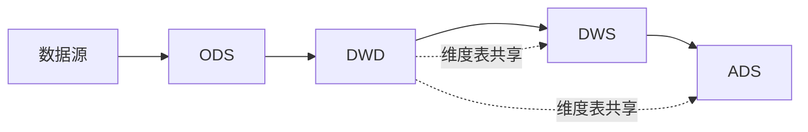
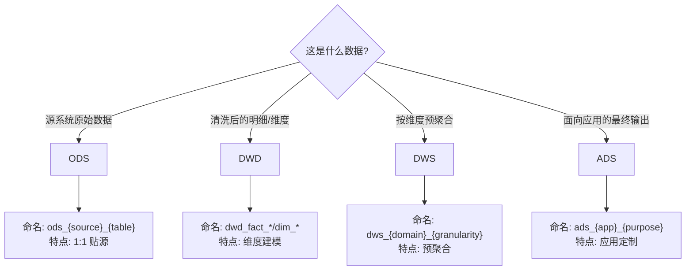

<objective>
创建分层体系规范文档（METHOD-04）

Purpose: 定义 ODS/DWD/DWS/ADS 四层的职责边界、跨层规则和落层决策指南，为后续评审和设计提供分层判断依据。

Output:
- `context/layers/layering-system.md` — 1500-2500 字，覆盖四层定义、跨层规则、落层决策、回刷约束
</objective>

<execution_context>
@./.claude/agents/gsd-executor.md
@./.claude/get-shit-done/templates/summary.md
</execution_context>

<context>
@.planning/PROJECT.md
@.planning/ROADMAP.md
@.planning/STATE.md
@.planning/phases/02-methodology/02-CONTEXT.md
@.planning/phases/02-methodology/02-RESEARCH.md
@.planning/phases/01-infrastructure/01-01-SUMMARY.md
@.planning/phases/01-infrastructure/01-02-SUMMARY.md
@.claude/data-warehouse/glossary/terms.md
@.claude/data-warehouse/docs/prompting.md
@.claude/data-warehouse/docs/naming.md
</context>

<tasks>

<task type="auto">
  <name>Task 1: 编写分层体系规范 (METHOD-04)</name>
  <files>.claude/data-warehouse/context/layers/layering-system.md</files>
  <action>
创建 `context/layers/layering-system.md`，遵循七段式结构：

**1. YAML frontmatter**：
```yaml
---
type: methodology
method_id: METHOD-04
title: 数仓分层体系规范
status: stable
version: 1.0.0
domain: layers
updated_at: 2026-01-31
---
```

**2. 适用范围 & 前置假设**：
- T+1 离线数仓场景
- Hive + dbt-hive 技术栈
- 遵循 Kimball 维度建模方法论
- 参考阿里云 DataWorks ODS/DWD/DWS/ADS 分层标准

**3. 读者导航（双轨）**：
- **[Analyst]** 你会得到：从哪层取数、各层数据口径差异、为什么不能直接查 ODS
- **[Engineer]** 你会得到：模型落层决策、跨层依赖规则、回刷窗口约束

**4. TL;DR**：
数仓分层 ODS → DWD → DWS → ADS，数据从原始贴源逐层加工为可用指标。标准数据流禁止跨层跳跃（如 ADS 不能直接引用 ODS）。落层决策基于"数据加工程度"和"复用性"。

**5. 核心概念 — 四层定义**：

### ODS（贴源层 / Operational Data Store）

| 属性 | 说明 |
|------|------|
| 职责 | 原封不动接入源系统数据，保持与源表 1:1 对应 |
| 数据特征 | 原始格式、未清洗、可能有脏数据 |
| 命名规范 | `ods_{source}_{table}` (如 `ods_mysql_orders`) |
| 更新策略 | 每日全量或增量同步，按日期分区 |
| 保留周期 | 7-30 天（可配置） |

- **[Analyst]** 不建议直接查询 ODS，数据未经清洗，口径不可控
- **[Engineer]** ODS 只做数据落地，不做任何业务逻辑转换

**典型表示例**：
```
ods_mysql_orders          -- MySQL 订单表同步
ods_mysql_customers       -- MySQL 客户表同步
ods_kafka_click_events    -- Kafka 点击事件落地
```

### DWD（明细层 / Data Warehouse Detail）

| 属性 | 说明 |
|------|------|
| 职责 | 数据清洗、标准化、构建明细事实表和维度表 |
| 数据特征 | 已清洗、已标准化、粒度为最细业务事件/实体 |
| 命名规范 | `dwd_fact_{domain}_{entity}` / `dim_{entity}` |
| 更新策略 | 增量追加（事实）或 SCD（维度） |
| 保留周期 | 永久保留或按业务需求 |

- **[Analyst]** DWD 是"标准明细"，可用于精细分析，口径已定义
- **[Engineer]** DWD 承载维度建模，事实表 + 维度表均落此层

**典型表示例**：
```
dwd_fact_order_detail     -- 订单明细事实表
dwd_fact_payment          -- 支付流水事实表
dim_customer              -- 客户维度表
dim_product               -- 产品维度表
dim_date                  -- 日期维度表
```

### DWS（汇总层 / Data Warehouse Summary）

| 属性 | 说明 |
|------|------|
| 职责 | 按主题域/维度组合预聚合，提供通用汇总数据 |
| 数据特征 | 粒度比 DWD 粗，已按常用维度聚合 |
| 命名规范 | `dws_{domain}_{granularity}_{metric}` (如 `dws_order_daily`) |
| 更新策略 | 每日重算或增量追加 |
| 保留周期 | 永久保留或按业务需求 |

- **[Analyst]** DWS 是"主题汇总"，查询效率高，适合报表底层
- **[Engineer]** DWS 提升查询性能，减少 DWD 重复聚合

**典型表示例**：
```
dws_order_daily           -- 订单日汇总
dws_customer_monthly      -- 客户月汇总
dws_product_category_sales-- 品类销售汇总
```

### ADS（应用层 / Application Data Service）

| 属性 | 说明 |
|------|------|
| 职责 | 面向特定应用/报表的最终输出，可高度定制 |
| 数据特征 | 面向消费端优化，可能反规范化 |
| 命名规范 | `ads_{application}_{purpose}` (如 `ads_bi_gmv_report`) |
| 更新策略 | 按应用需求 |
| 保留周期 | 按应用需求 |

- **[Analyst]** ADS 是"报表层"，直接对接 BI 工具，开箱即用
- **[Engineer]** ADS 可做反规范化/预计算，但不应包含业务逻辑首发

**典型表示例**：
```
ads_bi_gmv_report         -- BI GMV 报表
ads_api_user_profile      -- API 用户画像
ads_ml_feature_store      -- ML 特征宽表
```

### 维度表落层说明

维度表（`dim_*`）通常落在 DWD 层，与事实表并列：
- 维度表是"主数据"，被多个事实表引用
- 维度表使用 SCD 策略管理历史变更
- 一致性维度（Conformed Dimension）跨主题域共享

**6. 跨层引用规则 — **[Engineer] 必读****

### 标准数据流



### 允许的引用

| 目标层 | 可引用来源 | 说明 |
|-------|-----------|------|
| ODS | 数据源（source） | 只从外部源同步 |
| DWD | ODS、DWD（同层事实/维度） | 可引用 ODS 和同层模型 |
| DWS | DWD、DWS（同层）、维度表 | 可引用明细层和同层汇总 |
| ADS | DWS、ADS（同层）、维度表 | 可引用汇总层和同层应用表 |

### 禁止的跨层引用

| 禁止模式 | 问题 |
|---------|------|
| ❌ ADS 引用 ODS | 跳过数据清洗，口径不可控 |
| ❌ ADS 引用 DWD | 跳过汇总层，逻辑冗余 |
| ❌ DWS 引用 ODS | 跳过明细层，脏数据风险 |
| ❌ ODS 引用 DWD | 逆向依赖，架构混乱 |

- **例外情况**：维度表（`dim_*`）可被 DWS/ADS 直接引用（因为维度表是"主数据"）
- **审批流程**：非标准跨层引用需要架构评审和文档记录

**7. 落层决策指南 — Mermaid 决策树**：



### 落层判断清单

| 问题 | 答案 | 建议落层 |
|------|------|---------|
| 是否直接从源系统同步？ | 是 | ODS |
| 是否需要清洗/标准化？ | 是 | DWD |
| 是否是事实表或维度表？ | 是 | DWD |
| 是否按维度预聚合？ | 是 | DWS |
| 是否面向特定应用？ | 是 | ADS |

**8. 回刷/重算约束 — **[Engineer] 必读****

### 跨层回刷传播

当某层数据需要回刷时，下游层也需要联动回刷：

```
ODS 回刷 T-3 分区
  → DWD 对应分区回刷
    → DWS 对应周期回刷
      → ADS 对应报表重算
```

### 回刷窗口约束

| 层 | 典型回刷窗口 | 说明 |
|----|------------|------|
| ODS | 7 天 | 源系统数据补发窗口 |
| DWD | 7-14 天 | 与 ODS 对齐 + 处理时间 |
| DWS | 当月 | 汇总通常按月重算 |
| ADS | 按应用 | 依赖报表刷新策略 |

### 调度依赖原则

- 下游任务必须等待上游完成
- 调度依赖应反映分层结构（非蜘蛛网状）
- 回刷脚本需按层级顺序执行

**9. 误区与反模式**：

| 错误做法 | 正确做法 | 原因 |
|---------|---------|------|
| ❌ ADS 直接查 ODS | ✓ ADS 引用 DWS | 跳层导致口径混乱 |
| ❌ 业务逻辑首发在 ADS | ✓ 通用逻辑下沉到 DWD/DWS | ADS 应只做展示优化 |
| ❌ 维度表放 ODS | ✓ 维度表放 DWD | 维度表需要 SCD 管理 |
| ❌ 每个报表独立建 DWD 表 | ✓ DWD 表通用，ADS 做定制 | DWD 强调复用性 |
| ❌ 调度依赖是蜘蛛网 | ✓ 依赖图呈分层结构 | 便于问题排查和回刷 |

**10. 检查清单**：

- [ ] **[Analyst]** 是否从正确的层取数（避免直接查 ODS）
- [ ] **[Analyst]** 是否理解各层数据的口径差异
- [ ] **[Engineer]** 模型落层是否符合职责定义
- [ ] **[Engineer]** 是否遵循标准数据流（无跨层跳跃）
- [ ] **[Engineer]** 维度表是否落在 DWD 层
- [ ] **[Engineer]** 跨层引用是否只限于维度表例外
- [ ] **[Engineer]** 调度依赖是否反映分层结构
- [ ] **[Engineer]** 回刷策略是否按层级顺序

**11. 文档底部**：
- 参考文献：阿里云 DataWorks 数仓分层规范、《数据仓库工具箱》第三版
- 版本号 + 更新日期

**字数控制**：1500-2500 字
**交叉引用**：链接到 dimensional-modeling.md（维度表设计）、命名规范 naming.md
**术语引用**：链接到 glossary/terms.md
  </action>
  <verify>
    - 文件存在且 YAML frontmatter 有效
    - 包含四层定义（ODS/DWD/DWS/ADS）
    - 跨层引用规则表格完整
    - 包含 Mermaid 数据流图和决策树
    - 回刷约束部分存在
    - 误区表格 4+ 条
    - 检查清单 7+ 项
  </verify>
  <done>
    METHOD-04 文档完成，覆盖 ODS/DWD/DWS/ADS 四层定义、跨层规则、落层决策、回刷约束，
    包含数据流图、决策树、误区表格、检查清单
  </done>
</task>

<task type="auto">
  <name>Task 2: 更新方法论索引页（补充实际链接）</name>
  <files>.claude/data-warehouse/context/methodology/index.md</files>
  <action>
在 Plan 01 创建索引页后，本任务确保索引页中的链接与实际文件一致。

检查并确认：
1. `dimensional-modeling.md` 链接正确
2. `fact-table-types.md` 链接正确
3. `scd-strategies.md` 链接正确
4. `../layers/layering-system.md` 链接正确（跨目录）

如果索引页已正确，则无需修改。
如果有遗漏或错误，更新链接。

同时确认文档状态标记正确（所有 METHOD 文档已完成）。
  </action>
  <verify>
    - 索引页中 4 个文档链接均可访问
    - 链接路径与实际文件位置匹配
  </verify>
  <done>索引页链接与实际文件一致，所有 METHOD 文档状态正确</done>
</task>

</tasks>

<verification>
1. 文件存在：
   ```bash
   ls -la .claude/data-warehouse/context/layers/
   # 应包含 layering-system.md
   ```

2. YAML frontmatter 有效性：
   ```bash
   head -15 .claude/data-warehouse/context/layers/layering-system.md
   ```

3. 四层定义检查：
   ```bash
   grep -c "ODS\|DWD\|DWS\|ADS" .claude/data-warehouse/context/layers/layering-system.md
   # 应有多次出现
   ```

4. Mermaid 图表存在：
   ```bash
   grep -c "mermaid" .claude/data-warehouse/context/layers/layering-system.md
   # 应有 2+ 个 Mermaid 代码块
   ```

5. 跨层规则检查：
   ```bash
   grep -c "禁止\|允许" .claude/data-warehouse/context/layers/layering-system.md
   ```

6. 索引页链接验证：
   ```bash
   # 检查所有 METHOD 文件是否存在
   ls .claude/data-warehouse/context/methodology/*.md
   ls .claude/data-warehouse/context/layers/*.md
   ```
</verification>

<success_criteria>
1. layering-system.md 遵循七段式结构，1500-2500 字
2. 覆盖 ODS/DWD/DWS/ADS 四层定义（职责、特征、命名、更新策略）
3. 跨层引用规则清晰（允许 + 禁止 + 例外）
4. 包含 Mermaid 数据流图和落层决策树
5. 包含回刷约束说明
6. 误区表格 4+ 条，检查清单 7+ 项
7. 双受众标识（[Analyst]/[Engineer]）穿插呈现
8. 索引页链接与实际文件一致
</success_criteria>

<output>
After completion, create `.planning/phases/02-methodology/02-03-SUMMARY.md`
</output>
