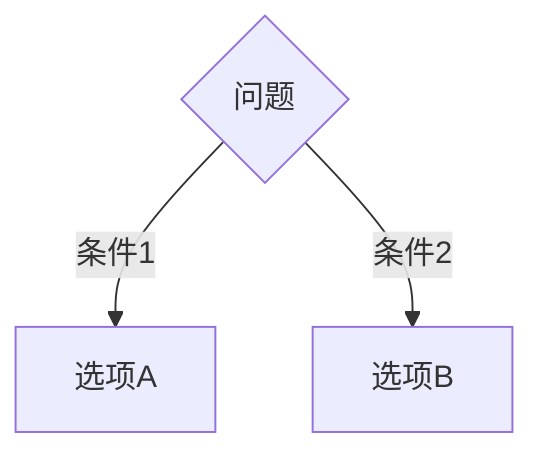
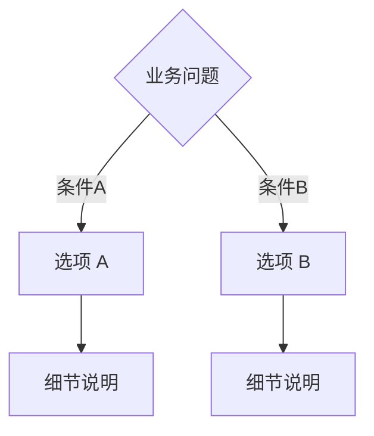
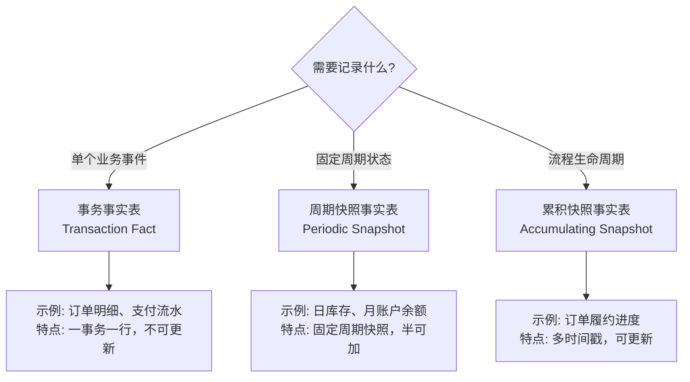
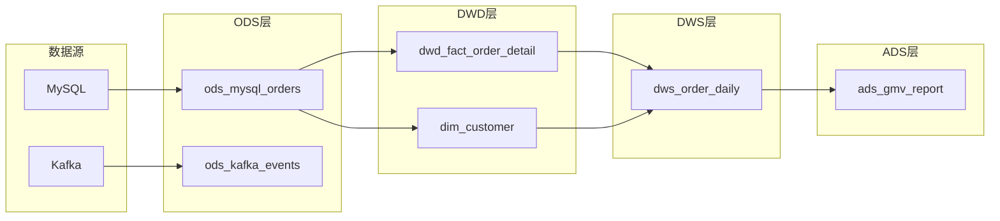

# Phase 02: 方法论库 (Methodology Library) - Research

**Researched:** 2026-01-31
**Domain:** Kimball 维度建模方法论文档、技术文档写作、Mermaid 图表
**Confidence:** HIGH

## Summary

本阶段研究了如何构建高质量的 Kimball 维度建模方法论文档库。研究覆盖四个核心领域：文档结构与写作模式、Kimball 方法论核心概念、Mermaid 决策树图表语法、以及反模式/误区的呈现方式。

研究发现，Kimball 维度建模的官方技术文档（Kimball Group 网站和《数据仓库工具箱》第三版）提供了权威的概念定义和方法论框架。文档写作方面，采用"TL;DR + 原理 + 实操 + 检查清单"的四段式结构是技术手册的最佳实践。Mermaid 的 flowchart 图表类型完全支持决策树场景，使用菱形节点（`{}`）表示决策点。反模式部分建议采用"错误示例 + 正确示例 + 原因"的三段式对比格式。

**Primary recommendation:** 采用"TL;DR 摘要 + 核心概念 + 选型决策树(Mermaid) + 实操指南 + 误区/反模式 + 检查清单"的六段式文档结构，每篇 1500-2500 字，通过 term_id 链接到 glossary/terms.md 实现术语一致性。

## Standard Stack

本阶段不涉及编程库，而是文档格式和写作规范。以下是"标准工具栈"：

### Core

| Tool/Pattern | Version/Type | Purpose | Why Standard |
|-------------|--------------|---------|--------------|
| Markdown | CommonMark | 方法论文档格式 | 人类可读、版本控制友好、Claude 原生支持 |
| Mermaid flowchart | Mermaid 10.x | 决策树/选型地图 | GitHub/GitLab 原生支持、Markdown 内嵌、易维护 |
| YAML frontmatter | YAML 1.2 | 文档元数据（版本、更新日期） | 结构化元数据、支持版本管理 |
| Markdown 复选框 | `- [ ]` 语法 | 检查清单 | 原生支持、可复制使用、GitHub 可勾选 |

### Supporting

| Tool/Pattern | Version/Type | Purpose | When to Use |
|-------------|--------------|---------|-------------|
| 术语链接 | Markdown anchor | 引用 glossary/terms.md | 专业术语首次出现时 |
| 代码块 | SQL/HiveQL | 骨架示例 | 展示模式而非完整可运行代码 |
| 表格 | Markdown table | 对比说明、选型矩阵 | 多选项对比时 |

### Alternatives Considered

| Instead of | Could Use | Tradeoff |
|------------|-----------|----------|
| Mermaid flowchart | Mermaid graph | flowchart 语法更直观，TD/LR 方向更适合决策树 |
| Markdown 复选框 | 编号列表 | 复选框可交互勾选，更适合检查清单场景 |
| 内嵌术语定义 | 全部链接 terms.md | 简单概念自包含更流畅，复杂概念链接更权威 |

## Architecture Patterns

### Recommended Document Structure

每篇方法论文档采用统一的六段式结构：

```
methodology/
├── index.md                      # 方法论索引页（总览链接所有文档）
├── dimensional-modeling.md       # METHOD-01: 维度建模概念
├── fact-table-types.md           # METHOD-02: 事实表类型指南
├── scd-strategies.md             # METHOD-03: SCD 策略指南
└── layering-system.md            # METHOD-04: 分层体系规范
```

### Pattern 1: 六段式文档结构

**What:** 每篇方法论文档的标准章节组织
**When to use:** 所有 METHOD-* 文档
**Structure:**

```markdown
---
type: methodology
title: <文档标题>
version: 1.0.0
updated_at: 2026-01-31
---

# <标题>

## TL;DR

> 一段话总结核心要点，不超过 3 句话。

## 核心概念

### 概念 A
<定义 + 为什么重要 + 1-2 个案例>

### 概念 B
<定义 + 为什么重要 + 1-2 个案例>

## 选型决策树



## 实操指南

### 场景 1: <具体场景名>
<步骤 + SQL 骨架示例>

## 误区与反模式

| 错误做法 | 正确做法 | 原因 |
|---------|---------|------|
| ❌ ... | ✓ ... | ... |

## 检查清单

- [ ] 检查项 1
- [ ] 检查项 2
- [ ] 检查项 3

---

**参考文献:** 《数据仓库工具箱》第三版, Kimball Group
**版本:** 1.0.0 | **更新日期:** 2026-01-31
```

Source: 技术文档写作最佳实践 + CONTEXT.md 用户决策

### Pattern 2: Mermaid 决策树语法

**What:** 使用 Mermaid flowchart 绘制选型决策树
**When to use:** 需要帮助读者做选择的场景（事实表类型选型、SCD 策略选型等）
**Syntax:**

```markdown

```

**节点类型:**
- `A{菱形}` - 决策点/问题（MUST use for decisions）
- `A[矩形]` - 结论/选项
- `A(圆角矩形)` - 中间步骤
- `A((圆形))` - 起点/终点

**方向选择:**
- `flowchart TD` (Top-Down) - 推荐，适合多层决策
- `flowchart LR` (Left-Right) - 适合简单二选一

**标签语法:**
- `A -->|标签文字| B` - 在连线上添加条件说明

Source: [Mermaid Flowchart Syntax](https://mermaid.js.org/syntax/flowchart.html)

### Pattern 3: 误区/反模式对比格式

**What:** 呈现常见错误和正确做法的对比
**When to use:** 每篇文档的"误区与反模式"部分
**Format:**

```markdown
## 误区与反模式

### 误区 1: <误区名称>

❌ **错误做法:**
```sql
-- 示例代码或描述
```

✓ **正确做法:**
```sql
-- 示例代码或描述
```

**原因:** <为什么错误做法有问题，正确做法的好处>
```

或使用表格形式（适合多个简短误区）：

```markdown
| 错误做法 | 正确做法 | 原因 |
|---------|---------|------|
| ❌ 不定义粒度就设计事实表 | ✓ 先声明粒度，再选择维度和事实 | 粒度是维度设计的"合同"，不明确会导致数据一致性问题 |
| ❌ 在事实表中存储冗余的维度属性 | ✓ 维度属性放维度表，事实表只存外键 | 违反星型模型原则，更新困难 |
```

Source: 软件反模式文档最佳实践

### Pattern 4: 骨架示例格式

**What:** 展示模式而非完整可运行代码的 SQL 示例
**When to use:** 解释设计模式和实现方式时
**Format:**

```markdown
```sql
-- 订单明细事实表骨架 (order_detail -- 订单明细)
CREATE TABLE dwd_fact_order_detail (
    -- 代理键
    order_detail_sk     BIGINT,             -- 代理键

    -- 维度外键
    date_key            INT,                -- 日期维度外键
    customer_key        INT,                -- 客户维度外键
    product_key         INT,                -- 产品维度外键

    -- 退化维度
    order_no            STRING,             -- 订单号（退化维度）

    -- 事实/度量
    quantity            INT,                -- 数量（可加）
    unit_price          DECIMAL(10,2),      -- 单价（不可加）
    line_amount         DECIMAL(10,2),      -- 行金额（可加）

    -- 分区键
    dt                  STRING              -- 分区日期
)
PARTITIONED BY (dt);
```
```

**命名规范:**
- 英文标识符 + 中文注释：`order_amount (-- 订单金额)`
- 关键字段标注用途：`-- 代理键`、`-- 维度外键`、`-- 可加事实`

Source: CONTEXT.md 用户决策（骨架示例 + 英文标识符 + 中文注释）

### Anti-Patterns to Avoid

- **过度规范化文档:** 不要在方法论文档中过度追求学术严谨，工作手册风格更实用
- **只有概念没有案例:** 每个核心概念必须配 2-3 个多行业案例（电商/金融/零售）
- **决策树过深:** 决策树分支深度建议 ≤4 层，过深则拆分为多个图
- **术语不一致:** 同一术语必须使用统一的中文表达，首次出现标注英文
- **检查清单过长:** 每篇文档检查清单 5-10 条，聚焦关键检查点

## Don't Hand-Roll

| Problem | Don't Build | Use Instead | Why |
|---------|-------------|-------------|-----|
| 维度建模术语定义 | 自创定义 | Kimball Group 官方定义 + terms.md | 行业标准，避免歧义 |
| 分层体系定义 | 自创分层描述 | 阿里云 DataWorks ODS/DWD/DWS/ADS 标准 | 中国数仓生态事实标准 |
| SCD 类型定义 | 自编 SCD 描述 | Kimball SCD Type 0-6 标准定义 | 权威来源，被广泛引用 |
| 事实表类型定义 | 简化描述 | Kimball 三种事实表类型标准定义 | 事务/周期快照/累积快照各有精确语义 |
| 决策树图表 | ASCII art 或纯文字 | Mermaid flowchart | 可维护、可渲染、版本控制友好 |

**Key insight:** Kimball 方法论已有 30 年历史和完整的术语体系，方法论文档的价值在于准确传达和本地化应用，而非创新概念。

## Common Pitfalls

### Pitfall 1: 混淆"事实"与"维度"的边界

**What goes wrong:** 将应该放在维度表的属性冗余到事实表，或将度量放入维度表
**Why it happens:** 追求查询便利性，忽视模型规范性
**How to avoid:**
- 事实表只存储度量和维度外键
- 维度属性冗余到事实表仅限于退化维度（如订单号）
- 度量必须与粒度一致（可加性检验）
**Warning signs:** 事实表中出现大量描述性文本字段

### Pitfall 2: 未明确声明粒度就设计事实表

**What goes wrong:** 事实表粒度不清晰，导致可加性问题和重复计算
**Why it happens:** 急于交付，跳过粒度声明步骤
**How to avoid:**
- Kimball 四步法：第 2 步必须声明粒度
- 用一句话描述"一行代表什么"
- 粒度声明后不可轻易变更
**Warning signs:** 同一事实表中有不同粒度的度量

### Pitfall 3: SCD Type 2 实现不完整

**What goes wrong:** 缺少 is_current 标志或有效期字段，历史查询困难
**Why it happens:** 只关注当前数据，忽视历史追溯需求
**How to avoid:**
- 标准字段组合：`effective_start` + `effective_end` + `is_current`
- 当前记录 `effective_end = '9999-12-31'` 或 NULL
- 历史查询使用 `WHERE effective_start <= @date AND effective_end > @date`
**Warning signs:** 维度变更后无法追溯历史关联

### Pitfall 4: 分层体系跨层引用混乱

**What goes wrong:** ADS 直接引用 ODS，跳过中间层，导致依赖混乱
**Why it happens:** 追求开发速度，走捷径
**How to avoid:**
- 标准数据流：ODS → DWD → DWS → ADS
- 跨层引用需要审批和文档记录
- 建立层间依赖规范
**Warning signs:** 调度依赖图呈现蜘蛛网状而非分层结构

### Pitfall 5: 文档与实际实现脱节

**What goes wrong:** 方法论文档描述的模式与实际代码不一致
**Why it happens:** 文档更新滞后，代码先行
**How to avoid:**
- 文档带版本号和更新日期
- 建立文档评审机制
- 检查清单用于自查
**Warning signs:** 团队成员不看方法论文档，因为"过时了"

## Code Examples

### Example 1: 事实表类型选型决策树



Source: Kimball Group Dimensional Modeling Techniques

### Example 2: SCD Type 2 标准实现（无 Snapshots）

```sql
-- SCD Type 2 维度表结构 (dim_customer -- 客户维度)
CREATE TABLE dim_customer (
    customer_sk         BIGINT,             -- 代理键
    customer_id         STRING,             -- 业务键

    -- 维度属性
    customer_name       STRING,             -- 客户名称
    customer_address    STRING,             -- 客户地址（可能变更）
    customer_level      STRING,             -- 客户等级（可能变更）

    -- SCD Type 2 标准字段
    effective_start     DATE,               -- 生效开始日期
    effective_end       DATE,               -- 生效结束日期 (当前记录: 9999-12-31)
    is_current          INT,                -- 当前标识 (1=当前, 0=历史)

    -- ETL 审计字段
    dw_insert_time      TIMESTAMP,          -- 首次加载时间
    dw_update_time      TIMESTAMP           -- 最后更新时间
);

-- 增量更新逻辑（INSERT OVERWRITE 模式）
-- Step 1: 找出变更记录，关闭旧版本
-- Step 2: 插入新版本记录
-- Step 3: INSERT OVERWRITE 全表（或特定分区）
```

Source: CONTEXT.md 用户决策 + [dbt Community SCD2 without Snapshots](https://discourse.getdbt.com/t/how-to-implement-scd-type-2-without-using-snapshot/4346)

### Example 3: 分层体系数据流



Source: [阿里云 DataWorks 数据仓库分层](https://help.aliyun.com/zh/dataworks/use-cases/data-layer)

### Example 4: 可加性检验表格

```markdown
| 度量 | 可加类型 | 时间维度 | 产品维度 | 客户维度 | 说明 |
|------|---------|---------|---------|---------|------|
| 销售金额 | 可加 | ✓ 可加 | ✓ 可加 | ✓ 可加 | 所有维度可求和 |
| 账户余额 | 半可加 | ✗ 不可加 | ✓ 可加 | ✓ 可加 | 时间维度取最新值或平均值 |
| 单价 | 不可加 | ✗ 不可加 | ✗ 不可加 | ✗ 不可加 | 需用加权平均 |
| 折扣率 | 不可加 | ✗ 不可加 | ✗ 不可加 | ✗ 不可加 | 比率类指标不可加 |
```

## State of the Art

| Old Approach | Current Approach | When Changed | Impact |
|--------------|------------------|--------------|--------|
| 长篇理论文档 | TL;DR + 实操指南 | 2020+ 技术写作趋势 | 提高可读性和实用性 |
| ASCII 流程图 | Mermaid 图表 | 2019+ Mermaid 普及 | 可维护、可渲染、版本控制友好 |
| 纯文字规范 | 决策树 + 检查清单 | 2020+ | 降低认知负担，提高执行力 |
| dbt Snapshots | 自定义 SCD2 增量模型 | 2023+ dbt-hive 限制 | dbt-hive 不支持 snapshots，需自定义实现 |

**Deprecated/outdated:**
- 纯学术风格的方法论文档：实践证明工作手册风格更有效
- 不带版本号的文档：无法追踪变更，难以维护
- 只有文字没有图表的决策指南：决策树更直观

## Kimball 核心概念速查

### 四步维度建模法

1. **选择业务过程** - 确定要建模的业务活动（下单、支付、发货）
2. **声明粒度** - 定义事实表一行代表什么（一个订单明细、一天的库存）
3. **确定维度** - 识别分析视角（时间、客户、产品、地点）
4. **确定事实** - 选择要存储的度量（金额、数量、件数）

### 三种事实表类型

| 类型 | 粒度 | 更新方式 | 典型场景 |
|------|------|---------|---------|
| 事务事实表 | 单个事件 | 只插入不更新 | 订单明细、支付流水 |
| 周期快照事实表 | 固定时间周期 | 按周期新增行 | 日库存、月账户余额 |
| 累积快照事实表 | 流程实例 | 可更新（多时间戳） | 订单履约生命周期 |

### SCD 类型选择

| 类型 | 历史保留 | 实现复杂度 | 适用场景 |
|------|---------|-----------|---------|
| Type 1 | 不保留 | 低 | 数据纠错、不关心历史 |
| Type 2 | 完整保留 | 中 | 需要历史追溯（客户地址变更） |
| Type 3 | 只保留前值 | 低 | 只关心当前和上一个值 |

Source: [Kimball Dimensional Modeling Techniques](https://www.kimballgroup.com/data-warehouse-business-intelligence-resources/kimball-techniques/dimensional-modeling-techniques/)

## Open Questions

### 1. 文档间交叉引用的最佳实践

**What we know:** 用户决定使用 Markdown 链接语法实现文档间引用
**What's unclear:** 是使用相对路径还是 term_id anchor 引用
**Recommendation:**
- 术语引用：`[事实表](../glossary/terms.md#modeling_fact_table)`
- 文档引用：`详见 [SCD 策略指南](./scd-strategies.md)`

### 2. 案例行业选择策略

**What we know:** 混合多行业（电商 + 金融 + 零售），每概念 2-3 个案例
**What's unclear:** 如何分配行业到具体概念
**Recommendation:**
- 事务事实表：电商订单（最直观）
- 周期快照：金融账户余额
- 累积快照：电商订单履约
- SCD：零售会员等级变更

### 3. 索引页的组织方式

**What we know:** 需要一个方法论索引页
**What's unclear:** 索引页是简单链接列表还是包含摘要
**Recommendation:** 采用"链接 + 一句话描述"格式，便于快速定位

## Sources

### Primary (HIGH confidence)
- [Kimball Dimensional Modeling Techniques](https://www.kimballgroup.com/data-warehouse-business-intelligence-resources/kimball-techniques/dimensional-modeling-techniques/) - 维度建模官方技术参考
- [Kimball Three Fact Table Types](https://www.holistics.io/blog/the-three-types-of-fact-tables/) - 事实表类型定义
- [阿里云 DataWorks 数仓分层](https://help.aliyun.com/zh/dataworks/use-cases/data-layer) - ODS/DWD/DWS/ADS 分层规范
- [Mermaid Flowchart Syntax](https://mermaid.js.org/syntax/flowchart.html) - 决策树图表语法

### Secondary (MEDIUM confidence)
- [dbt Community: SCD Type 2 without Snapshots](https://discourse.getdbt.com/t/how-to-implement-scd-type-2-without-using-snapshot/4346) - 无 Snapshots 的 SCD2 实现模式
- [Star Schema vs Snowflake Schema](https://www.thoughtspot.com/data-trends/data-modeling/star-schema-vs-snowflake-schema) - 模式选型对比
- [Building a Kimball dimensional model with dbt](https://docs.getdbt.com/blog/kimball-dimensional-model) - dbt + Kimball 实践

### Tertiary (LOW confidence)
- [Technical Documentation Anti-patterns](https://medium.com/@christophnissle/anti-patterns-in-software-development-c51957867f27) - 反模式文档写作参考
- 中文博客分层体系文章 - 社区经验，需验证与官方标准一致性

## Metadata

**Confidence breakdown:**
- Standard Stack: HIGH - 基于 Mermaid 官方文档和 Markdown 标准
- Architecture Patterns: HIGH - 基于 CONTEXT.md 用户决策 + 技术写作最佳实践
- Kimball Concepts: HIGH - 基于 Kimball Group 官方资料
- Pitfalls: MEDIUM - 基于社区经验和最佳实践文档
- Code Examples: HIGH - 基于官方语法和用户决策的 SCD 字段组合

**Research date:** 2026-01-31
**Valid until:** 2026-03-31（60 天，文档写作规范相对稳定）
