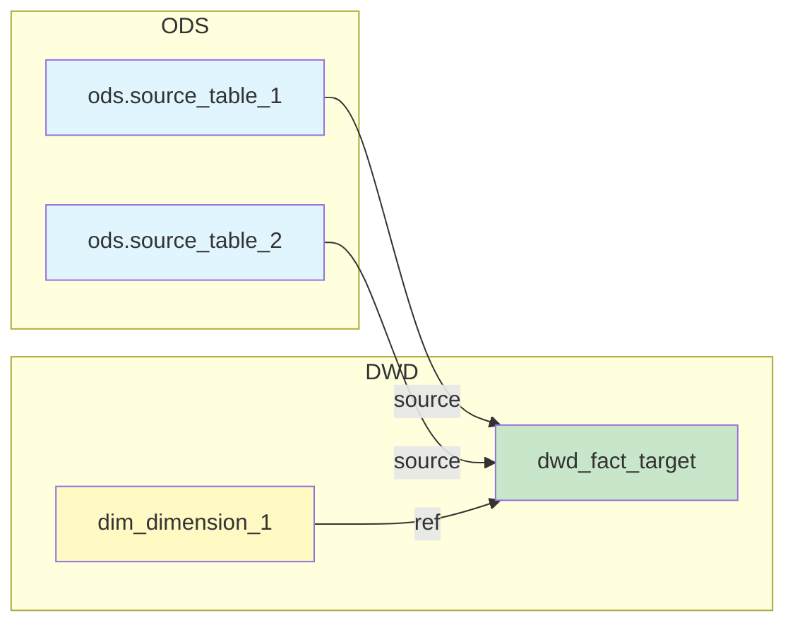

<objective>
创建血缘分析场景（LINEAGE）的完整提示系统，包括主提示、输出模板和案例库。

Purpose: 实现 LINEAGE-01 ~ LINEAGE-03 需求，使用户可以输入 SQL/dbt 模型，获取表级和字段级血缘关系。

Output: prompt.md（约 1,000 tokens）、output-template.md（约 700 tokens）、2 个案例（各约 500 tokens）
</objective>

<execution_context>
@./.claude/agents/gsd-executor.md
@./.claude/get-shit-done/workflows/execute-plan.md
@./.claude/get-shit-done/templates/summary.md
</execution_context>

<context>
@.planning/PROJECT.md
@.planning/ROADMAP.md
@.planning/STATE.md
@.planning/phases/06-governance-scenarios/06-CONTEXT.md
@.planning/phases/06-governance-scenarios/06-RESEARCH.md
@.planning/phases/06-governance-scenarios/06-01-SUMMARY.md

# 参考 Phase 4 的 Mermaid 图表风格
@.claude/data-warehouse/prompts/scenarios/design-new-model/output-template.md

# Plan 01 创建的上下文
@.claude/data-warehouse/context/governance/metrics-core.md
@.claude/data-warehouse/context/platform/dbt-hive-limitations-core.md
</context>

<tasks>

<task type="auto">
  <name>Task 1: 创建 analyze-lineage 场景目录</name>
  <files>.claude/data-warehouse/prompts/scenarios/analyze-lineage/</files>
  <action>
创建 analyze-lineage 场景目录结构：
```
.claude/data-warehouse/prompts/scenarios/analyze-lineage/
├── examples/
```

若目录已存在则跳过。
  </action>
  <verify>目录存在：`ls -la .claude/data-warehouse/prompts/scenarios/analyze-lineage/`</verify>
  <done>analyze-lineage 场景目录结构就绪</done>
</task>

<task type="auto">
  <name>Task 2: 创建主提示文件 prompt.md</name>
  <files>.claude/data-warehouse/prompts/scenarios/analyze-lineage/prompt.md</files>
  <action>
创建血缘分析场景主提示文件，采用与 Phase 4/5 一致的 4-block 结构。

**1. Frontmatter**
```yaml
---
type: scenario-prompt
scenario: analyze-lineage
version: 1.0.0
token_budget: 1200
includes:
  - context/platform/dbt-hive-limitations-core
  - context/layers/layering-system-core
  - docs/naming-core
---
```

**2. INSTRUCTIONS 块**
- 角色：数据架构师 / 血缘分析师
- 任务：根据用户输入的 SQL/dbt 模型代码，输出表级和字段级血缘关系
- 两段式交互（与 Phase 4/5 一致）：
  - Stage 1（默认）：输出表级血缘概览（Mermaid 图 + 依赖清单 + 解析精度说明）
  - Stage 2（用户选择字段级时）：输出字段级血缘映射表 + 详细血缘报告
- 触发 Stage 2：用户回复"字段级"/"详细血缘"/"继续"
- 特殊情况：简单 SQL（无 JOIN/CTE）且表级血缘足够时，可直接输出

**3. CONTEXT 块**
```
{CONTEXT_PLACEHOLDER: 运行时注入的上下文}
```

**4. TASK 块**

**输入格式（必填最小集）：**
| 字段 | 必填 | 说明 |
|------|------|------|
| SQL 代码 / dbt 模型 | ✓ | 待分析的代码 |

**可选信息：**
| 字段 | 说明 | 缺失处理 |
|------|------|----------|
| 模式选择 | 表级/字段级 | 默认表级 |
| 上游表结构 | 源表 DDL | 字段级精度可能降低 |

**解析策略（Codex 共识）：**

**dbt 模型代码：**
1. 优先识别 `ref()` 和 `source()` 调用
2. 解析 FROM/JOIN 中的原生表名
3. 区分 dbt 依赖和原生表名

**原生 SQL：**
1. 解析 FROM/JOIN 子句中的表名
2. 识别 CTE (WITH 子句) 和子查询
3. 标记动态 SQL 或无法解析的部分

**字段级解析：**
- 静态解析优先 + LLM 补全
- 遇到复杂结构时标记精度限制

**5. OUTPUT FORMAT 块**
- Stage 1：表级血缘格式引用（Mermaid + 依赖清单）
- Stage 2：字段级血缘格式引用（映射表 + 精度标注）
- 说明 `### File: {path}` 输出格式

**6. 精度等级说明（Codex 共识）**

| 等级 | 含义 | 触发条件 |
|------|------|----------|
| **A** | 高置信 | 显式列映射/别名/cast，来源唯一 |
| **B** | 中置信 | 表达式/CASE/聚合/窗口，依赖列集合确定 |
| **C** | 低置信 | CTE/子查询/UNION/`select *`，来源不完全确定 |
| **D** | 需人工确认 | 动态宏/UDF 黑盒/字符串拼 SQL |

控制在 ~1,000 tokens。
  </action>
  <verify>
- 文件存在：`ls .claude/data-warehouse/prompts/scenarios/analyze-lineage/prompt.md`
- 包含 4-block 结构：`grep -E "INSTRUCTIONS|CONTEXT|TASK|OUTPUT FORMAT" prompt.md`
- 包含两段式交互：`grep -E "Stage 1|Stage 2" prompt.md`
- 包含精度等级：`grep -E "confidence_level|A.*高置信|D.*需人工" prompt.md`
  </verify>
  <done>prompt.md 包含完整的 4-block 结构、两段式交互机制、精度等级定义</done>
</task>

<task type="auto">
  <name>Task 3: 创建输出模板文件 output-template.md</name>
  <files>.claude/data-warehouse/prompts/scenarios/analyze-lineage/output-template.md</files>
  <action>
创建 Stage 1/Stage 2 的详细输出格式模板。

**1. Frontmatter**
```yaml
---
type: scenario-support
scenario: analyze-lineage
document: output-template
version: 1.0.0
token_budget: 700
---
```

**2. Stage 1 输出模板：表级血缘概览**

```markdown
# 血缘分析报告

## 分析模式

- [x] 表级血缘
- [ ] 字段级血缘

## 解析精度

| 属性 | 值 |
|------|-----|
| **表级血缘** | 100% 准确 |
| **识别方式** | {ref()/source() 识别 / FROM/JOIN 解析} |

## 依赖图



## 依赖清单

| 类型 | 依赖对象 | 调用方式 | 位置 |
|------|----------|----------|------|
| source | `{schema}.{table}` | `source('{schema}', '{table}')` | L{line} |
| ref | `{model_name}` | `ref('{model_name}')` | L{line} |
| table | `{db}.{table}` | FROM/JOIN | L{line} |

## 识别统计

| 类型 | 数量 |
|------|------|
| source() 调用 | {N} |
| ref() 调用 | {M} |
| 原生表名 | {K} |

---

回复"**字段级**"获取字段级血缘映射表。
```

**3. Stage 2 输出模板：字段级血缘报告**

```markdown
# 字段级血缘报告

## 字段映射表

| 目标字段 | 源表 | 源字段 | 转换 | 置信度 | 方法 | 标记 |
|----------|------|--------|------|--------|------|------|
| `{target_col}` | `{source_table}` | `{source_col}` | 直接映射 | A | STATIC | - |
| `{target_col}` | - | - | `md5(concat_ws(...))` | A | STATIC | GENERATED |
| `{target_col}` | `{source_table}` | `{expr}` | 表达式计算 | B | STATIC | EXPR |
| `{target_col}` | `{source_table}` | `{col1}, {col2}` | CASE WHEN | B | MIXED | CASE |
| `{target_col}` | `{source_table}` | `*` | CTE 传递 | C | LLM | CTE |
| `{target_col}` | ? | ? | UDF 黑盒 | D | LLM | UDF |

## 置信度说明

| 等级 | 含义 | 数量 |
|------|------|------|
| **A** | 高置信 — 显式映射/别名/cast | {N} |
| **B** | 中置信 — 表达式/聚合/窗口 | {M} |
| **C** | 低置信 — CTE/子查询/UNION | {K} |
| **D** | 需人工确认 — UDF/动态 SQL | {J} |

## 标记说明

- `GENERATED`: 生成列（如代理键、MD5 哈希）
- `EXPR`: 表达式计算
- `CASE`: CASE WHEN 分支
- `CTE`: CTE/子查询传递
- `AGG`: 聚合函数
- `WINDOW`: 窗口函数
- `UDF`: 用户自定义函数
- `STAR_EXPANSION`: SELECT * 展开

## 无法解析的字段

| 字段 | 原因 | 建议 |
|------|------|------|
| `{col}` | 动态 SQL 生成 | 需人工确认 |
| `{col}` | 递归 CTE | 需人工追踪 |

## 详细 Mermaid 图（字段级）

```mermaid
graph LR
    subgraph Source["源表: {source_table}"]
        S1[{source_col_1}]
        S2[{source_col_2}]
    end

    subgraph Target["目标表: {target_table}"]
        T1[{target_col_1}]
        T2[{target_col_2}]
    end

    S1 --> T1
    S2 -->|CASE| T2
```
```

控制在 ~700 tokens。
  </action>
  <verify>
- 文件存在：`ls .claude/data-warehouse/prompts/scenarios/analyze-lineage/output-template.md`
- 包含 Stage 1/2 结构：`grep -E "Stage 1|Stage 2|表级血缘|字段级血缘" output-template.md`
- 包含 Mermaid 格式：`grep "graph LR" output-template.md`
- 包含精度标注：`grep -E "confidence_level|置信度" output-template.md`
  </verify>
  <done>output-template.md 包含 Stage 1 表级血缘和 Stage 2 字段级血缘的完整格式</done>
</task>

<task type="auto">
  <name>Task 4: 创建案例库（表级 + 字段级）</name>
  <files>
    .claude/data-warehouse/prompts/scenarios/analyze-lineage/examples/table-level.md
    .claude/data-warehouse/prompts/scenarios/analyze-lineage/examples/column-level.md
  </files>
  <action>
创建 2 个血缘分析案例，覆盖表级和字段级两种典型场景。

**案例 1: table-level.md（多表 JOIN 的表级血缘）**

```yaml
---
type: scenario-example
scenario: analyze-lineage
example: table-level
complexity: medium
---
```

**用户输入：**
```sql
-- dbt 模型: dwd_fact_order_detail.sql
{{
  config(
    materialized='incremental',
    partition_by='dt'
  )
}}

SELECT
    CAST(conv(substr(md5(concat_ws('||', o.order_id, o.item_id, '{{ var("ds") }}')), 1, 15), 16, 10) AS BIGINT) AS order_detail_sk,
    c.customer_sk AS customer_key,
    p.product_sk AS product_key,
    o.order_id,
    o.item_id,
    o.order_amount AS line_amount,
    o.order_status,
    '{{ var("ds") }}' AS dt
FROM {{ source('ods', 'order_detail') }} o
LEFT JOIN {{ ref('dim_customer') }} c ON o.customer_id = c.customer_id AND c.is_current = 1
LEFT JOIN {{ ref('dim_product') }} p ON o.product_id = p.product_id AND p.is_current = 1

WHERE o.dt = '{{ var("ds") }}'

```

**Stage 1 输出：**
- Mermaid 依赖图（3 个 source/ref 依赖）
- 依赖清单：
  - source('ods', 'order_detail') @ L14
  - ref('dim_customer') @ L15
  - ref('dim_product') @ L16
- 解析精度：100% 准确（ref/source 识别）

**案例 2: column-level.md（含窗口函数的字段级血缘）**

```yaml
---
type: scenario-example
scenario: analyze-lineage
example: column-level
complexity: complex
---
```

**用户输入：**
```sql
SELECT
    customer_sk,
    customer_name,
    CASE
        WHEN total_amount >= 10000 THEN 'VIP'
        WHEN total_amount >= 1000 THEN 'Regular'
        ELSE 'New'
    END AS customer_level,
    total_amount,
    order_count,
    ROW_NUMBER() OVER (PARTITION BY customer_sk ORDER BY order_date DESC) AS rn
FROM (
    SELECT
        c.customer_sk,
        c.customer_name,
        SUM(o.line_amount) AS total_amount,
        COUNT(*) AS order_count,
        MAX(o.order_date) AS order_date
    FROM dim_customer c
    LEFT JOIN dwd_fact_order_detail o ON c.customer_sk = o.customer_key
    GROUP BY c.customer_sk, c.customer_name
) sub
```

**Stage 1 输出：**
- 表级依赖：dim_customer, dwd_fact_order_detail
- 识别方式：FROM/JOIN 解析

**Stage 2 输出：**
- 字段映射表（含精度标注）：
  - customer_sk → dim_customer.customer_sk (A, STATIC)
  - customer_name → dim_customer.customer_name (A, STATIC)
  - customer_level → total_amount (B, CASE)
  - total_amount → dwd_fact_order_detail.line_amount (B, AGG)
  - order_count → dwd_fact_order_detail.* (B, AGG)
  - rn → customer_sk, order_date (B, WINDOW)
- 置信度统计：A=2, B=4

每个案例控制在 ~500 tokens。
  </action>
  <verify>
- 文件存在：`ls .claude/data-warehouse/prompts/scenarios/analyze-lineage/examples/`
- 表级案例包含 Mermaid：`grep "graph LR" examples/table-level.md`
- 表级案例包含 ref/source：`grep -E "ref\\(|source\\(" examples/table-level.md`
- 字段级案例包含精度标注：`grep -E "confidence_level|A.*STATIC|B.*CASE" examples/column-level.md`
  </verify>
  <done>2 个血缘分析案例创建完成，覆盖表级和字段级两种典型场景</done>
</task>

</tasks>

<verification>
1. analyze-lineage 目录结构完整
2. prompt.md 包含完整的 4-block 结构和两段式交互机制
3. prompt.md 包含精度等级定义（A-D）
4. output-template.md 包含 Stage 1 表级血缘（Mermaid 图 + 依赖清单）
5. output-template.md 包含 Stage 2 字段级血缘（映射表 + 精度标注）
6. 2 个案例分别覆盖表级血缘和字段级血缘
7. 所有文件的 token 预算符合要求（合计 ~2,700 tokens）
</verification>

<success_criteria>
- [ ] 创建 analyze-lineage 场景目录结构
- [ ] prompt.md 包含 INSTRUCTIONS/CONTEXT/TASK/OUTPUT FORMAT 四个块
- [ ] prompt.md 实现两段式交互（Stage 1 表级 + Stage 2 字段级）
- [ ] prompt.md 包含精度等级定义（A/B/C/D）
- [ ] output-template.md 包含 Mermaid 表级血缘图格式
- [ ] output-template.md 包含字段级映射表格式（含 confidence_level）
- [ ] 表级案例展示 ref()/source() 识别
- [ ] 字段级案例展示窗口函数/CASE 等复杂表达式的精度标注
- [ ] 所有文件的 token 预算符合要求
</success_criteria>

<output>
After completion, create `.planning/phases/06-governance-scenarios/06-04-SUMMARY.md`
</output>
