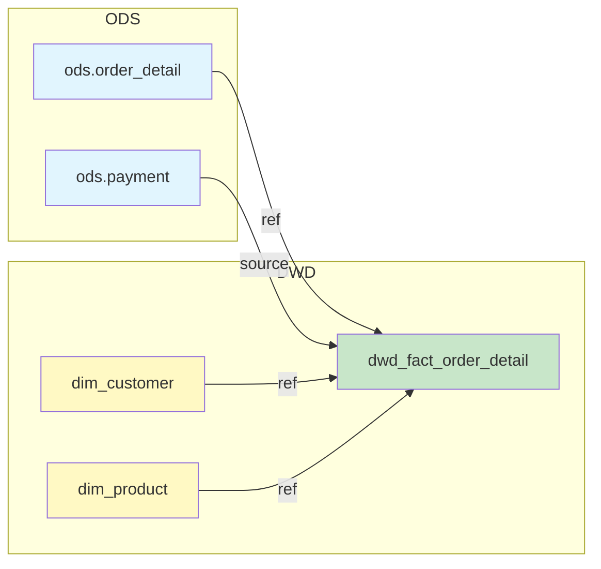

# Phase 6: 治理场景（指标、DQ、血缘基础） - Research

**Researched:** 2026-02-01
**Domain:** Data Governance Prompts / dbt Semantic Layer / dbt Tests / SQL Lineage
**Confidence:** HIGH

## Summary

本研究聚焦于三个数据治理场景的提示系统实现：指标口径定义（METRICS）、DQ 规则生成（DQRULES）、基础血缘分析（LINEAGE）。这三个场景服务于数据治理标准化，帮助用户定义指标口径、生成 DQ 测试规则、分析表/字段级血缘关系。

研究发现，此类提示系统的关键在于：
1. **dbt Semantic Layer 2.0 格式** — 指标定义采用 MetricFlow 标准，`semantic_models` + `metrics` YAML 结构已 GA（2024-10），格式稳定
2. **dbt 原生 tests + dbt-expectations** — 基础 DQ 使用原生 tests，复杂场景（正则、范围、统计）使用 dbt-expectations 扩展
3. **SQL 血缘解析模式** — 表级依靠 `ref()/source()` 识别（正则即可），字段级需 AST/schema-aware parsing（LLM 擅长）
4. **统一体验** — 与 Phase 4/5 一致的两段式交互 + `### File: {path}` 输出契约

项目已有成熟的提示模式（Phase 4/5 成果），治理场景应复用相同的结构和交互设计，同时新增治理专属的 `*-core.md` 上下文文件。

**Primary recommendation:** 采用"字段类型驱动"的 DQ 规则推断策略，dbt Semantic Layer 2.0 标准的指标定义格式，以及 Mermaid + 表格的双格式血缘输出，确保三场景与 Phase 4/5 保持一致的两段式交互模式。

---

## Standard Stack

### Core Components

| 组件 | 版本/格式 | 用途 | 为何标准 |
|------|----------|------|---------|
| dbt Semantic Layer | MetricFlow v0.209+ (GA Oct 2024) | 指标定义 YAML 格式 | dbt 官方标准，支持多数仓库 |
| dbt native tests | dbt 1.7+ | 基础 DQ 规则（unique/not_null/accepted_values/relationships） | 内置无需额外依赖 |
| dbt-expectations | 0.10.x | 高级 DQ 规则（正则/范围/统计/新鲜度） | Great Expectations 移植，生态成熟 |
| source freshness | dbt native | 数据新鲜度检测 | 原生支持 warn_after/error_after |
| Mermaid | graph LR/TD | 血缘可视化 | 广泛渲染支持，与 Phase 4/5 一致 |
| Markdown Table | 标准 Markdown | 字段级映射表格 | 结构化、可解析 |

### Supporting Context References

| 文档 | 用途 | 引用方式 |
|------|------|---------|
| `context/governance/metrics-core.md` (新建) | 指标分类、Semantic Layer 格式要点 | includes（运行时注入） |
| `context/governance/dq-rules-core.md` (新建) | 规则类型、阈值策略、字段类型驱动规则 | includes（运行时注入） |
| `context/methodology/fact-table-types-core.md` | 可加性概念（指标场景复用） | includes（运行时注入） |
| `context/layers/layering-system-core.md` | 分层阈值差异（ODS 宽松/ADS 严格） | includes（运行时注入） |
| `docs/naming-core.md` | 字段后缀规则（_id/_amt/_status 等） | includes（运行时注入） |

### Token Budget Consideration

根据 `docs/token-budget.md`：
- 单文件上限：2,000 tokens
- 标准场景组装：8,000 tokens

**策略：**
- 主提示文件控制在 1,200-1,500 tokens
- 输出模板单独文件（约 600-800 tokens）
- 新增 `*-core.md` 文件控制在 800-1,000 tokens/场景
- 三场景共用的上下文（如分层规则）复用已有 `*-core.md`

---

## Architecture Patterns

### Recommended Prompt Structure

```
prompts/scenarios/
├── define-metrics/                  # 指标定义场景
│   ├── prompt.md                    # 主提示（~1,200 tokens）
│   ├── output-template.md           # 输出模板（~700 tokens）
│   └── examples/
│       ├── atomic-metric.md         # 原子指标案例
│       └── derived-metric.md        # 派生/复合指标案例
├── generate-dq-rules/               # DQ 规则生成场景
│   ├── prompt.md                    # 主提示（~1,300 tokens）
│   ├── output-template.md           # 输出模板（~600 tokens）
│   ├── field-type-rules.md          # 字段类型 → 规则映射（~500 tokens）
│   └── examples/
│       ├── fact-table-dq.md         # 事实表 DQ 案例
│       └── dim-table-dq.md          # 维度表 DQ 案例
└── analyze-lineage/                 # 血缘分析场景
    ├── prompt.md                    # 主提示（~1,000 tokens）
    ├── output-template.md           # 输出模板（~600 tokens）
    └── examples/
        ├── table-level.md           # 表级血缘案例
        └── column-level.md          # 字段级血缘案例
```

### Pattern 1: dbt Semantic Layer 2.0 指标格式

**What:** 使用 MetricFlow 标准的 `semantic_models` + `metrics` YAML 结构定义指标
**When to use:** 所有指标定义输出

**Example:**
```yaml
# semantic_models 定义（关联 dbt 模型）
semantic_models:
  - name: order_facts
    model: ref('dwd_fact_order_detail')
    description: "订单明细事实表的语义模型"
    defaults:
      agg_time_dimension: order_date

    entities:
      - name: order
        type: primary
        expr: order_detail_sk
      - name: customer
        type: foreign
        expr: customer_key

    dimensions:
      - name: order_date
        type: time
        type_params:
          time_granularity: day
      - name: order_status
        type: categorical

    measures:
      - name: order_amount
        description: "订单金额"
        agg: sum
        expr: line_amount
      - name: order_count
        description: "订单数量"
        agg: sum
        expr: "1"

# metrics 定义（引用 measures）
metrics:
  - name: total_order_amount
    description: "订单总金额"
    type: simple
    label: "订单总金额"
    type_params:
      measure: order_amount

  - name: avg_order_value
    description: "平均客单价"
    type: derived
    label: "平均客单价"
    type_params:
      expr: total_order_amount / order_count
      metrics:
        - name: total_order_amount
        - name: order_count
```

**Source:** [dbt Semantic Models](https://docs.getdbt.com/docs/build/semantic-models), [Creating Metrics](https://docs.getdbt.com/docs/build/metrics-overview)

### Pattern 2: 字段类型驱动的 DQ 规则推断

**What:** 根据字段命名后缀和类型自动推荐 DQ 测试规则
**When to use:** 用户提供表结构/DDL 时自动推断规则

**Example:**
```markdown
## 字段类型 → DQ 规则映射表

| 后缀模式 | 示例 | 推荐规则 | 严格程度 |
|----------|------|----------|----------|
| `_id`, `_sk`, `_key` | `customer_id`, `order_sk` | unique + not_null | P0 |
| `_amt`, `_amount` | `order_amt`, `total_amount` | not_null + `>= 0` | P1 |
| `_cnt`, `_count` | `item_cnt`, `order_count` | not_null + `>= 0` (INTEGER) | P1 |
| `_status`, `_type` | `order_status`, `pay_type` | accepted_values | P1 |
| `_date`, `_time` | `order_date`, `create_time` | not_null + 格式检查 | P1 |
| `is_`, `has_` | `is_deleted`, `has_coupon` | accepted_values: [0, 1] | P2 |
| `*_key` (FK) | `customer_key` | relationships | P2 |

### 分层阈值策略

| 分层 | warn_if | error_if | 理由 |
|------|---------|----------|------|
| ODS | 5% | 10% | 贴源数据，容忍度高 |
| DWD/DWS | 1% | 5% | 中间层，质量要求中等 |
| ADS | 0% | 1% | 应用层，质量要求严格 |
```

**Source:** 用户决策（06-CONTEXT.md）

### Pattern 3: 两段式交互（三场景统一）

**What:** Stage 1 输出规格书/摘要，用户确认后 Stage 2 生成完整产物
**When to use:** 所有三个治理场景

**METRICS 场景：**
- Stage 1：指标规格书（分类、计算公式、源表追踪、关联指标）
- Stage 2：Semantic Layer YAML + 口径说明文档

**DQRULES 场景：**
- Stage 1：规则清单（按字段类型推断的规则 + 分层阈值）
- Stage 2：dbt tests YAML 配置

**LINEAGE 场景：**
- Stage 1：血缘概览（表级依赖图 + 解析精度说明）
- Stage 2：详细血缘报告（Mermaid 图 + 字段映射表）

**Source:** Phase 4/5 已验证模式

### Pattern 4: 血缘解析策略

**What:** 表级解析 + 字段级尽力解析，明确标记精度限制
**When to use:** 血缘分析场景

**表级解析（100% 准确）：**
```python
# 识别 dbt ref() 和 source()
ref_pattern = r"ref\(['\"](\w+)['\"]\)"
source_pattern = r"source\(['\"](\w+)['\"],\s*['\"](\w+)['\"]\)"

# 识别原生表名（FROM/JOIN）
from_pattern = r"(?:FROM|JOIN)\s+(\w+\.)?(\w+)"
```

**字段级解析（尽力模式）：**
```markdown
### 精度说明

| 复杂度 | 示例 | 解析精度 |
|--------|------|----------|
| 简单 | `SELECT a, b FROM t` | 100% |
| 重命名 | `SELECT a AS x FROM t` | 100% |
| 表达式 | `SELECT a + b AS c` | 95% |
| 窗口函数 | `ROW_NUMBER() OVER (...)` | 90% |
| CTE | `WITH cte AS (...) SELECT ...` | 90% |
| 子查询 | `SELECT * FROM (SELECT ...)` | 85% |
| 动态 SQL | `EXECUTE IMMEDIATE` | 标记"无法解析" |
| 递归 CTE | `WITH RECURSIVE ...` | 标记"精度可能不完整" |
```

**Source:** [DataHub SQL Parsing](https://docs.datahub.com/docs/lineage/sql_parsing), [SQLLineage](https://pypi.org/project/sqllineage/)

### Pattern 5: 指标分类体系（三分法）

**What:** 原子/派生/复合三层指标分类
**When to use:** 指标定义场景的分类体系

**Example:**
```markdown
## 指标分类

### 原子指标 (Atomic)
- 定义：直接聚合的基础度量
- 特征：不依赖其他指标，仅依赖 measures
- 示例：`total_order_amount = SUM(line_amount)`

### 派生指标 (Derived)
- 定义：基于原子指标的计算
- 特征：引用 1-2 个原子指标
- 示例：`avg_order_value = total_order_amount / order_count`

### 复合指标 (Composite)
- 定义：多指标组合或复杂计算
- 特征：引用 2+ 个派生指标，或包含复杂逻辑
- 示例：`user_ltv = (total_order_amount - refund_amount) / user_count`

### 关联规则
- 派生/复合指标**必须关联**已定义的原子指标 ID
- 形成指标依赖图，确保血缘可追溯
```

**Source:** 用户决策（06-CONTEXT.md）

### Anti-Patterns to Avoid

- **过度复杂的指标定义:** 一次定义太多指标，应聚焦核心指标
- **硬编码阈值:** DQ 阈值应根据分层自动适配，不要写死
- **忽略精度限制:** 字段级血缘必须标记精度，不要承诺 100% 准确
- **重复定义规则:** 使用已有 `*-core.md` 中的规则，不要重新发明
- **脱离 dbt 生态:** 输出格式必须是 dbt 可用的 YAML

---

## Don't Hand-Roll

| 问题 | 不要手写 | 使用替代 | 原因 |
|------|---------|---------|------|
| 指标 YAML 格式 | 自定义 schema | dbt Semantic Layer 2.0 | 官方标准，工具链支持 |
| 基础 DQ 测试 | 自定义 SQL 检查 | dbt native tests | 内置、可维护 |
| 正则/范围验证 | 手写 SQL CASE | dbt-expectations | 已验证、边界处理完善 |
| 新鲜度检测 | 手写 SELECT MAX | source freshness | 原生支持、告警集成 |
| 血缘解析 | 硬编码正则 | LLM 智能解析 + 正则辅助 | 处理复杂 SQL 结构 |
| 可加性定义 | 重新定义概念 | 引用 `fact-table-types-core.md` | 与 Phase 4/5 一致 |

**Key insight:** 治理场景的输出应直接可用于 dbt 项目，不要发明新的配置格式。dbt Semantic Layer 和 dbt-expectations 已经是生态标准，提示系统的职责是"正确填充这些格式"。

---

## dbt-expectations 常用测试清单

### 必备测试（推荐使用）

| 测试 | 用途 | 关键参数 |
|------|------|----------|
| `expect_column_values_to_not_be_null` | 非空检查 | `row_condition` |
| `expect_column_values_to_be_unique` | 唯一性检查 | `row_condition` |
| `expect_column_values_to_be_in_set` | 枚举值检查 | `value_set`, `quote_values` |
| `expect_column_values_to_be_between` | 范围检查 | `min_value`, `max_value`, `strictly` |
| `expect_column_values_to_match_regex` | 正则匹配 | `regex`, `is_raw`, `flags` |
| `expect_row_values_to_have_recent_data` | 新鲜度检查 | `datepart`, `interval` |

### 高级测试（按需使用）

| 测试 | 用途 | 关键参数 |
|------|------|----------|
| `expect_column_values_to_be_of_type` | 类型检查 | `column_type` |
| `expect_column_pair_values_A_to_be_greater_than_B` | 字段对比 | `column_A`, `column_B` |
| `expect_table_row_count_to_be_between` | 行数范围 | `min_value`, `max_value` |
| `expect_compound_columns_to_be_unique` | 组合唯一 | `column_list` |

**Source:** [dbt-expectations GitHub](https://github.com/calogica/dbt-expectations)

---

## Interaction Design: 三场景两段式交互

### 场景 1：指标定义 (METRICS)

**必填最小集：**
| 字段 | 说明 | 缺失处理 |
|------|------|----------|
| **指标名称** | 指标的业务名称 | 无法继续，必须追问 |
| **业务描述** | 指标的业务含义 | 无法继续，必须追问 |

**可选信息：**
| 字段 | 说明 | 缺失处理 |
|------|------|----------|
| 计算公式草稿 | 用户提供的初步公式 | 根据描述推断 |
| 关联模型 | dbt 模型名称 | 在 Stage 2 追问 |

**Stage 1 输出：**
- 指标规格书（名称、分类、公式、源表追踪）
- 关联原子指标清单（派生/复合时）
- 待确认问题

**Stage 2 输出：**
- Semantic Layer YAML（semantic_models + metrics）
- 指标口径说明文档

### 场景 2：DQ 规则生成 (DQRULES)

**必填最小集：**
| 字段 | 说明 | 缺失处理 |
|------|------|----------|
| **表名** | 待生成规则的表 | 无法继续，必须追问 |
| **分层** | 表所属分层（ODS/DWD/DWS/ADS） | 无法确定阈值，追问 |

**可选信息：**
| 字段 | 说明 | 缺失处理 |
|------|------|----------|
| DDL/字段清单 | 表结构 | 根据表名/分层推断字段类型 |
| 业务规则 | 特殊业务约束 | 仅生成通用规则 |

**Stage 1 输出：**
- 规则清单（按字段类型推断）
- 阈值建议（按分层适配）
- 待确认问题

**Stage 2 输出：**
- dbt tests YAML 配置
- dbt-expectations 配置（如需要）
- source freshness 配置（如需要）

### 场景 3：血缘分析 (LINEAGE)

**必填最小集：**
| 字段 | 说明 | 缺失处理 |
|------|------|----------|
| **SQL 代码** | 待分析的 SQL | 无法继续，必须追问 |

**可选信息：**
| 字段 | 说明 | 缺失处理 |
|------|------|----------|
| 模式选择 | 表级/字段级 | 默认表级 |
| 上游表结构 | 源表 DDL | 字段级精度可能降低 |

**Stage 1 输出：**
- 表级依赖图（Mermaid）
- 解析精度说明
- ref()/source() 识别结果

**Stage 2 输出（用户选择字段级时）：**
- 字段级映射表
- 详细血缘报告（含表达式解析）

---

## Common Pitfalls

### Pitfall 1: 指标分类混乱

**What goes wrong:** 用户定义的"派生指标"实际是原子指标
**Why it happens:** 分类标准不清晰
**How to avoid:**
- 明确判断逻辑：是否引用其他指标？否 → 原子，是 → 派生/复合
- Stage 1 明确输出分类和理由
**Warning signs:** 派生指标的 `type_params.metrics` 为空

### Pitfall 2: DQ 规则过度生成

**What goes wrong:** 为每个字段生成大量测试，CI 运行时间过长
**Why it happens:** 未按优先级筛选
**How to avoid:**
- 优先生成 P0/P1 规则，P2/P3 作为可选建议
- 使用 `warn_if`/`error_if` 而非立即失败
**Warning signs:** schema.yml 中 tests 数量 > 字段数量 * 3

### Pitfall 3: 血缘精度过度承诺

**What goes wrong:** 宣称 100% 准确但实际遗漏依赖
**Why it happens:** 未考虑动态 SQL、递归 CTE 等边界情况
**How to avoid:**
- 明确标记精度限制
- 复杂 SQL 输出"精度可能不完整"警告
**Warning signs:** 用户反馈"漏了某个依赖表"

### Pitfall 4: Semantic Layer 版本不兼容

**What goes wrong:** 生成的 YAML 在用户 dbt 版本上无法解析
**Why it happens:** 使用了新版本特性
**How to avoid:**
- 默认使用 dbt 1.7+ 兼容的语法
- 避免使用实验性特性（如 conversion metrics）
**Warning signs:** `dbt parse` 报错 "unknown key"

### Pitfall 5: dbt-expectations 依赖未声明

**What goes wrong:** 生成的配置引用 dbt-expectations 但用户未安装
**Why it happens:** 未在输出中说明依赖
**How to avoid:**
- Stage 2 输出开头说明依赖的 packages
- 提供 packages.yml 安装指引
**Warning signs:** `dbt run` 报错 "macro not found"

---

## Code Examples

### Example 1: 完整的 Semantic Layer YAML

```yaml
# Source: dbt Semantic Layer 2.0 官方格式
# File: models/semantic/order_semantic.yml

semantic_models:
  - name: order_facts
    model: ref('dwd_fact_order_detail')
    description: |
      订单明细事实表的语义模型
      **粒度：** 一个订单行
    defaults:
      agg_time_dimension: order_date

    entities:
      - name: order_detail
        type: primary
        expr: order_detail_sk
      - name: customer
        type: foreign
        expr: customer_key
      - name: product
        type: foreign
        expr: product_key

    dimensions:
      - name: order_date
        type: time
        type_params:
          time_granularity: day
        expr: "CAST(order_time AS DATE)"
      - name: order_status
        type: categorical
      - name: payment_method
        type: categorical

    measures:
      - name: order_amount
        description: "订单金额（可加）"
        agg: sum
        expr: line_amount
      - name: order_count
        description: "订单笔数"
        agg: sum
        expr: "1"
      - name: distinct_customer_count
        description: "去重客户数"
        agg: count_distinct
        expr: customer_key

metrics:
  # 原子指标
  - name: total_order_amount
    description: "订单总金额"
    type: simple
    label: "订单总金额"
    type_params:
      measure: order_amount

  - name: total_order_count
    description: "订单总数"
    type: simple
    label: "订单总数"
    type_params:
      measure: order_count

  # 派生指标
  - name: avg_order_value
    description: "平均客单价 = 订单总金额 / 订单总数"
    type: derived
    label: "平均客单价"
    type_params:
      expr: total_order_amount / total_order_count
      metrics:
        - name: total_order_amount
        - name: total_order_count
```

### Example 2: 字段类型驱动的 DQ 规则输出

```yaml
# File: models/dwd/dwd_fact_order_detail.yml
version: 2

models:
  - name: dwd_fact_order_detail
    description: "订单明细事实表"
    meta:
      layer: dwd
      owner: data-platform

    tests:
      # 组合唯一性检查
      - dbt_utils.unique_combination_of_columns:
          combination_of_columns:
            - order_no
            - order_item_id
            - dt

    columns:
      # _sk 后缀 → unique + not_null (P0)
      - name: order_detail_sk
        description: "订单明细代理键"
        tests:
          - unique
          - not_null

      # _key 后缀（FK）→ not_null + relationships (P1/P2)
      - name: customer_key
        description: "客户维度外键"
        tests:
          - not_null
          - relationships:
              to: ref('dim_customer')
              field: customer_sk

      # _amt 后缀 → not_null + 范围检查 (P1)
      - name: line_amount
        description: "订单行金额"
        meta:
          additivity: additive
        tests:
          - not_null
          - dbt_expectations.expect_column_values_to_be_between:
              min_value: 0
              max_value: 10000000  # 根据业务调整

      # _status 后缀 → accepted_values (P1)
      - name: order_status
        description: "订单状态"
        tests:
          - not_null
          - accepted_values:
              values: ['PENDING', 'PAID', 'SHIPPED', 'COMPLETED', 'CANCELLED']

      # is_ 前缀 → accepted_values [0, 1] (P2)
      - name: is_deleted
        description: "删除标志"
        tests:
          - not_null
          - accepted_values:
              values: [0, 1]

      # 分区列 → not_null + 格式检查 (P1)
      - name: dt
        description: "日期分区"
        tests:
          - not_null
          - dbt_expectations.expect_column_values_to_match_regex:
              regex: '^\d{4}-\d{2}-\d{2}$'

# DWD 层阈值配置（中等严格度）
# warn_if: "< 99%"  (1% 容忍)
# error_if: "< 95%" (5% 容忍)
```

### Example 3: Source Freshness 配置

```yaml
# File: models/sources/ods_sources.yml
version: 2

sources:
  - name: ods
    description: "ODS 层源表"
    database: ods_db
    schema: ods

    # 默认新鲜度配置（T+1 标准）
    freshness:
      warn_after:
        count: 1
        period: day
      error_after:
        count: 2
        period: day
    loaded_at_field: etl_time

    tables:
      - name: order_detail
        description: "订单明细源表"
        # 可覆盖默认配置
        freshness:
          warn_after:
            count: 12
            period: hour
          error_after:
            count: 24
            period: hour
          filter: "dt = '{{ var('ds') }}'"

        columns:
          - name: order_id
            tests:
              - not_null
```

### Example 4: 血缘分析输出（表级）

```markdown
## 血缘分析报告

### 模式
- [x] 表级血缘
- [ ] 字段级血缘

### 依赖图



### 依赖清单

| 类型 | 依赖对象 | 调用方式 | 位置 |
|------|----------|----------|------|
| source | `ods.order_detail` | `source('ods', 'order_detail')` | L5 |
| source | `ods.payment` | `source('ods', 'payment')` | L12 |
| ref | `dim_customer` | `ref('dim_customer')` | L18 |
| ref | `dim_product` | `ref('dim_product')` | L22 |

### 解析精度
- **表级血缘：** 100% 准确
- **识别方式：** ref()/source() 调用识别
```

### Example 5: 血缘分析输出（字段级）

```markdown
## 字段级血缘报告

### 字段映射表

| 目标字段 | 源表 | 源字段 | 转换 | 精度 |
|----------|------|--------|------|------|
| `order_detail_sk` | - | - | `md5(concat_ws(...))` | 100% |
| `customer_key` | `dim_customer` | `customer_sk` | COALESCE(..., -1) | 100% |
| `line_amount` | `ods.order_detail` | `order_amt` | 直接映射 | 100% |
| `order_count` | - | - | `COUNT(*)` | 100% |
| `total_amount` | `ods.order_detail` | `order_amt + discount_amt` | 表达式计算 | 95% |

### 精度说明

- **100% 准确：** 直接映射或简单表达式
- **95% 准确：** 复杂表达式，可能存在边界情况
- **90% 准确：** 窗口函数/CTE，大部分情况正确
- **标记"不完整"：** 动态 SQL 或递归 CTE

### 无法解析的字段

| 字段 | 原因 |
|------|------|
| `dynamic_col` | 动态 SQL 生成 |
```

---

## State of the Art

| 旧方法 | 当前方法 | 何时改变 | 影响 |
|--------|---------|---------|------|
| 手动 Excel 指标定义 | dbt Semantic Layer YAML | 2024 GA | 版本控制、与 dbt DAG 集成 |
| 手写 SQL 数据质量检查 | dbt tests + dbt-expectations | 2023-2024 | CI/CD 集成、可维护 |
| 人工分析 SQL 依赖 | LLM + 自动化解析 | 2025 | 效率提升、支持复杂 SQL |
| 单一阈值配置 | 分层阈值策略 | 2025 | 适应不同数据层质量要求 |
| dbt metrics (旧版) | dbt Semantic Layer 2.0 | 2024 | MetricFlow 标准化 |

**Deprecated/outdated:**
- **dbt metrics (v1.5 之前):** 已被 Semantic Layer 2.0 替代
- **纯正则血缘解析:** 无法处理复杂 SQL，被 AST/LLM 方法替代
- **手动 Great Expectations 集成:** 使用 dbt-expectations 更简单

---

## Open Questions

### 1. 指标 ID 生成规则

**What we know:** 用户将此项标记为 Claude's Discretion
**What's unclear:** 是使用前缀风格（`MET_001`）还是语义风格（`metrics_order_total`）
**Recommendation:**
- 使用语义风格：`{domain}_{metric_name}`
- 示例：`order_total_amount`, `user_daily_active_count`
- 原因：与 dbt 模型命名风格一致，可读性更好

### 2. dbt-expectations 版本兼容性

**What we know:** 当前版本 0.10.x，支持 dbt 1.7+
**What's unclear:** 用户 dbt 版本是否兼容
**Recommendation:**
- 输出中注明版本要求
- 提供 packages.yml 安装片段
- 复杂测试标记为"可选，需 dbt-expectations"

### 3. 字段级血缘的输入要求

**What we know:** schema-aware parsing 更准确
**What's unclear:** 是否强制要求用户提供上游表结构
**Recommendation:**
- 不强制要求，但在精度说明中标注
- 有上游 DDL → 精度更高
- 无上游 DDL → 标记"可能不完整"

---

## Sources

### Primary (HIGH confidence)

- **dbt 官方文档（已读取验证）：**
  - [Semantic Models](https://docs.getdbt.com/docs/build/semantic-models) — entities/dimensions/measures 格式
  - [Creating Metrics](https://docs.getdbt.com/docs/build/metrics-overview) — 5 种 metric 类型
  - [Source Freshness](https://docs.getdbt.com/reference/resource-properties/freshness) — warn_after/error_after 配置
  - [About MetricFlow](https://docs.getdbt.com/docs/build/about-metricflow) — MetricFlow v0.209+

- **项目内部文档：**
  - Phase 4/5 RESEARCH.md — 两段式交互模式、输出契约
  - 06-CONTEXT.md — 用户决策（字段类型驱动、三分法、分层阈值）

### Secondary (MEDIUM confidence)

- [dbt-expectations GitHub](https://github.com/calogica/dbt-expectations) — 测试宏清单
- [DataHub SQL Parsing](https://docs.datahub.com/docs/lineage/sql_parsing) — 列级血缘方法论
- [SQLLineage PyPI](https://pypi.org/project/sqllineage/) — Python SQL 血缘工具
- [Semantic Layer Architectures 2025](https://www.typedef.ai/resources/semantic-layer-architectures-explained-warehouse-native-vs-dbt-vs-cube) — MetricFlow vs 其他方案

### Tertiary (LOW confidence)

- [Column-Level Lineage: An Adventure in SQL Parsing](https://www.metaplane.dev/blog/column-level-lineage-an-adventure-in-sql-parsing) — ANTLR AST 方法
- [Extracting Column-Level Lineage from SQL](https://datahub.com/blog/extracting-column-level-lineage-from-sql/) — Schema-aware parsing

---

## Metadata

**Confidence breakdown:**
- dbt Semantic Layer 格式: HIGH — 官方文档验证
- dbt-expectations 测试清单: HIGH — GitHub README 验证
- 字段类型驱动规则: HIGH — 用户决策明确
- 血缘解析模式: MEDIUM — 业界标准方法，无官方规范
- 两段式交互: HIGH — Phase 4/5 已验证

**Research date:** 2026-02-01
**Valid until:** 60 days（dbt Semantic Layer 已 GA，格式稳定）
