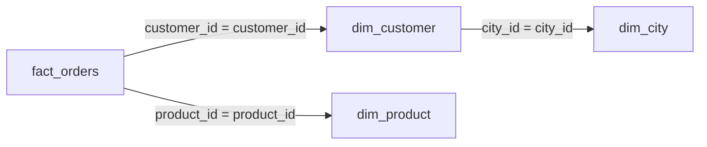
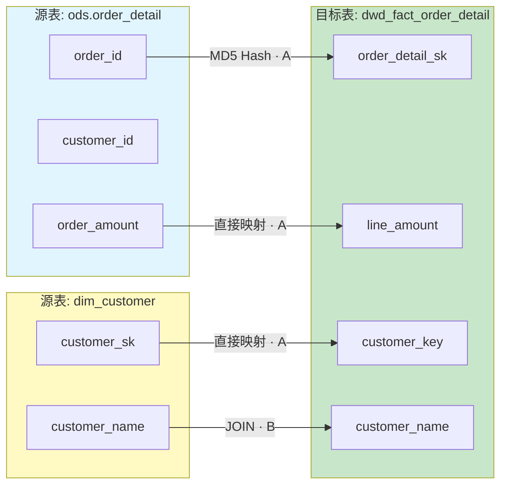

<objective>
增强现有血缘分析场景：添加 JOIN 关联识别、边级置信度、变更影响评估能力。

Purpose: 实现 LINEAGE-04 ~ LINEAGE-06 需求，增强 Phase 6 已有的血缘分析基础。
Output: 更新 2 个现有文件 + 新增 1 个影响评估模板。
</objective>

<execution_context>
@./.claude/get-shit-done/workflows/execute-plan.md
@./.claude/get-shit-done/templates/summary.md
</execution_context>

<context>
@.planning/PROJECT.md
@.planning/ROADMAP.md
@.planning/STATE.md
@.planning/phases/07-sql-generation-lineage/07-RESEARCH.md

# Phase 6 已有血缘分析文件（需增强）
@.claude/data-warehouse/prompts/scenarios/analyze-lineage/prompt.md
@.claude/data-warehouse/prompts/scenarios/analyze-lineage/output-template.md
</context>

<tasks>

<task type="auto">
  <name>Task 1: 增强血缘分析主提示 prompt.md</name>
  <files>.claude/data-warehouse/prompts/scenarios/analyze-lineage/prompt.md</files>
  <action>
在现有 prompt.md 基础上增强，添加 LINEAGE-04 ~ LINEAGE-06 能力：

**保持不变的部分：**
- Frontmatter 结构（更新 version 为 1.1.0，token_budget 可增至 1400）
- INSTRUCTIONS 角色定义
- 两段式交互基础框架
- 精度等级 A/B/C/D 定义

**新增/增强的部分：**

1. **增强 INSTRUCTIONS：**
   - 新增：JOIN 关联关系识别能力
   - 新增：变更影响评估能力
   - 强调：边级置信度（每条边独立标记）

2. **新增 Stage 选项：**
   ```
   **Stage 1（默认）：** 表级血缘概览 + JOIN 关联图
   **Stage 2（用户选择）：** 字段级血缘映射表 + 详细报告
   **Stage 3（影响评估）：** 变更影响评估报告

   触发 Stage 3 的方式：
   - 用户提供变更描述（如"dim_customer.customer_level 将被修改"）
   - 用户明确要求"影响评估"/"变更分析"
   ```

3. **新增 JOIN 关联识别策略（LINEAGE-04）：**
   ```markdown
   ### JOIN 关联识别

   **识别类型：**
   | 关联类型 | 识别规则 | 示例 |
   |----------|----------|------|
   | INNER JOIN | `JOIN ... ON` | 等值关联 |
   | LEFT/RIGHT JOIN | `LEFT/RIGHT JOIN ... ON` | 外连接 |
   | FULL OUTER JOIN | `FULL OUTER JOIN ... ON` | 全外连接 |
   | CROSS JOIN | `CROSS JOIN` 或逗号分隔 | 笛卡尔积（警告） |
   | 隐式 JOIN | `FROM a, b WHERE a.x = b.y` | 老式语法 |

   **风险标记：**
   - `SCD2=is_current`: 维表 JOIN 使用当前版本
   - `SCD2=as-of`: 维表 JOIN 使用历史版本
   - `M2M?`: 可能多对多 JOIN
   - `KEY_UNIQ?`: JOIN key 唯一性未知
   - `CROSS_JOIN!`: 笛卡尔积风险
   ```

4. **增强精度等级说明（边级置信度）：**
   ```markdown
   ### 边级置信度

   置信度下沉到"每条边"（字段映射边、JOIN 边、影响路径边），并为每条边给出**证据/位置**。

   | 等级 | 含义 | 典型证据/位置 |
   |------|------|---------------|
   | **A** | AST 可确定、无歧义 | 行号 + 明确表达式（如 `L32: o.amount AS line_amount`） |
   | **B** | 可解析但存在复杂性 | CASE/窗口/多层表达式可追溯（给主表达式位置） |
   | **C** | 存在歧义，基于启发式推断 | `SELECT *`、同名遮蔽（说明推断依据） |
   | **D** | 无法可靠判断 | 动态 SQL/UDF（标"需人工确认"） |

   **路径置信度 = min(路径上所有边置信度)**
   ```

5. **新增变更影响评估指导（LINEAGE-06）：**
   ```markdown
   ### 变更影响评估

   当用户提供变更描述时，进入 Stage 3 影响评估模式。

   **输入格式：**
   - 变更对象：`{table_or_column}`
   - 变更类型：`{add|modify|delete|rename}`
   - 变更内容描述

   **影响类型判断：**
   | 影响类型 | 定义 | 典型变更 |
   |----------|------|----------|
   | **Breaking** | 下游不可直接运行 | 删列/改名/类型不兼容 |
   | **语义变更** | 可运行但口径变化 | 过滤条件/去重规则变更 |
   | **仅新增** | 不影响既有结果 | 新增列/新增表 |

   **追踪层级：**
   - Level 0: 变更源
   - Level 1: 一级下游（直接引用）
   - Level 2: 二级下游（引用一级）
   - Level N: 末端表/报表

   **影响等级：**
   - 高：ADS 层表、报表、指标
   - 中：DWS 层表、衍生指标
   - 低：DWD 层表、明细数据

   **输出引用：** 使用 `impact-analysis-template.md` 模板
   ```

6. **更新输出引用：**
   - Stage 1/2: 引用 `output-template.md`
   - Stage 3: 引用 `impact-analysis-template.md`

**Token 预算：** 增至 1300-1400 tokens。
  </action>
  <verify>
- prompt.md 版本更新为 1.1.0
- 包含 Stage 1/2/3 三种模式
- 包含 JOIN 关联识别策略表
- 包含边级置信度说明
- 包含变更影响评估指导
- Token 预算 < 1500
  </verify>
  <done>
prompt.md 增强完成，新增 JOIN 关联识别、边级置信度、变更影响评估能力。
  </done>
</task>

<task type="auto">
  <name>Task 2: 增强血缘分析输出模板 output-template.md</name>
  <files>.claude/data-warehouse/prompts/scenarios/analyze-lineage/output-template.md</files>
  <action>
在现有 output-template.md 基础上增强，添加 JOIN 关联清单和边级置信度：

**保持不变的部分：**
- Frontmatter 结构（更新 version 为 1.1.0）
- Stage 1 基础结构（分析模式、解析精度、识别统计）
- 样式约定（Mermaid 节点颜色、边标签）

**增强 Stage 1 输出：**

1. **新增 JOIN 关联清单（LINEAGE-04）：**
```markdown
## JOIN 关联分析

### 关联图



### 关联清单

| 左表 | 右表 | 关联类型 | 关联条件 | 边置信度 | 证据/位置 | 风险标记 |
|------|------|----------|----------|----------|----------|----------|
| `fact_orders` | `dim_customer` | LEFT JOIN | `customer_id = customer_id` | A | `L12: ON o.customer_id = c.customer_id` | `SCD2=is_current` |
| `fact_orders` | `dim_product` | LEFT JOIN | `product_id = product_id` | B | `L15` | `M2M?` |

### 关联风险

- [ ] 笛卡尔积风险
- [x] 多对多 JOIN 风险（`fact_orders` - `dim_product` 可能多对多）
- [ ] SCD2 语义未明确
```

**增强 Stage 2 输出：**

2. **增强字段映射表（边级置信度 + 证据/位置）：**
```markdown
## 字段映射表

| 源字段 | 目标字段 | 转换逻辑 | 边置信度 | 证据/位置 | 备注/风险 |
|--------|----------|----------|----------|----------|-----------|
| `ods.order_detail.order_amount` | `dwd_fact_order.line_amount` | `o.order_amount` | A | `L32: o.order_amount AS line_amount` | - |
| `dim_customer.customer_level` | `ads_vip_daily.is_vip` | `CASE WHEN ...` | B | `L58: CASE WHEN ... END` | 语义变更风险 |
| `cte_orders.*` | `fact_orders.order_id` | CTE 传递 | C | `L12` | CTE 遮蔽风险 |
| `my_udf(col)` | `result_col` | UDF 黑盒 | D | `L45` | 需人工确认 |
```

3. **新增置信度统计（按边计数）：**
```markdown
## 边置信度统计

| 等级 | 数量 | 占比 |
|------|------|------|
| **A** | {N} | {X}% |
| **B** | {M} | {Y}% |
| **C** | {K} | {Z}% |
| **D** | {J} | {W}% |
```

**增强 Mermaid 图（LINEAGE-05）：**

4. **字段级血缘图增强：**


**Token 预算：** 增至 800-900 tokens。
  </action>
  <verify>
- output-template.md 版本更新为 1.1.0
- Stage 1 包含 JOIN 关联清单（表格 + Mermaid 图）
- Stage 2 字段映射表包含边置信度 + 证据/位置列
- 包含边置信度统计
- Mermaid 图边上标注置信度
  </verify>
  <done>
output-template.md 增强完成，新增 JOIN 关联清单、边级置信度、增强 Mermaid 图。
  </done>
</task>

<task type="auto">
  <name>Task 3: 创建变更影响评估模板 impact-analysis-template.md</name>
  <files>.claude/data-warehouse/prompts/scenarios/analyze-lineage/impact-analysis-template.md</files>
  <action>
创建变更影响评估输出模板，支持 LINEAGE-06 需求：

**Frontmatter 结构：**
```yaml
type: scenario-support
scenario: analyze-lineage
document: impact-analysis-template
version: 1.0.0
token_budget: 700
```

**核心内容（来自 Research Pattern 6 + Pattern 9）：**

```markdown
# 变更影响评估报告

## 变更描述

- **变更对象：** `{table_or_column}`
- **变更类型：** `{add|modify|delete|rename}`
- **影响类型（初判）：** `{Breaking|语义变更|仅新增}`
- **变更内容：** `{description}`

## 影响范围

### Level 1: 一级下游

| 对象 | 类型 | 影响等级 | 影响类型 | 路径置信度 | 影响原因（路径摘要） | 处理建议 |
|------|------|----------|----------|------------|----------------------|----------|
| `{downstream_1}` | 表/字段 | 高/中/低 | Breaking/语义变更/仅新增 | A/B/C/D | `A → {downstream_1}` | 需重跑/需修改/需验证 |

### Level 2: 二级下游

| 对象 | 类型 | 影响等级 | 影响类型 | 路径置信度 | 影响原因（路径摘要） | 处理建议 |
|------|------|----------|----------|------------|----------------------|----------|
| `{downstream_2}` | 表/字段 | 高/中/低 | ... | ... | `A → B → {downstream_2}` | ... |

### 末端影响（报表/应用）

| 报表/应用 | 负责人 | 影响等级 | 影响类型 | 路径置信度 | 影响原因（路径摘要） | 处理建议 |
|-----------|--------|----------|----------|------------|----------------------|----------|
| `{report_1}` | `{owner}` | 高 | Breaking | B | `A → ... → {report_1}` | 通知业务方 + 回归验证 |

## 影响图谱

```mermaid
graph TD
    A["变更源: {changed_object}"]

    subgraph L1["一级下游"]
        B[{downstream_1}]
        C[{downstream_2}]
    end

    subgraph L2["二级下游"]
        D[{downstream_3}]
    end

    subgraph End["末端"]
        E[{report_1}]
    end

    A -->|"LOW·语义变更·B"| B
    A -->|"MEDIUM·语义变更·B"| C
    C -->|"HIGH·Breaking·C"| D
    D -->|"HIGH·Breaking·C"| E

    style A fill:#ff8a80
    style B fill:#c8e6c9
    style C fill:#c8e6c9
    style D fill:#ffecb3
    style E fill:#ffcc80
```

## 循环与截断说明

- **循环检测：** `{detected|not_detected}`（若 detected，列出环路节点）
- **最大深度：** `{N}`（超过后截断并提示"未完全展开"）
- **最大节点数：** `{M}`（超过后按层级/影响等级优先保留）

## 处理清单

- [ ] 重跑 `{table}`（分区范围：`{dt_range}`）
- [ ] 修改下游 SQL/模型（若影响类型为 Breaking）
- [ ] 通知 `{owner}`（高影响 + Breaking/语义变更）
- [ ] 回归验证关键指标/报表
```

**影响类型与处理建议矩阵（来自 Research Pattern 9）：**

```markdown
## 影响类型处理矩阵

| 影响类型 | 定义 | 典型变更 | 默认建议动作 |
|----------|------|----------|--------------|
| **Breaking** | 下游不可直接运行 | 删列/改名/类型不兼容/改粒度 | 阻断发布；修改下游；全链路重跑；通知负责人 |
| **语义变更** | 可运行但口径变化 | 过滤条件/去重规则/指标定义变更 | 标记口径升级；重跑/回刷；关键报表回归 |
| **仅新增** | 不影响既有结果 | 新增列/新增表/新增可选指标 | 更新文档/血缘；下游按需接入 |

**合成规则：** 最终建议动作 = max(影响类型动作, 影响等级动作)
```

**节点颜色约定：**

```markdown
## 节点颜色

| 类型 | 颜色代码 | 说明 |
|------|----------|------|
| 变更源 | `#ff8a80` | 红色（警告） |
| DWD 层 | `#c8e6c9` | 淡绿色 |
| DWS 层 | `#f3e5f5` | 淡紫色 |
| ADS 层 | `#ffecb3` | 淡橙色 |
| 末端报表 | `#ffcc80` | 橙色（关注） |
```

**Token 预算：** 目标 600-700 tokens。
  </action>
  <verify>
- 文件存在且可读
- 包含 frontmatter
- 包含变更描述模板
- 包含 Level 1/2/末端影响清单表
- 包含影响图谱 Mermaid 模板（边上标注等级·类型·置信度）
- 包含循环与截断说明
- 包含处理清单
- 包含影响类型处理矩阵
  </verify>
  <done>
impact-analysis-template.md 创建完成，包含完整的变更影响评估输出格式。
  </done>
</task>

</tasks>

<verification>
1. 文件验证：
   ```bash
   ls -la .claude/data-warehouse/prompts/scenarios/analyze-lineage/
   ```
   预期输出：prompt.md, output-template.md, impact-analysis-template.md, examples/

2. 增强内容验证：
   - prompt.md 包含 Stage 1/2/3、JOIN 识别、边级置信度、影响评估
   - output-template.md 包含 JOIN 关联清单、增强字段映射表
   - impact-analysis-template.md 包含完整影响评估模板

3. 版本更新验证：
   - prompt.md version: 1.1.0
   - output-template.md version: 1.1.0
</verification>

<success_criteria>
1. prompt.md 增强完成，版本更新为 1.1.0
2. output-template.md 增强完成，包含 JOIN 关联清单和边级置信度
3. impact-analysis-template.md 新建完成，包含完整影响评估模板
4. 所有文件保持与 Phase 6 一致的风格
5. 新增能力覆盖 LINEAGE-04 ~ LINEAGE-06 需求
</success_criteria>

<output>
After completion, create `.planning/phases/07-sql-generation-lineage/07-02-SUMMARY.md`
</output>
