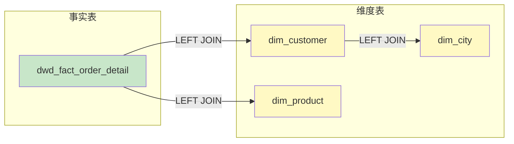
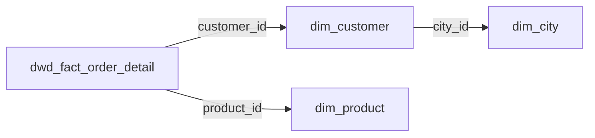
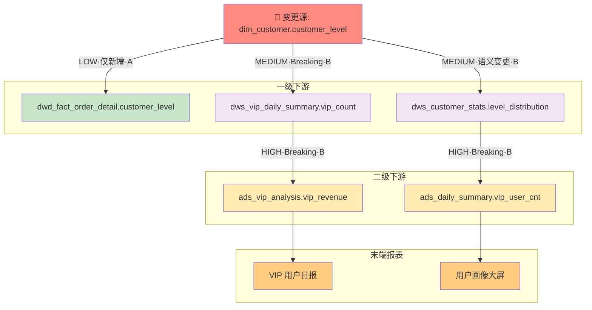

<objective>
创建血缘增强场景的 2 个新案例：JOIN 关联识别、变更影响评估。

Purpose: 为用户提供 LINEAGE-04 ~ LINEAGE-06 新增能力的参考案例。
Output: 2 个完整案例文件，展示 JOIN 识别和影响评估。
</objective>

<execution_context>
@./.claude/get-shit-done/workflows/execute-plan.md
@./.claude/get-shit-done/templates/summary.md
</execution_context>

<context>
@.planning/PROJECT.md
@.planning/ROADMAP.md
@.planning/STATE.md
@.planning/phases/07-sql-generation-lineage/07-RESEARCH.md

# 本阶段已创建/更新的文件（Wave 1 完成后）
@.claude/data-warehouse/prompts/scenarios/analyze-lineage/prompt.md
@.claude/data-warehouse/prompts/scenarios/analyze-lineage/output-template.md
@.claude/data-warehouse/prompts/scenarios/analyze-lineage/impact-analysis-template.md

# Phase 6 已有案例参考
@.claude/data-warehouse/prompts/scenarios/analyze-lineage/examples/table-level.md
@.claude/data-warehouse/prompts/scenarios/analyze-lineage/examples/column-level.md
</context>

<tasks>

<task type="auto">
  <name>Task 1: 创建 JOIN 关联识别案例 join-relationship.md</name>
  <files>.claude/data-warehouse/prompts/scenarios/analyze-lineage/examples/join-relationship.md</files>
  <action>
创建一个展示 JOIN 关联识别能力的案例（LINEAGE-04）：

**Frontmatter：**
```yaml
type: scenario-example
scenario: analyze-lineage
example: join-relationship
complexity: medium
version: 1.0.0
requirement: LINEAGE-04
```

**案例场景：**
- 业务场景：分析一个复杂的多表 JOIN SQL，识别所有关联关系
- 复杂度：中等
- 涉及：5 个表的 JOIN 关系、SCD2 维表、潜在多对多

**用户输入：**
```sql
-- 订单汇总报表模型
SELECT
    o.order_id,
    o.order_date,
    c.customer_name,
    c.customer_level,
    p.product_name,
    p.category_name,
    city.city_name,
    city.province_name,
    o.order_amt,
    o.quantity
FROM dwd_fact_order_detail o
LEFT JOIN dim_customer c
    ON o.customer_id = c.customer_id
    AND c.is_current = 1
LEFT JOIN dim_product p
    ON o.product_id = p.product_id
LEFT JOIN dim_city city
    ON c.city_id = city.city_id
WHERE o.dt >= '2026-01-01'
  AND o.order_status = 'completed'
```

**Stage 1 响应（表级血缘 + JOIN 关联）：**

```markdown
# 血缘分析报告

## 分析模式

- [x] 表级血缘
- [x] JOIN 关联分析
- [ ] 字段级血缘

## 解析精度

| 属性 | 值 |
|------|-----|
| **表级血缘** | 100% 准确 |
| **JOIN 识别** | 100% 准确 |
| **识别方式** | FROM/JOIN 解析 |

## 依赖图



## JOIN 关联分析

### 关联图



### 关联清单

| 左表 | 右表 | 关联类型 | 关联条件 | 边置信度 | 证据/位置 | 风险标记 |
|------|------|----------|----------|----------|----------|----------|
| `dwd_fact_order_detail` | `dim_customer` | LEFT JOIN | `o.customer_id = c.customer_id AND c.is_current = 1` | A | `L7-8: ON o.customer_id = c.customer_id AND c.is_current = 1` | `SCD2=is_current` |
| `dwd_fact_order_detail` | `dim_product` | LEFT JOIN | `o.product_id = p.product_id` | A | `L10: ON o.product_id = p.product_id` | `KEY_UNIQ?` |
| `dim_customer` | `dim_city` | LEFT JOIN | `c.city_id = city.city_id` | A | `L12: ON c.city_id = city.city_id` | - |

### 关联风险

- [ ] 笛卡尔积风险：无
- [x] SCD2 语义：`dim_customer` 使用 `is_current = 1`（当前版本）
- [x] 唯一性待确认：`dim_product.product_id` 唯一性未知（标记 `KEY_UNIQ?`）
- [ ] 多对多 JOIN：无明显多对多风险

## 识别统计

| 类型 | 数量 |
|------|------|
| LEFT JOIN | 3 |
| INNER JOIN | 0 |
| 原生表名 | 4 |

---

回复"**字段级**"获取字段级血缘映射表。
```

**案例要点：**
- 4 个表的 JOIN 关系识别
- SCD2 语义标记（is_current = 1）
- KEY_UNIQ? 风险标记
- 边级置信度 + 证据/位置
- Mermaid 关联图
  </action>
  <verify>
- 文件存在且可读
- 包含 JOIN 关联清单（表格）
- 包含 JOIN 关联图（Mermaid）
- 每条 JOIN 边有置信度 + 证据/位置
- 包含风险标记（SCD2、KEY_UNIQ?）
  </verify>
  <done>
join-relationship.md 案例创建完成，展示 JOIN 关联识别和风险标记能力。
  </done>
</task>

<task type="auto">
  <name>Task 2: 创建变更影响评估案例 impact-assessment.md</name>
  <files>.claude/data-warehouse/prompts/scenarios/analyze-lineage/examples/impact-assessment.md</files>
  <action>
创建一个展示变更影响评估能力的案例（LINEAGE-06）：

**Frontmatter：**
```yaml
type: scenario-example
scenario: analyze-lineage
example: impact-assessment
complexity: complex
version: 1.0.0
requirement: LINEAGE-06
```

**案例场景：**
- 业务场景：评估 `dim_customer.customer_level` 字段变更的下游影响
- 变更内容：VIP 等级将拆分为 VIP 和 SVIP
- 复杂度：复杂
- 涉及：多层级下游追踪、影响类型判断、处理建议

**用户输入：**
```markdown
我需要评估一个字段变更的影响：

**变更对象：** dim_customer.customer_level
**变更类型：** modify
**变更内容：** 原来的 'VIP' 等级将拆分为 'VIP' 和 'SVIP' 两个等级

请分析这个变更会影响哪些下游表和报表。
```

**Stage 3 响应（影响评估报告）：**

```markdown
# 变更影响评估报告

## 变更描述

- **变更对象：** `dim_customer.customer_level`
- **变更类型：** modify（修改枚举值）
- **影响类型（初判）：** 语义变更
- **变更内容：** 原 'VIP' 等级拆分为 'VIP' 和 'SVIP'

## 影响范围

### Level 1: 一级下游（3 个对象）

| 对象 | 类型 | 影响等级 | 影响类型 | 路径置信度 | 影响原因（路径摘要） | 处理建议 |
|------|------|----------|----------|------------|----------------------|----------|
| `dwd_fact_order_detail.customer_level` | 字段 | 低 | 仅新增 | A | `dim_customer → dwd_fact_order_detail` | 无需修改（直接映射） |
| `dws_customer_stats.level_distribution` | 字段 | 中 | 语义变更 | B | `dim_customer → dws_customer_stats` | 需更新聚合逻辑 |
| `dws_vip_daily_summary.vip_count` | 字段 | 中 | Breaking | B | `dim_customer → dws_vip_daily_summary` | 需修改 VIP 过滤条件 |

### Level 2: 二级下游（2 个对象）

| 对象 | 类型 | 影响等级 | 影响类型 | 路径置信度 | 影响原因（路径摘要） | 处理建议 |
|------|------|----------|----------|------------|----------------------|----------|
| `ads_vip_analysis.vip_revenue` | 字段 | 高 | Breaking | B | `dim_customer → dws_vip_daily_summary → ads_vip_analysis` | 需修改口径（VIP/SVIP 区分或合并） |
| `ads_daily_summary.vip_user_cnt` | 字段 | 高 | Breaking | B | `dim_customer → dws_customer_stats → ads_daily_summary` | 需修改口径 |

### 末端影响（2 个报表）

| 报表/应用 | 负责人 | 影响等级 | 影响类型 | 路径置信度 | 影响原因（路径摘要） | 处理建议 |
|-----------|--------|----------|----------|------------|----------------------|----------|
| VIP 用户日报 | 张三 | 高 | Breaking | B | `dim_customer → ... → VIP 用户日报` | 通知业务方 + 确认新口径定义 |
| 用户画像大屏 | 李四 | 高 | Breaking | B | `dim_customer → ... → 用户画像大屏` | 更新展示逻辑（VIP/SVIP 分开或合并） |

## 影响图谱



## 循环与截断说明

- **循环检测：** not_detected
- **最大深度：** 3（Level 0 → Level 1 → Level 2 → 末端）
- **最大节点数：** 8（未截断）

## 处理清单

### 必须处理（Breaking）

- [ ] 修改 `dws_vip_daily_summary` 的 VIP 过滤条件（决定是否包含 SVIP）
- [ ] 修改 `ads_vip_analysis` 的口径定义（VIP/SVIP 分开统计 or 合并）
- [ ] 修改 `ads_daily_summary` 的 vip_user_cnt 口径
- [ ] 通知 VIP 用户日报负责人（张三）确认新口径
- [ ] 通知用户画像大屏负责人（李四）更新展示

### 建议处理（语义变更）

- [ ] 更新 `dws_customer_stats` 的 level_distribution 聚合逻辑
- [ ] 在数据字典中更新 customer_level 的枚举值说明

### 无需处理（仅新增）

- `dwd_fact_order_detail.customer_level`：直接映射，无需修改

## 重跑计划

| 表 | 分区范围 | 优先级 | 前置条件 |
|----|----------|--------|----------|
| `dws_vip_daily_summary` | 最近 30 天 | P1 | dim_customer 变更生效后 |
| `dws_customer_stats` | 最近 30 天 | P1 | dim_customer 变更生效后 |
| `ads_vip_analysis` | 最近 90 天 | P2 | dws 层重跑完成后 |
| `ads_daily_summary` | 最近 90 天 | P2 | dws 层重跑完成后 |
```

**案例要点：**
- 完整的多层级影响追踪（Level 1 → Level 2 → 末端）
- 影响类型分类（Breaking / 语义变更 / 仅新增）
- 路径置信度传播（min 规则）
- Mermaid 影响图谱（边上标注等级·类型·置信度）
- 分类处理清单
- 重跑计划
  </action>
  <verify>
- 文件存在且可读
- 包含变更描述（对象、类型、影响类型）
- 包含多层级影响清单（Level 1/2/末端）
- 包含影响图谱（Mermaid，边上标注）
- 包含循环与截断说明
- 包含分类处理清单（必须/建议/无需）
- 包含重跑计划
  </verify>
  <done>
impact-assessment.md 案例创建完成，展示完整的变更影响评估流程。
  </done>
</task>

</tasks>

<verification>
1. 目录结构验证：
   ```bash
   ls -la .claude/data-warehouse/prompts/scenarios/analyze-lineage/examples/
   ```
   预期输出：table-level.md, column-level.md, join-relationship.md, impact-assessment.md

2. 案例完整性验证：
   - join-relationship.md 包含 JOIN 关联清单 + 风险标记
   - impact-assessment.md 包含多层级影响 + 处理清单

3. 边级置信度验证：
   - 每条边有 A/B/C/D 置信度
   - 有证据/位置说明
</verification>

<success_criteria>
1. 2 个案例文件全部创建完成
2. join-relationship.md 展示 JOIN 关联识别能力
3. impact-assessment.md 展示变更影响评估能力
4. 所有案例使用边级置信度标记
5. 案例格式与 Phase 6 已有案例一致
</success_criteria>

<output>
After completion, create `.planning/phases/07-sql-generation-lineage/07-04-SUMMARY.md`
</output>
