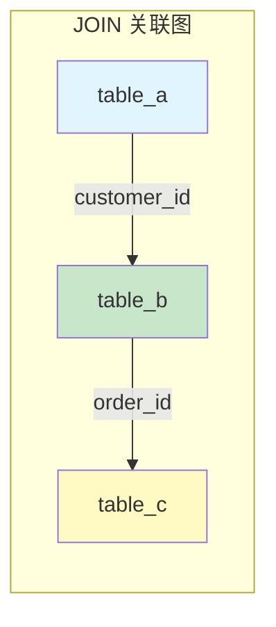
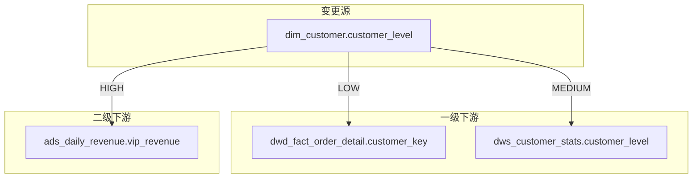
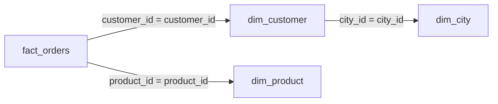
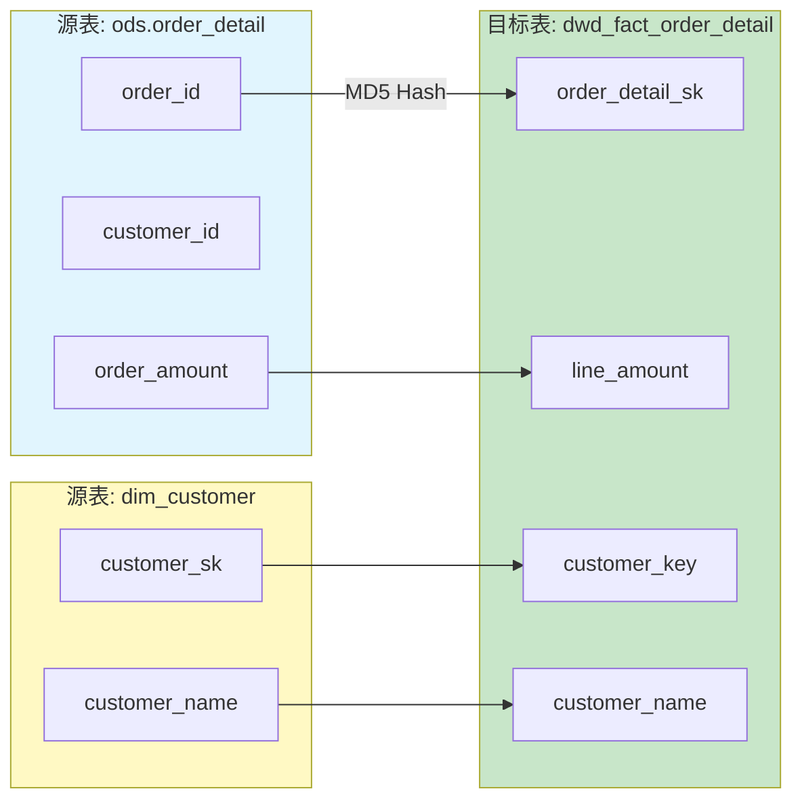
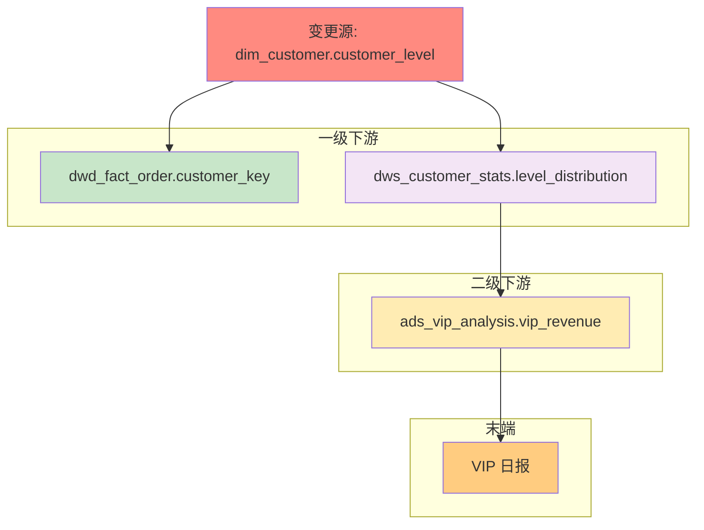
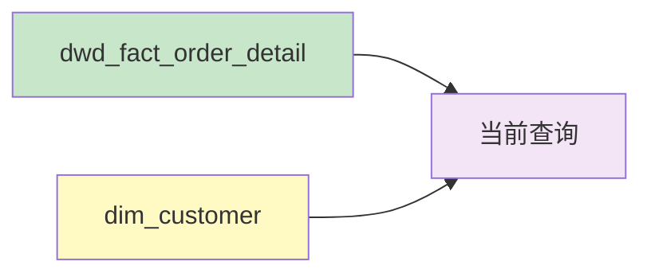
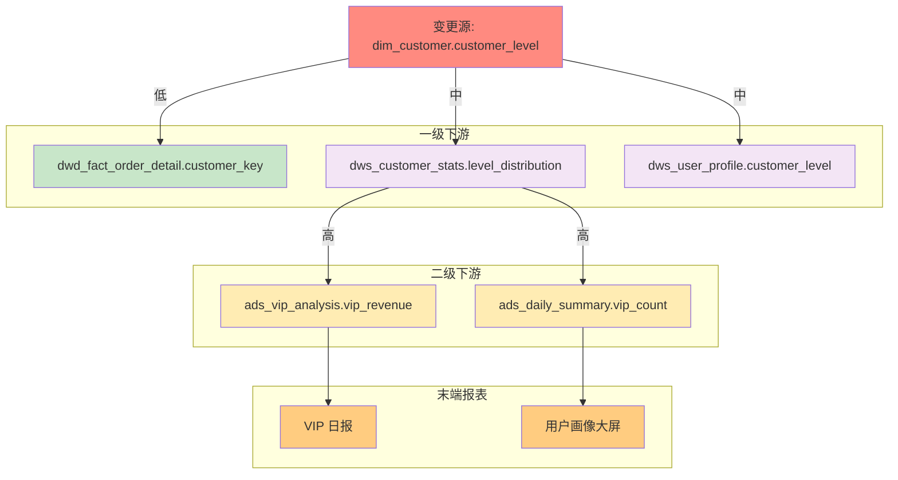

# Phase 7: SQL 生成 + 血缘增强 - Research

**Researched:** 2026-02-01
**Domain:** Text-to-SQL Prompting / SQL Lineage Enhancement / Impact Analysis
**Confidence:** HIGH

## Summary

本研究聚焦于两个核心场景的提示系统实现：**SQL 生成**（根据取数口径/过滤/时间窗输出 Hive SQL + 配套文档）和**血缘增强**（识别 JOIN 关联、Mermaid 血缘图、变更影响评估）。

研究发现，此类提示系统的关键在于：
1. **两段式交互模式** — 与 Phase 4-6 一致，Stage 1 确认理解，Stage 2 生成完整产物
2. **分区过滤强制机制** — 生成的 Hive SQL 必须包含分区过滤条件，缺失时警告 + 生成双版本
3. **动态时间表达** — 相对时间转换为 `DATE_SUB(CURRENT_DATE, N)` 等动态表达式
4. **血缘精度等级** — 延续 Phase 6 的 A/B/C/D 四级置信度标记体系
5. **全链路影响追踪** — 递归追踪下游依赖，按层级展示影响范围

项目已有成熟的血缘分析基础（Phase 6 LINEAGE-01 ~ LINEAGE-03）和两段式交互模式（Phase 4-6），本阶段增强 SQL 生成场景和血缘追踪能力，保持与已有架构的一致性。

**Primary recommendation:** 采用"Schema Context + Partition-Aware"的 SQL 生成策略，结合"静态解析优先 + LLM 补全"的血缘分析模式，使用 Mermaid flowchart + Markdown 表格的双格式输出，确保与 Phase 4-6 保持一致的两段式交互体验。

---

## Standard Stack

### Core Components

| 组件 | 版本/格式 | 用途 | 为何标准 |
|------|----------|------|---------|
| Hive SQL (HiveQL) | Hive 3.x | 生成的目标 SQL | 项目目标平台 |
| dbt-hive | 1.7+ | dbt 模型生成 | dbt 官方 Hive 适配器 |
| Mermaid flowchart | graph LR/TD | 血缘可视化 | 与 Phase 6 一致，广泛渲染支持 |
| Markdown Table | 标准 Markdown | 字段映射/影响清单 | 结构化、可解析 |
| 动态日期表达式 | HiveQL | 相对时间处理 | SQL 可重复执行 |

### SQL 生成关键函数（Hive 3.x）

| 函数 | 用途 | 示例 |
|------|------|------|
| `DATE_SUB(CURRENT_DATE, N)` | 最近 N 天 | `WHERE dt >= DATE_SUB(CURRENT_DATE, 7)` |
| `TRUNC(CURRENT_DATE, 'MM')` | 当月第一天 | `WHERE dt >= TRUNC(CURRENT_DATE, 'MM')` |
| `ADD_MONTHS(TRUNC(CURRENT_DATE, 'MM'), -1)` | 上月第一天 | 月度报表 |
| `LAST_DAY(ADD_MONTHS(CURRENT_DATE, -1))` | 上月最后一天 | 月度截止 |
| `DATE_FORMAT(CURRENT_TIMESTAMP, 'yyyy-MM-dd')` | 当前日期格式化 | 动态分区值 |

### Supporting Context References

| 文档 | 用途 | 引用方式 |
|------|------|---------|
| `context/platform/hive-constraints-core.md` | 分区规则、P0 约束 | includes（运行时注入） |
| `context/layers/layering-system-core.md` | 跨层引用规则 | includes（运行时注入） |
| `context/governance/dq-rules-core.md` | 字段类型驱动规则（复用） | includes（按需） |
| `docs/naming-core.md` | 命名规范 | includes（运行时注入） |
| `prompts/scenarios/analyze-lineage/output-template.md` | 血缘输出模板（Phase 6） | 复用 |

### Token Budget Consideration

根据 `docs/token-budget.md`：
- 单文件上限：2,000 tokens
- 标准场景组装：8,000 tokens

**策略：**
- SQL 生成主提示：~1,200-1,500 tokens
- SQL 生成输出模板：~800 tokens
- 血缘增强主提示：~1,000 tokens（复用 Phase 6 基础）
- 影响评估输出模板：~600 tokens
- 共用上下文通过 `includes` 复用已有 `*-core.md`

---

## Architecture Patterns

### Recommended Prompt Structure

```
prompts/scenarios/
├── generate-sql/                      # SQL 生成场景（新增）
│   ├── prompt.md                      # 主提示（~1,300 tokens）
│   ├── output-template.md             # 输出模板（~800 tokens）
│   ├── time-expressions.md            # 动态时间表达速查（~400 tokens）
│   └── examples/
│       ├── simple-select.md           # 简单取数案例
│       ├── aggregation-with-join.md   # 聚合 + JOIN 案例
│       └── time-window-query.md       # 时间窗口案例
└── analyze-lineage/                   # 血缘分析场景（Phase 6 已有，本阶段增强）
    ├── prompt.md                      # 主提示（已有，微调）
    ├── output-template.md             # 输出模板（已有，扩展）
    ├── impact-analysis-template.md    # 影响评估模板（新增，~600 tokens）
    └── examples/
        ├── table-level.md             # 表级血缘案例（已有）
        ├── column-level.md            # 字段级血缘案例（已有）
        ├── join-relationship.md       # JOIN 关联识别案例（新增）
        └── impact-assessment.md       # 变更影响评估案例（新增）
```

### Pattern 1: Two-Stage SQL Generation（两段式 SQL 生成）

**What:** Stage 1 确认理解（表、字段、分区范围、过滤条件、粒度、聚合方式），Stage 2 生成完整 SQL 及配套文档
**When to use:** 所有 SQL 生成场景

**Stage 1 必确认项（全部）：**

| 项 | 说明 | 缺失处理 |
|----|------|----------|
| **数据源表** | 涉及的表名 | 根据取数口径推断 + 确认 |
| **关键字段** | SELECT 的字段清单 | 根据口径推断 + 确认 |
| **分区范围** | dt 的过滤条件 | 智能推断（默认最近 7 天）+ 确认 |
| **过滤条件** | WHERE 子句其他条件 | 根据口径推断 + 确认 |
| **粒度说明** | 结果集的粒度（一行代表什么） | 根据 GROUP BY 推断 + 确认 |
| **聚合方式** | SUM/COUNT/AVG 等 | 根据口径推断 + 确认 |

**Stage 2 输出：**
- Hive SQL（含中文注释）
- 口径说明文档
- 性能提示
- 依赖说明

**Source:** Phase 4-6 验证的两段式交互模式；[PET-SQL 两阶段框架](https://arxiv.org/abs/2403.09732)

### Pattern 2: Partition-Aware SQL Generation（分区感知 SQL 生成）

**What:** 生成的 SQL 强制包含分区过滤条件，缺失时警告 + 生成双版本
**When to use:** 所有 Hive SQL 生成

**策略：**

```markdown
### 分区过滤强制机制

1. **默认行为：** 所有生成的 SQL 必须包含分区列过滤
2. **缺失警告：** 如果用户需求未指定分区范围，Stage 1 主动追问
3. **双版本输出：** 当检测到全表扫描风险时，提供：
   - 原始版本（带警告标记）
   - 推荐版本（添加默认分区过滤）

### 警告标记格式

```sql
-- !!! WARNING: 全表扫描风险 !!!
-- 此 SQL 未包含分区过滤条件，可能导致：
-- 1. 扫描全部历史数据（成本高）
-- 2. 查询执行时间过长
-- 3. 集群资源占用过大
--
-- 推荐添加分区过滤：WHERE dt >= DATE_SUB(CURRENT_DATE, 7)
```
```

**Source:** [Hive Partition Best Practices](https://www.sparkcodehub.com/hive/partitions/partition-best-practices)；07-CONTEXT.md 用户决策

### Pattern 3: Dynamic Time Expression Conversion（动态时间表达转换）

**What:** 将自然语言时间表达转换为 Hive 动态日期函数
**When to use:** 用户使用"最近 N 天"、"上月"等相对时间表达时

**转换表：**

| 自然语言 | Hive 表达式 | 说明 |
|----------|------------|------|
| 今天 | `CURRENT_DATE` | 当前日期 |
| 昨天 | `DATE_SUB(CURRENT_DATE, 1)` | T-1 |
| 最近 N 天 | `dt >= DATE_SUB(CURRENT_DATE, N)` | 滚动窗口 |
| 本周 | `dt >= DATE_SUB(CURRENT_DATE, DAYOFWEEK(CURRENT_DATE)-1)` | 周一至今 |
| 上周 | 复杂表达式 | 上周一至上周日 |
| 本月 | `dt >= TRUNC(CURRENT_DATE, 'MM')` | 当月第一天至今 |
| 上月 | `dt >= ADD_MONTHS(TRUNC(CURRENT_DATE, 'MM'), -1) AND dt < TRUNC(CURRENT_DATE, 'MM')` | 上月整月 |
| 本季度 | `dt >= TRUNC(CURRENT_DATE, 'Q')` | 当季第一天至今 |
| 本年 | `dt >= TRUNC(CURRENT_DATE, 'YY')` | 当年第一天至今 |

**Source:** Hive 官方文档；07-CONTEXT.md 用户决策（使用动态计算）

### Pattern 4: SQL Output Bundle（SQL 输出套件）

**What:** 生成的 SQL 附带完整配套文档（口径说明 + 性能提示 + 依赖说明）
**When to use:** Stage 2 输出

**口径说明文档模板：**

```markdown
## 口径说明

### 1. 计算步骤
1. 从 `{source_table}` 读取 `{partition_range}` 范围的数据
2. 按 `{filter_conditions}` 条件过滤
3. 按 `{group_by_columns}` 粒度聚合
4. 计算 `{aggregations}` 指标

### 2. 数据源
| 表名 | 作用 | 关键字段 |
|------|------|----------|
| `{table}` | {role} | `{fields}` |

### 3. 假设和限制
- 数据新鲜度：{freshness}
- 已排除的数据：{exclusions}
- 边界情况处理：{edge_cases}

### 4. 版本记录
- v1.0 ({date}): 初始版本
```

**性能提示模板：**

```markdown
## 性能提示

### 风险识别
| 风险项 | 严重度 | 说明 |
|--------|--------|------|
| {risk} | {severity} | {description} |

### 优化建议
1. **{suggestion_1}**
   ```sql
   -- 优化前
   {before_sql}

   -- 优化后
   {after_sql}
   ```

### 资源估算
- 预估扫描数据量：{scan_size}
- 预估执行时间：{execution_time}
- 建议执行队列：{queue}
```

**Source:** 07-CONTEXT.md 用户决策（完整档案级口径说明、具体代码片段建议）

### Pattern 5: JOIN Relationship Extraction（JOIN 关联识别）

**What:** 识别 SQL 中的 JOIN 关联关系，输出关联图
**When to use:** 血缘增强场景（LINEAGE-04）

**识别内容：**

| 关联类型 | 识别规则 | 示例 |
|----------|----------|------|
| INNER JOIN | `JOIN ... ON` | 等值关联 |
| LEFT/RIGHT JOIN | `LEFT/RIGHT JOIN ... ON` | 外连接 |
| FULL OUTER JOIN | `FULL OUTER JOIN ... ON` | 全外连接 |
| CROSS JOIN | `CROSS JOIN` 或逗号分隔 | 笛卡尔积（警告） |
| 隐式 JOIN | `FROM a, b WHERE a.x = b.y` | 老式语法 |

**输出格式：**



**Source:** Phase 6 血缘分析基础；[SQLGlot Lineage](https://sqlglot.com/sqlglot/lineage.html)

### Pattern 6: Full-Chain Impact Analysis（全链路影响分析）

**What:** 递归追踪某字段/表变更影响的所有下游，按层级展示
**When to use:** 变更影响评估场景（LINEAGE-06）

**追踪策略：**

```markdown
### 影响追踪层级

Level 0: 变更源（被修改的字段/表）
Level 1: 一级下游（直接引用变更源的表/字段）
Level 2: 二级下游（引用一级下游的表/字段）
...
Level N: 末端表/报表（无下游依赖）

### 影响等级标记

| 等级 | 含义 | 触发条件 |
|------|------|----------|
| **高** | 关键业务受影响 | ADS 层表、报表、指标 |
| **中** | 中间层受影响 | DWS 层表、衍生指标 |
| **低** | 底层受影响 | DWD 层表、明细数据 |

### 处理建议

| 等级 | 建议操作 |
|------|----------|
| 高 | 需重跑 + 通知业务方 + 验证报表 |
| 中 | 需重跑 + 验证数据质量 |
| 低 | 需重跑 |
```

**输出格式：**



**Source:** [Atlan Data Lineage Impact Analysis](https://atlan.com/know/data-lineage-impact-analysis/)；07-CONTEXT.md 用户决策

### Anti-Patterns to Avoid

- **无分区过滤的 SQL 生成:** 必须强制分区过滤或警告
- **硬编码日期:** 使用动态日期函数，避免 `WHERE dt = '2026-01-31'`
- **忽略性能问题:** 检测到笛卡尔积、大表 JOIN 时必须警告
- **血缘精度过度承诺:** 复杂 SQL 标记置信度，不宣称 100% 准确
- **影响范围低估:** 全链路追踪，不只追踪一级下游
- **脱离已有模式:** 保持与 Phase 4-6 一致的交互和输出格式

---

## Don't Hand-Roll

| 问题 | 不要手写 | 使用替代 | 原因 |
|------|---------|---------|------|
| 动态日期计算 | 自定义日期逻辑 | Hive 内置函数 | `DATE_SUB/TRUNC/ADD_MONTHS` 标准化 |
| 分区裁剪检查 | 手动校验 | 分区过滤强制机制 | 自动化警告 + 双版本 |
| 血缘图可视化 | 自定义图格式 | Mermaid flowchart | 与 Phase 6 一致，广泛支持 |
| 影响等级判断 | 主观评估 | 分层规则 + 自动标记 | ADS=高/DWS=中/DWD=低 |
| JOIN 识别 | 正则硬编码 | AST 解析 + LLM 补全 | 处理复杂嵌套 |
| 口径文档 | 自由格式 | 标准化模板 | 可维护性、一致性 |

**Key insight:** SQL 生成场景的核心价值在于"生成可直接执行的安全 SQL + 完整配套文档"，而非仅仅是语法正确。分区过滤、性能提示、口径说明是不可或缺的附加值。血缘增强的核心价值在于"变更前知道影响范围"，全链路追踪是关键。

---

## SQL Generation: Stage 1 必问项清单

### A. 取数目标（必问）

| 项 | 说明 | 示例 |
|----|------|------|
| **业务目标** | 这个数据用来做什么 | "分析上月 VIP 用户的消费金额" |
| **输出粒度** | 结果集一行代表什么 | "一个用户一行" / "一个订单一行" |

### B. 数据源（必问）

| 项 | 说明 | 缺失处理 |
|----|------|----------|
| **主表** | 主要数据来源表 | 根据目标推断 + 确认 |
| **关联表** | 需要 JOIN 的维度/明细表 | 根据字段推断 + 确认 |

### C. 字段清单（必问）

| 项 | 说明 | 缺失处理 |
|----|------|----------|
| **维度字段** | GROUP BY / 展示的维度 | 根据目标推断 + 确认 |
| **度量字段** | 聚合计算的指标 | 根据目标推断 + 确认 |
| **过滤字段** | WHERE 条件涉及的字段 | 根据目标推断 + 确认 |

### D. 时间范围（必问）

| 项 | 说明 | 缺失处理 |
|----|------|----------|
| **分区范围** | dt 的过滤条件 | 默认最近 7 天 + 确认 |
| **时间粒度** | 日/周/月级别 | 根据目标推断 + 确认 |
| **时间表达** | 固定日期/动态计算 | 默认动态计算 |

### E. 过滤条件（必问）

| 项 | 说明 | 缺失处理 |
|----|------|----------|
| **业务过滤** | 状态、类型等过滤条件 | 根据目标推断 + 确认 |
| **数据质量过滤** | 是否排除异常/测试数据 | 默认排除 |

### F. 聚合方式（有聚合时必问）

| 项 | 说明 | 示例 |
|----|------|------|
| **聚合函数** | SUM/COUNT/AVG 等 | `SUM(order_amount)` |
| **去重需求** | COUNT DISTINCT | `COUNT(DISTINCT user_id)` |
| **分组维度** | GROUP BY 字段 | `GROUP BY user_id, order_date` |

---

## Lineage Enhancement: 新增能力

### LINEAGE-04: JOIN 关联识别

**Stage 1 输出增强：**

```markdown
## JOIN 关联分析

### 关联图



### 关联清单

| 左表 | 右表 | 关联类型 | 关联条件 | 位置 |
|------|------|----------|----------|------|
| `fact_orders` | `dim_customer` | LEFT JOIN | `customer_id = customer_id` | L12 |
| `fact_orders` | `dim_product` | LEFT JOIN | `product_id = product_id` | L15 |
| `dim_customer` | `dim_city` | LEFT JOIN | `city_id = city_id` | L18 |

### 关联风险
- [ ] 笛卡尔积风险
- [x] 多对多 JOIN 风险（`fact_orders` - `dim_product` 可能多对多）
```

### LINEAGE-05: Mermaid 格式血缘图增强

**字段级血缘图格式：**



**样式约定（与 Phase 6 一致）：**

| 层级/类型 | 颜色代码 | 说明 |
|----------|----------|------|
| ODS 源表 | `#e1f5fe` | 淡蓝色 |
| DWD 事实表 | `#c8e6c9` | 淡绿色 |
| 维度表 | `#fff9c4` | 淡黄色 |
| DWS 汇总表 | `#f3e5f5` | 淡紫色 |
| ADS 应用表 | `#ffecb3` | 淡橙色 |

### LINEAGE-06: 变更影响评估

**输出模板：**

```markdown
## 变更影响评估报告

### 变更描述
- **变更对象：** `{table_or_column}`
- **变更类型：** {add|modify|delete|rename}
- **变更内容：** {description}

### 影响范围

#### Level 1: 一级下游

| 对象 | 类型 | 影响等级 | 处理建议 |
|------|------|----------|----------|
| `{downstream_1}` | 表/字段 | 高/中/低 | 需重跑/需修改/需验证 |

#### Level 2: 二级下游

| 对象 | 类型 | 影响等级 | 处理建议 |
|------|------|----------|----------|
| `{downstream_2}` | 表/字段 | 高/中/低 | 需重跑/需修改/需验证 |

#### 末端影响

| 报表/应用 | 负责人 | 影响等级 | 处理建议 |
|-----------|--------|----------|----------|
| `{report_1}` | {owner} | 高 | 通知业务方 + 验证 |

### 影响图谱



### 处理清单

- [ ] 重跑 `dwd_fact_order`（分区范围：{range}）
- [ ] 重跑 `dws_customer_stats`
- [ ] 重跑 `ads_vip_analysis`
- [ ] 通知 VIP 日报负责人
- [ ] 验证数据一致性
```

---

## Common Pitfalls

### Pitfall 1: SQL 缺少分区过滤

**What goes wrong:** 生成的 SQL 导致全表扫描，执行时间过长或集群资源耗尽
**Why it happens:** 用户需求未明确分区范围，Claude 未主动追问
**How to avoid:**
- Stage 1 强制追问分区范围
- 未指定时使用默认值（最近 7 天）+ 确认
- 检测到缺失时警告 + 双版本输出
**Warning signs:** SQL 无 `WHERE dt` 条件

### Pitfall 2: 硬编码日期值

**What goes wrong:** SQL 只能执行一次，无法重复使用（定时任务失败）
**Why it happens:** 直接使用用户给的具体日期
**How to avoid:**
- 默认使用动态日期函数
- 仅当用户明确要求"固定日期"时才硬编码
- Stage 1 确认时间表达方式
**Warning signs:** `WHERE dt = '2026-01-31'` 而非 `DATE_SUB()`

### Pitfall 3: 性能问题未提示

**What goes wrong:** 生成的 SQL 执行失败或耗时过长
**Why it happens:** 未检测大表 JOIN、笛卡尔积等风险
**How to avoid:**
- 自动检测风险模式（无 ON 条件、大表 CROSS JOIN）
- 提供原始版本 + 优化版本
- 性能提示中给出具体代码片段
**Warning signs:** 用户反馈"SQL 跑不动"

### Pitfall 4: 口径说明不完整

**What goes wrong:** 用户不理解 SQL 的计算逻辑
**Why it happens:** 只输出 SQL，未附带说明文档
**How to avoid:**
- 使用标准化口径说明模板
- 包含计算步骤、数据源、假设和限制
- Stage 2 强制输出完整套件
**Warning signs:** 用户追问"这个数怎么算的"

### Pitfall 5: 血缘影响范围低估

**What goes wrong:** 变更后意外影响了未识别的下游
**Why it happens:** 只追踪一级下游，未做全链路追踪
**How to avoid:**
- 递归追踪至末端表/报表
- 按层级展示（Level 1, 2, ..., N）
- 末端影响特别标记负责人
**Warning signs:** 用户反馈"还有报表受影响你没说"

### Pitfall 6: JOIN 关联识别遗漏

**What goes wrong:** 漏识别隐式 JOIN 或子查询中的 JOIN
**Why it happens:** 只匹配显式 JOIN 语法
**How to avoid:**
- 识别隐式 JOIN（FROM a, b WHERE...）
- 递归解析子查询和 CTE
- 使用 AST 解析 + LLM 补全
**Warning signs:** 依赖清单少于实际 JOIN 数量

---

## Code Examples

### Example 1: 完整的 SQL 生成输出（Stage 2）

```markdown
## 生成结果

### File: queries/vip_monthly_revenue.sql

```sql
-- ===============================================
-- 查询名称：VIP 用户上月消费金额统计
-- 生成时间：{{ CURRENT_TIMESTAMP }}
-- 口径版本：v1.0
-- ===============================================

-- 取数口径：
-- 1. 统计上月（完整月份）VIP 用户的订单金额
-- 2. VIP 定义：customer_level = 'VIP'
-- 3. 排除已取消订单（order_status != 'CANCELLED'）
-- 4. 粒度：一个用户一行

SELECT
    -- 维度字段
    c.customer_id,
    c.customer_name,
    c.customer_level,

    -- 度量字段
    COUNT(DISTINCT o.order_id) AS order_count,      -- 订单数
    SUM(o.line_amount) AS total_amount,             -- 消费总额
    AVG(o.line_amount) AS avg_order_amount          -- 平均客单价

FROM dwd_fact_order_detail o
INNER JOIN dim_customer c
    ON o.customer_key = c.customer_sk
    AND c.is_current = 1                            -- SCD2: 当前有效版本

WHERE 1=1
    -- 分区过滤（上月完整月份，动态计算）
    AND o.dt >= ADD_MONTHS(TRUNC(CURRENT_DATE, 'MM'), -1)
    AND o.dt < TRUNC(CURRENT_DATE, 'MM')

    -- 业务过滤
    AND c.customer_level = 'VIP'                    -- VIP 用户
    AND o.order_status != 'CANCELLED'               -- 排除取消订单
    AND o.is_deleted = 0                            -- 排除删除数据

GROUP BY
    c.customer_id,
    c.customer_name,
    c.customer_level

ORDER BY
    total_amount DESC
;
```

---

## 口径说明

### 1. 计算步骤

1. 从 `dwd_fact_order_detail` 读取上月分区数据
2. 关联 `dim_customer` 获取客户信息（SCD2 当前版本）
3. 过滤 VIP 用户、排除取消订单和删除数据
4. 按客户粒度聚合，计算订单数、消费总额、平均客单价

### 2. 数据源

| 表名 | 作用 | 关键字段 |
|------|------|----------|
| `dwd_fact_order_detail` | 订单明细事实表 | `order_id, customer_key, line_amount, order_status, dt` |
| `dim_customer` | 客户维度表 | `customer_sk, customer_id, customer_name, customer_level, is_current` |

### 3. 假设和限制

- **数据新鲜度：** 假设 T+1 更新完成
- **已排除的数据：** 取消订单、删除标记数据
- **SCD 处理：** 使用 `is_current = 1` 取当前有效版本

### 4. 版本记录

- v1.0 (2026-02-01): 初始版本

---

## 性能提示

### 风险识别

| 风险项 | 严重度 | 说明 |
|--------|--------|------|
| 大表 JOIN | 中 | `dwd_fact_order_detail` 可能数据量大 |

### 优化建议

1. **分区裁剪已生效**：WHERE 条件直接使用分区列 `dt`，Hive 会自动裁剪

2. **如果执行慢，可考虑**：
   ```sql
   -- 优化：先过滤再 JOIN
   WITH filtered_orders AS (
       SELECT * FROM dwd_fact_order_detail
       WHERE dt >= ADD_MONTHS(TRUNC(CURRENT_DATE, 'MM'), -1)
         AND dt < TRUNC(CURRENT_DATE, 'MM')
         AND order_status != 'CANCELLED'
         AND is_deleted = 0
   )
   SELECT ...
   FROM filtered_orders o
   INNER JOIN dim_customer c ON ...
   ```

### 资源估算

- 预估扫描数据量：上月订单数据（约 30 个分区）
- 预估执行时间：< 5 分钟（视数据量）
- 建议执行队列：default

---

## 依赖说明

### 上游依赖

| 表名 | 分层 | 更新频率 | 备注 |
|------|------|----------|------|
| `dwd_fact_order_detail` | DWD | T+1 | 订单明细事实表 |
| `dim_customer` | DWD | T+1 | 客户维度表（SCD2） |

### 依赖图


```

### Example 2: 变更影响评估输出

```markdown
## 变更影响评估报告

### 变更描述

- **变更对象：** `dim_customer.customer_level`
- **变更类型：** modify（修改枚举值）
- **变更内容：** 新增 'SVIP' 等级，原 'VIP' 分拆为 'VIP' 和 'SVIP'

### 影响范围

#### Level 1: 一级下游（3 个对象）

| 对象 | 类型 | 影响等级 | 处理建议 |
|------|------|----------|----------|
| `dwd_fact_order_detail.customer_key` | 字段（FK） | 低 | 无需修改（关联 SK 未变） |
| `dws_customer_stats.level_distribution` | 字段 | 中 | 需重跑 + 更新聚合逻辑 |
| `dws_user_profile.customer_level` | 字段 | 中 | 需重跑 |

#### Level 2: 二级下游（2 个对象）

| 对象 | 类型 | 影响等级 | 处理建议 |
|------|------|----------|----------|
| `ads_vip_analysis.vip_revenue` | 字段 | 高 | 需修改口径（区分 VIP/SVIP） |
| `ads_daily_summary.vip_count` | 字段 | 高 | 需修改口径 |

#### 末端影响（2 个报表）

| 报表/应用 | 负责人 | 影响等级 | 处理建议 |
|-----------|--------|----------|----------|
| VIP 日报 | 张三 | 高 | 通知业务方 + 确认新口径 |
| 用户画像大屏 | 李四 | 高 | 更新展示逻辑 |

### 影响图谱



### 处理清单

- [ ] 更新 `dws_customer_stats` 聚合逻辑（区分 VIP/SVIP）
- [ ] 更新 `dws_user_profile` 字段值映射
- [ ] 更新 `ads_vip_analysis` 口径（决定是否合并统计）
- [ ] 更新 `ads_daily_summary` 口径
- [ ] 通知 VIP 日报负责人（张三）确认新口径
- [ ] 通知用户画像大屏负责人（李四）更新展示
- [ ] 重跑受影响的全部表（建议从 DWS 层开始）
- [ ] 验证数据一致性
```

---

## State of the Art

| 旧方法 | 当前方法 | 何时改变 | 影响 |
|--------|---------|---------|------|
| 手写 SQL | LLM 辅助生成 + 两段式确认 | 2024-2025 | 效率提升、错误减少 |
| 单纯 SQL 输出 | SQL + 口径说明 + 性能提示 + 依赖 | 2025 | 可维护性、可理解性 |
| 表级血缘 | 表级 + 字段级 + JOIN 关联 | 2025 | 精细化追踪 |
| 一级影响分析 | 全链路递归追踪 | 2025-2026 | 完整影响评估 |
| 百分比精度标记 | A/B/C/D 置信度等级 | 2025 | 更准确的精度表达 |
| 手动 Mermaid 绘图 | 自动生成 flowchart | 2025 | 效率、一致性 |

**Deprecated/outdated:**
- **单纯 SQL 输出:** 缺少口径说明导致理解成本高
- **硬编码日期:** 无法重复执行
- **一级影响分析:** 遗漏下游影响

---

## Open Questions

### 1. 复杂窗口函数的性能评估

**What we know:** 窗口函数（ROW_NUMBER, RANK, LAG/LEAD）在 Hive 上可能性能问题
**What's unclear:** 如何精确评估窗口函数的性能影响
**Recommendation:**
- 检测到窗口函数时输出通用警告
- 建议用户关注执行计划
- 不做精确资源估算（精度不可控）

### 2. 血缘追踪的深度限制

**What we know:** 全链路追踪可能涉及大量下游
**What's unclear:** 追踪深度是否需要限制（如最多 5 层）
**Recommendation:**
- 默认追踪至末端（无限深度）
- 输出时按层级折叠展示
- 超过 3 层时提示"完整影响范围较大，建议分步处理"

### 3. 跨项目血缘追踪

**What we know:** 本阶段假设血缘在单个 dbt 项目内
**What's unclear:** 跨项目/跨平台的血缘如何处理
**Recommendation:**
- v1 限定单项目范围
- 标记"外部依赖"但不追踪
- 跨项目追踪留待后续增强

---

## Sources

### Primary (HIGH confidence)

- **项目内部文档（已读取验证）：**
  - 07-CONTEXT.md — 用户决策（两段式交互、动态时间、分区强制、全链路追踪）
  - Phase 6 RESEARCH.md — 血缘分析基础、精度等级、Mermaid 格式
  - Phase 4 RESEARCH.md — 两段式交互模式、输出契约
  - `context/platform/hive-constraints-core.md` — 分区规则、P0 约束
  - `context/layers/layering-system-core.md` — 分层体系
  - `prompts/scenarios/analyze-lineage/` — 已有血缘分析实现

- **SQLGlot 官方文档：**
  - [SQLGlot Lineage API](https://sqlglot.com/sqlglot/lineage.html) — 列级血缘实现

- **Mermaid 官方文档：**
  - [Mermaid Flowchart Syntax](https://mermaid.js.org/syntax/flowchart.html) — subgraph、direction 语法

### Secondary (MEDIUM confidence)

- [PET-SQL: Two-Stage Text-to-SQL Framework](https://arxiv.org/abs/2403.09732) — 两阶段 SQL 生成
- [AWS Best Practices for Text-to-SQL](https://aws.amazon.com/blogs/machine-learning/enterprise-grade-natural-language-to-sql-generation-using-llms-balancing-accuracy-latency-and-scale/) — Schema Context、分区感知
- [Hive Partition Best Practices](https://www.sparkcodehub.com/hive/partitions/partition-best-practices) — 分区裁剪优化
- [Atlan Data Lineage Impact Analysis](https://atlan.com/know/data-lineage-impact-analysis/) — 全链路影响分析
- [dbt Column-Level Lineage](https://docs.getdbt.com/docs/explore/column-level-lineage) — dbt 字段级血缘

### Tertiary (LOW confidence)

- [Medium: Prompt Engineering for SQL Generation](https://dev.to/osmanuygar/how-prompt-engineering-turned-natural-language-into-production-ready-sql-queries-3afp) — 分区感知提示工程
- [DataHub SQL Parsing](https://docs.datahub.com/docs/lineage/sql_parsing) — SQLGlot 血缘实践

---

## Metadata

**Confidence breakdown:**
- SQL 生成策略: HIGH — 基于 Phase 4-6 验证的交互模式 + 业界最佳实践
- 分区过滤机制: HIGH — Hive 官方最佳实践 + 用户决策明确
- 动态时间表达: HIGH — Hive 内置函数，语法确定
- 血缘增强: HIGH — Phase 6 基础已验证，本阶段增量扩展
- 影响分析: MEDIUM — 业界标准方法，无官方规范
- 性能提示: MEDIUM — 通用建议，无法精确预测

**Research date:** 2026-02-01
**Valid until:** 60 days（Hive 3.x 稳定，模式成熟）

---

## Codex Review Integration Note

本研究与 Phase 6 的 Codex Review Consensus 保持一致：

- **精度等级体系**: 沿用 A/B/C/D 置信度等级（替代固定百分比）
- **静态解析优先 + LLM 补全**: 与 Phase 6 血缘解析策略一致
- **Mermaid + 表格双格式**: 与 Phase 6 输出格式一致
- **两段式交互**: 与 Phase 4-6 交互模式一致

---

*Research completed: 2026-02-01*
